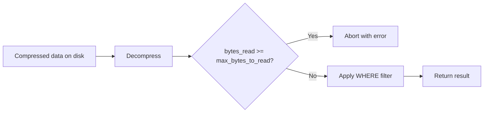

# How to Set max_bytes_to_read in ClickHouse

Author: [nawazdhandala](https://www.github.com/nawazdhandala)

Tags: ClickHouse, Configuration, QueryLimit, Safety, Performance

Description: Learn how to set max_bytes_to_read in ClickHouse to limit the amount of raw data a query can read from disk, protecting shared clusters from expensive scans.

---

`max_bytes_to_read` is a ClickHouse query setting that caps the total uncompressed bytes a SELECT query can read from storage. It works alongside `max_rows_to_read` to put a data-volume ceiling on queries. Using bytes instead of rows is useful when column widths vary significantly across tables.

## Setting max_bytes_to_read

Set for the current session:

```sql
SET max_bytes_to_read = 107374182400;  -- 100 GB
SELECT * FROM events WHERE ts >= today() - 7;
```

Set per query:

```sql
SELECT
    user_id,
    count() AS events,
    sum(revenue) AS total_revenue
FROM orders
WHERE ts >= '2024-01-01'
SETTINGS max_bytes_to_read = 53687091200;  -- 50 GB
```

When exceeded:

```text
Code: 159. DB::Exception: Limit for bytes to read exceeded:
read 53687091201 bytes, maximum is 53687091200 bytes.
```

## Setting Defaults in User Profiles

```xml
<!-- /etc/clickhouse-server/users.d/profiles.xml -->
<clickhouse>
    <profiles>
        <default>
            <max_bytes_to_read>0</max_bytes_to_read>  <!-- unlimited -->
        </default>

        <analyst>
            <!-- 200 GB limit -->
            <max_bytes_to_read>214748364800</max_bytes_to_read>
        </analyst>

        <api_user>
            <!-- 10 GB limit for API-driven queries -->
            <max_bytes_to_read>10737418240</max_bytes_to_read>
        </api_user>
    </profiles>
</clickhouse>
```

Or via SQL:

```sql
ALTER PROFILE analyst SETTINGS max_bytes_to_read = 214748364800;
ALTER PROFILE api_user SETTINGS max_bytes_to_read = 10737418240;
```

## bytes_read vs read_bytes_compressed

`max_bytes_to_read` counts uncompressed bytes. Since ClickHouse stores data compressed, the actual disk I/O will be smaller. The setting is intentionally based on uncompressed bytes because that better reflects processing effort.



## read_overflow_mode

The `read_overflow_mode` setting controls behavior when the limit is hit:

```sql
-- Throw an exception (default)
SET read_overflow_mode = 'throw';
SET max_bytes_to_read = 10737418240;

-- Return partial results
SET read_overflow_mode = 'break';
SET max_bytes_to_read = 10737418240;
```

Use `break` in interactive tools where partial results are acceptable.

## max_bytes_to_read_leaf

For distributed queries, the per-shard byte limit:

```sql
SET max_bytes_to_read_leaf = 10737418240;  -- 10 GB per shard
```

## Combining max_bytes_to_read with max_rows_to_read

Use both settings together for defense in depth. The query aborts when either limit is reached first:

```sql
SELECT count(), sum(revenue)
FROM orders
WHERE ts >= today() - 30
SETTINGS
    max_rows_to_read = 1000000000,
    max_bytes_to_read = 107374182400;  -- 100 GB
```

## Monitoring Byte Read Volumes

```sql
-- Queries with the highest read bytes in the last hour
SELECT
    query_id,
    user,
    read_rows,
    formatReadableSize(read_bytes) AS read_bytes,
    formatReadableSize(result_bytes) AS result_bytes,
    query_duration_ms,
    query
FROM system.query_log
WHERE type = 'QueryFinish'
  AND event_time >= now() - INTERVAL 1 HOUR
ORDER BY read_bytes DESC
LIMIT 20;
```

## Typical Byte Limit Guidelines

| Profile | max_bytes_to_read | Use case |
|---|---|---|
| `0` | Unlimited | Internal ETL |
| 500 GB | 536870912000 | Data engineers |
| 100 GB | 107374182400 | Analytics team |
| 10 GB | 10737418240 | Dashboard queries |
| 1 GB | 1073741824 | API / low-latency endpoints |

## Relationship to max_execution_time

`max_bytes_to_read` and `max_execution_time` are complementary. Bytes read limits protect against wide scans; execution time limits protect against slow queries regardless of data volume. Apply both:

```sql
SETTINGS
    max_bytes_to_read = 107374182400,
    max_execution_time = 60;
```

## Summary

`max_bytes_to_read` limits the uncompressed data volume a query can read, making it a natural complement to `max_rows_to_read` for protecting shared ClickHouse clusters. Set per-profile defaults in `users.xml` scaled to the expected data volumes for each user class. Use `read_overflow_mode = 'break'` for interactive queries, `throw` for strict API safety. Monitor `system.query_log` `read_bytes` to calibrate limits against real workload patterns.
