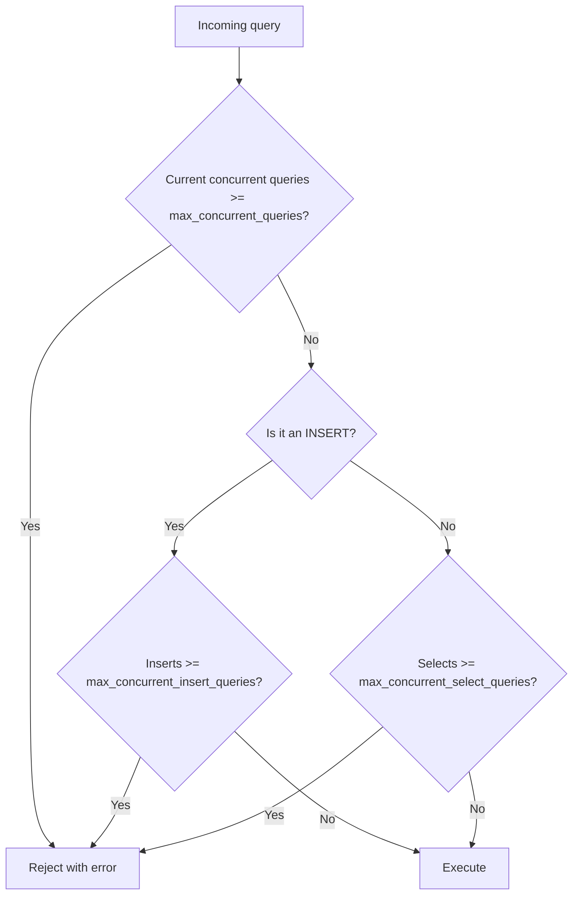

# How to Configure ClickHouse Max Concurrent Queries

Author: [nawazdhandala](https://www.github.com/nawazdhandala)

Tags: ClickHouse, Configuration, Concurrency, Performance, QueryLimit

Description: Learn how to configure max_concurrent_queries and related settings to prevent query overload and ensure fair resource sharing in ClickHouse.

---

When too many queries run simultaneously in ClickHouse, CPU, memory, and disk I/O become saturated, causing all queries to slow down. The `max_concurrent_queries` setting puts a hard cap on simultaneous query execution, rejecting new queries when the limit is reached instead of letting the system degrade.

## max_concurrent_queries

Set this in the server configuration:

```xml
<!-- /etc/clickhouse-server/config.d/query-limits.xml -->
<clickhouse>
    <max_concurrent_queries>100</max_concurrent_queries>
</clickhouse>
```

The default is `100`. Incoming queries that exceed this limit receive an error:

```text
Too many simultaneous queries. Maximum: 100
```

## max_concurrent_insert_queries

Inserts can be separated from reads with their own concurrency limit:

```xml
<clickhouse>
    <max_concurrent_queries>100</max_concurrent_queries>
    <max_concurrent_insert_queries>30</max_concurrent_insert_queries>
</clickhouse>
```

This ensures heavy insert traffic cannot starve analytical queries. The insert limit counts against `max_concurrent_queries` as well.

## max_concurrent_select_queries

Similarly, you can cap SELECT queries independently:

```xml
<clickhouse>
    <max_concurrent_select_queries>70</max_concurrent_select_queries>
</clickhouse>
```

## Query Concurrency Flow



## max_waiting_queries

In ClickHouse 24.3+, queries can be queued rather than immediately rejected. Set `max_waiting_queries` to allow a queue:

```xml
<clickhouse>
    <max_concurrent_queries>100</max_concurrent_queries>
    <max_waiting_queries>50</max_waiting_queries>
</clickhouse>
```

Queued queries wait for a slot to open. Set a query timeout with `max_execution_time` to prevent queued queries from waiting forever.

## Per-User Concurrency Limits

You can also set concurrency limits per user profile in `users.xml`:

```xml
<profiles>
    <analytics_user>
        <max_concurrent_queries_for_user>20</max_concurrent_queries_for_user>
    </analytics_user>
    <etl_user>
        <max_concurrent_queries_for_user>10</max_concurrent_queries_for_user>
    </etl_user>
</profiles>
```

## Monitoring Current Concurrency

```sql
-- Live view of running queries
SELECT
    query_id,
    user,
    elapsed,
    read_rows,
    memory_usage,
    query
FROM system.processes
ORDER BY elapsed DESC;
```

```sql
-- Historical concurrent query count
SELECT
    toStartOfMinute(event_time) AS minute,
    max(value) AS max_concurrent
FROM system.metric_log
WHERE metric = 'Query'
GROUP BY minute
ORDER BY minute DESC
LIMIT 60;
```

## Sizing max_concurrent_queries

A practical formula:

```text
max_concurrent_queries = min(
    available_CPU_cores / avg_threads_per_query,
    available_memory_GB / avg_query_memory_GB
)
```

For a 32-core server where typical analytical queries use 8 threads and 2 GB:

```text
by CPU: 32 / 8 = 4 max truly parallel queries
by memory: 64 GB / 2 GB = 32 max
```

In this case, `max_concurrent_queries` around 20-30 is reasonable, allowing I/O parallelism while limiting CPU over-subscription.

## Handling Rejected Queries in Applications

When ClickHouse rejects a query due to concurrency limits, it returns HTTP 503. Implement retry with backoff in your application:

```python
import time
import clickhouse_connect

def query_with_retry(client, sql, max_retries=5):
    for attempt in range(max_retries):
        try:
            return client.query(sql)
        except Exception as e:
            if "Too many simultaneous queries" in str(e):
                wait = 2 ** attempt
                print(f"Throttled, retrying in {wait}s...")
                time.sleep(wait)
            else:
                raise
    raise RuntimeError("Max retries exceeded")
```

## Summary

Set `max_concurrent_queries` based on available CPU and memory, not just connection count. Use separate limits for inserts and selects to protect analytical workloads. In ClickHouse 24.3+ use `max_waiting_queries` to queue bursts instead of rejecting them. Monitor `system.processes` and `system.metric_log` to validate your settings under real load.
