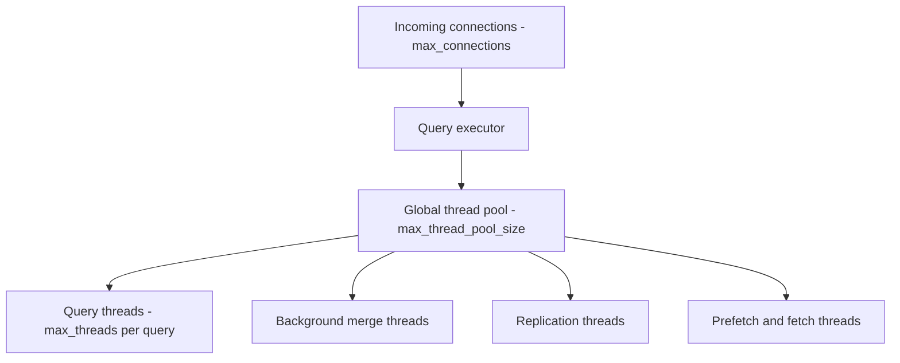

# How to Configure ClickHouse Max Connections and Threads

Author: [nawazdhandala](https://www.github.com/nawazdhandala)

Tags: ClickHouse, Configuration, Performance, Concurrency, Server

Description: Learn how to tune max_connections, max_thread_pool_size, and related thread settings in ClickHouse for optimal concurrent workload performance.

---

ClickHouse has two distinct concurrency knobs you need to understand: the number of client connections the server accepts, and the number of OS threads it uses internally for query processing. Getting these right prevents connection refusals, thread starvation, and unnecessary context-switching overhead.

## max_connections

`max_connections` limits how many simultaneous TCP connections the ClickHouse server accepts across all interfaces (HTTP, native TCP, MySQL, PostgreSQL).

```xml
<!-- /etc/clickhouse-server/config.d/connections.xml -->
<clickhouse>
    <max_connections>4096</max_connections>
</clickhouse>
```

The default is `1024`. Each idle connection holds a small amount of memory (a few KB). Raise this if you see `Too many simultaneous connections` errors in the ClickHouse log.

Check current connections:

```sql
SELECT count() FROM system.processes;
```

## max_thread_pool_size

This controls the global thread pool size for all server operations except query-level parallelism:

```xml
<clickhouse>
    <max_thread_pool_size>10000</max_thread_pool_size>
</clickhouse>
```

The default is `10000`. This covers threads for background merges, replication, network I/O, and query processing coordination.

## max_threads (Per-Query Parallelism)

`max_threads` is a query-level setting, not a server-level one. It controls how many threads a single query can use for parallel processing. Set it in user profiles or per session:

```sql
SET max_threads = 8;
```

Or in `users.xml` for all users:

```xml
<profiles>
    <default>
        <max_threads>8</max_threads>
    </default>
</profiles>
```

The default is the number of logical CPU cores on the server.

## Thread Pool Relationships



## max_thread_pool_free_size

Sets how many idle threads are kept alive in the pool before being destroyed:

```xml
<clickhouse>
    <max_thread_pool_free_size>1000</max_thread_pool_free_size>
</clickhouse>
```

A higher value reduces thread creation overhead at the cost of memory. For bursty workloads, set this to 10-20% of `max_thread_pool_size`.

## thread_pool_queue_size

Maximum number of tasks that can be queued waiting for a thread:

```xml
<clickhouse>
    <thread_pool_queue_size>10000</thread_pool_queue_size>
</clickhouse>
```

If the queue fills up, new tasks are rejected. Increase this if you see task queue overflow errors.

## Sizing Guidelines

| Server Type | max_connections | max_thread_pool_size | max_threads |
|---|---|---|---|
| 8 CPU / 32 GB | 1024 | 5000 | 8 |
| 32 CPU / 128 GB | 4096 | 10000 | 16 |
| 64 CPU / 256 GB | 8192 | 20000 | 32 |
| 128 CPU / 512 GB | 16384 | 40000 | 64 |

These are starting points. Profile with `system.query_log` and `system.metrics` under real load.

## Monitoring Thread Usage

```sql
-- Current thread pool metrics
SELECT metric, value
FROM system.metrics
WHERE metric IN (
    'GlobalThread',
    'GlobalThreadActive',
    'LocalThread',
    'LocalThreadActive'
);
```

```sql
-- Historical thread exhaustion events
SELECT
    toStartOfMinute(event_time) AS minute,
    sum(value) AS thread_count
FROM system.metric_log
WHERE metric = 'GlobalThread'
GROUP BY minute
ORDER BY minute DESC
LIMIT 30;
```

## Connection Pool on Client Side

If you are using a connection pool (e.g. from Python's `clickhouse-driver` or `clickhouse-connect`), set the pool size to match `max_connections / number_of_app_instances`:

```python
from clickhouse_connect import get_client

client = get_client(
    host="clickhouse.internal",
    port=8123,
    pool_size=50,       # per application instance
    max_retries=3,
)
```

## Summary

Tune `max_connections` to match the maximum number of simultaneous clients. Tune `max_thread_pool_size` to match the total concurrent thread demand from all queries and background operations. Use `max_threads` per-user or per-session to cap query-level parallelism on shared servers. Monitor `system.metrics` and `system.query_log` to confirm settings are appropriate for your actual workload.
