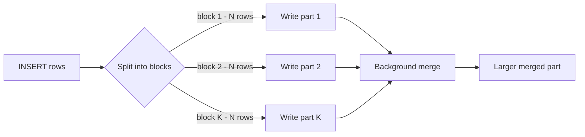

# How to Use max_insert_block_size in ClickHouse

Author: [nawazdhandala](https://www.github.com/nawazdhandala)

Tags: ClickHouse, Performance, Insert, Configuration, MergeTree, Tuning

Description: Learn how max_insert_block_size controls the size of blocks written during INSERT operations in ClickHouse, affecting part count, merge pressure, and insert throughput.

---

## Introduction

When ClickHouse receives an INSERT, it splits the incoming data into blocks of `max_insert_block_size` rows. Each block is written as a separate part (before merging). Understanding and tuning this setting is critical for balancing insert throughput, part fragmentation, and memory usage during bulk loads.

## INSERT Data Flow



## Default Value

```sql
SELECT name, value, description
FROM system.settings
WHERE name = 'max_insert_block_size';
```

Default: `1048576` (1,048,576 rows per block).

## Setting max_insert_block_size

### Per Query

```sql
INSERT INTO events
SELECT *
FROM staging_events
SETTINGS max_insert_block_size = 4194304;  -- 4M rows per block
```

### Per User Profile

```xml
<profiles>
  <bulk_loader>
    <max_insert_block_size>4194304</max_insert_block_size>
  </bulk_loader>
</profiles>
```

### Globally in config.xml

```xml
<clickhouse>
  <profiles>
    <default>
      <max_insert_block_size>1048576</max_insert_block_size>
    </default>
  </profiles>
</clickhouse>
```

## Effect on Part Count

Smaller `max_insert_block_size` = more parts per INSERT = higher merge pressure.
Larger `max_insert_block_size` = fewer parts per INSERT = less merge pressure but more memory per insert.

Example:

```sql
-- Insert 10M rows
-- With max_insert_block_size = 1048576 -> ~10 parts created
-- With max_insert_block_size = 4194304 -> ~3 parts created
INSERT INTO events SELECT * FROM generateRandom('event_id UInt64, ts DateTime', 1, 10, 0) LIMIT 10000000;
```

## Monitoring Parts After Insert

```sql
SELECT
    partition,
    count() AS parts,
    formatReadableSize(sum(bytes_on_disk)) AS size
FROM system.parts
WHERE table = 'events' AND active = 1
GROUP BY partition
ORDER BY parts DESC
LIMIT 10;
```

## Relationship with min_insert_block_size_rows

`min_insert_block_size_rows` squeezes small blocks together before writing:

```sql
INSERT INTO events
SELECT *
FROM staging_events
SETTINGS
    max_insert_block_size   = 1048576,
    min_insert_block_size_rows = 1048576,
    min_insert_block_size_bytes = 268435456;  -- 256 MiB
```

If the data being inserted has a block smaller than `min_insert_block_size_rows`, ClickHouse waits to accumulate more rows before flushing to disk.

## Tuning for Bulk Loads

For nightly ETL bulk loads where insert speed matters most:

```sql
INSERT INTO events
SELECT *
FROM s3('s3://bucket/events/*.parquet', 'Parquet')
SETTINGS
    max_insert_block_size          = 4194304,
    min_insert_block_size_rows     = 4194304,
    min_insert_block_size_bytes    = 536870912,
    max_insert_threads             = 4;
```

## Tuning for Real-Time Streaming

For real-time inserts (small batches every second), keep the default or smaller to keep latency low:

```sql
INSERT INTO events VALUES (1, 'click', now());
-- Default max_insert_block_size is fine for small streaming inserts
```

Use async inserts for very high-frequency small inserts:

```sql
INSERT INTO events VALUES (1, 'click', now())
SETTINGS async_insert = 1, wait_for_async_insert = 0;
```

## Checking Insert Block Stats

```sql
SELECT
    query,
    written_rows,
    written_bytes,
    query_duration_ms
FROM system.query_log
WHERE type = 'QueryFinish'
  AND query LIKE 'INSERT INTO events%'
ORDER BY event_time DESC
LIMIT 10;
```

## Summary

`max_insert_block_size` determines how many rows ClickHouse writes per part during an INSERT. Larger values reduce part fragmentation and merge pressure at the cost of more insert-time memory. For bulk ETL loads, increase it to 4-8 million rows. For real-time streaming, keep the default or use async inserts. Pair with `min_insert_block_size_rows` to prevent tiny parts from small inserts.
