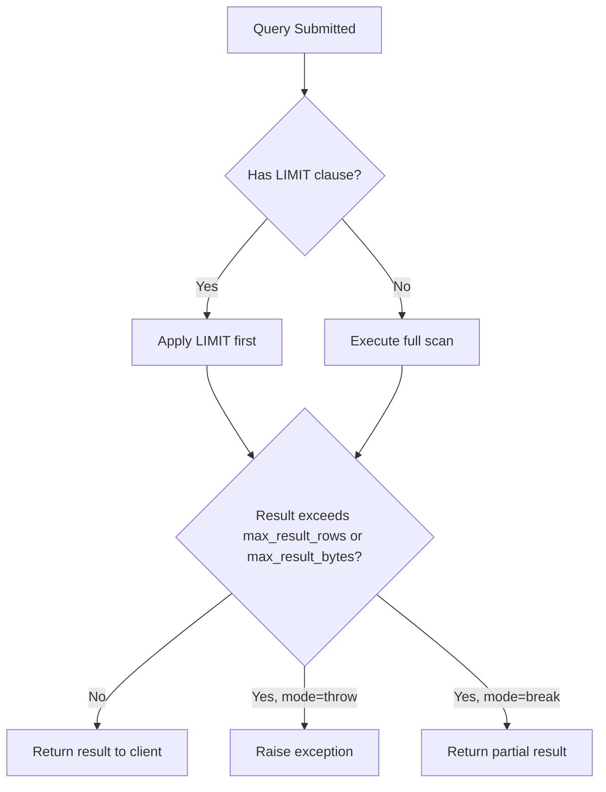

# How to Set max_result_rows and max_result_bytes in ClickHouse

Author: [nawazdhandala](https://www.github.com/nawazdhandala)

Tags: ClickHouse, Configuration, Performance, Query, Setting

Description: Learn how to use max_result_rows and max_result_bytes in ClickHouse to cap query output size and protect your cluster from oversized result sets.

---

ClickHouse executes analytical queries that can return millions of rows or gigabytes of data. Without limits, a single runaway query can exhaust network bandwidth, overwhelm a client application, or cause out-of-memory errors. The settings `max_result_rows` and `max_result_bytes` give you precise control over how large a query result is allowed to be before ClickHouse throws an error or silently truncates it.

## What the Settings Control

`max_result_rows` caps the number of rows returned to the client. `max_result_bytes` caps the total uncompressed bytes of result data. Either limit, once reached, triggers the behavior defined by `result_overflow_mode`.

The companion setting `result_overflow_mode` has two values:

| Value | Behavior |
|-------|----------|
| `throw` (default) | Raise an exception and abort the query |
| `break` | Stop returning rows and return a partial result silently |

## Setting Limits at the Session Level

```sql
SET max_result_rows = 100000;
SET max_result_bytes = 104857600; -- 100 MB
SET result_overflow_mode = 'throw';

SELECT *
FROM system.query_log
WHERE event_date = today()
ORDER BY query_start_time DESC;
```

If the result exceeds 100 000 rows or 100 MB, ClickHouse throws:

```yaml
Code: 396. DB::Exception: Limit for result exceeded, max rows: 100000
```

## Setting Limits at the Query Level

You can override defaults per query using the `SETTINGS` clause:

```sql
SELECT
    user,
    count() AS query_count,
    sum(query_duration_ms) AS total_ms
FROM system.query_log
WHERE event_date = today()
GROUP BY user
ORDER BY query_count DESC
SETTINGS max_result_rows = 50, result_overflow_mode = 'break';
```

This returns at most 50 rows without raising an error, which is handy for exploratory queries in dashboards.

## Setting Limits in users.xml

To apply limits globally for a user profile, configure them in `users.xml`:

```xml
<profiles>
  <default>
    <max_result_rows>1000000</max_result_rows>
    <max_result_bytes>1073741824</max_result_bytes>
    <result_overflow_mode>throw</result_overflow_mode>
  </default>
  <readonly>
    <max_result_rows>10000</max_result_rows>
    <max_result_bytes>10485760</max_result_bytes>
    <result_overflow_mode>break</result_overflow_mode>
  </readonly>
</profiles>
```

## How These Settings Interact with LIMIT

`max_result_rows` is applied after `LIMIT`. If your query already has `LIMIT 1000`, the result can never exceed 1000 rows regardless of `max_result_rows`. The setting only fires when `LIMIT` is absent or larger than `max_result_rows`.

```sql
-- This query will never trigger max_result_rows = 100000
-- because LIMIT 500 is smaller
SELECT *
FROM events
ORDER BY ts DESC
LIMIT 500;

-- This query will trigger if more than 100000 rows match
SELECT *
FROM events
WHERE status = 'error'
SETTINGS max_result_rows = 100000;
```

## Flow Diagram



## Verifying Current Values

```sql
SELECT name, value, description
FROM system.settings
WHERE name IN ('max_result_rows', 'max_result_bytes', 'result_overflow_mode');
```

## Practical Recommendations

- Set `max_result_rows = 1000000` and `max_result_bytes = 1073741824` (1 GB) as a reasonable production default in the `default` profile.
- Use `result_overflow_mode = 'throw'` for API-facing services where partial results would be misleading.
- Use `result_overflow_mode = 'break'` for internal BI dashboards that show "top N" results and can tolerate truncation.
- Keep `max_result_bytes = 0` (unlimited) only for ETL pipelines where you explicitly manage result size through `LIMIT`.

## Summary

`max_result_rows` and `max_result_bytes` are lightweight safeguards that prevent oversized query results from harming your ClickHouse cluster and downstream clients. Configure them in user profiles for global protection, and override per query when needed. Pair them with `result_overflow_mode = 'throw'` for strict enforcement or `'break'` for graceful truncation depending on your use case.
