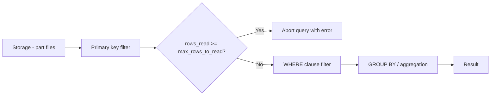

# How to Set max_rows_to_read for Query Limits in ClickHouse

Author: [nawazdhandala](https://www.github.com/nawazdhandala)

Tags: ClickHouse, Configuration, QueryLimit, Safety, Performance

Description: Learn how to set max_rows_to_read in ClickHouse to limit how many rows a query can scan, preventing runaway queries from overloading the server.

---

`max_rows_to_read` is a ClickHouse query setting that caps the number of rows a single SELECT query can read from storage. When the limit is exceeded, ClickHouse immediately aborts the query with an error rather than allowing it to continue consuming resources. This protects shared clusters from expensive full-table scans caused by missing WHERE clauses or large ad-hoc queries.

## Setting max_rows_to_read

Set it for the current session:

```sql
SET max_rows_to_read = 1000000000;  -- 1 billion rows max
SELECT count() FROM large_table;
```

Or per query:

```sql
SELECT count()
FROM large_table
WHERE ts >= today()
SETTINGS max_rows_to_read = 500000000;
```

When the limit is exceeded:

```text
Code: 158. DB::Exception: Limit for rows to read exceeded:
read 1000000001 rows, maximum is 1000000000.
```

## Setting Defaults in User Profiles

Apply a default limit for a user profile in `users.xml` or via SQL-based access control:

```xml
<!-- /etc/clickhouse-server/users.d/profiles.xml -->
<clickhouse>
    <profiles>
        <default>
            <!-- 0 means unlimited -->
            <max_rows_to_read>0</max_rows_to_read>
        </default>

        <analyst>
            <!-- 5 billion row limit for analysts -->
            <max_rows_to_read>5000000000</max_rows_to_read>
        </analyst>

        <dashboard>
            <!-- 100 million row limit for dashboard queries -->
            <max_rows_to_read>100000000</max_rows_to_read>
        </dashboard>
    </profiles>
</clickhouse>
```

Or using SQL access control:

```sql
ALTER PROFILE analyst SETTINGS max_rows_to_read = 5000000000;
ALTER PROFILE dashboard SETTINGS max_rows_to_read = 100000000;
```

## Behavior: Rows Read vs Rows Processed

`max_rows_to_read` counts rows read from storage (after primary key filtering but before WHERE clause filtering). This means:

- A query with a good primary key index that reads 1M rows but filters down to 1K will count as 1M rows read.
- A full table scan reads every row regardless of the WHERE clause result.



## read_overflow_mode

Control what happens when the limit is reached with `read_overflow_mode`:

```sql
-- Default: throw an error
SET read_overflow_mode = 'throw';

-- Return partial results instead of erroring
SET read_overflow_mode = 'break';
```

With `break`, the query returns whatever rows have been accumulated so far when the limit is hit. This is useful for interactive dashboards that prefer approximate results over errors.

## max_rows_to_read_leaf

For distributed queries, each shard reads rows independently. `max_rows_to_read_leaf` sets the per-shard limit:

```sql
SET max_rows_to_read_leaf = 500000000;
```

The total rows read across all shards can exceed `max_rows_to_read_leaf` multiplied by the number of shards. Use `max_rows_to_read` for an overall cluster-wide limit.

## Monitoring Row Read Volumes

```sql
-- Find queries that read the most rows in the last hour
SELECT
    query_id,
    user,
    read_rows,
    formatReadableSize(read_bytes) AS read_bytes,
    query_duration_ms,
    query
FROM system.query_log
WHERE type = 'QueryFinish'
  AND event_time >= now() - INTERVAL 1 HOUR
ORDER BY read_rows DESC
LIMIT 20;
```

## Typical Limit Guidelines

| Profile | max_rows_to_read | Use case |
|---|---|---|
| `0` | Unlimited | Internal ETL / maintenance |
| 1B (1,000,000,000) | 1 billion | Analytics engineers |
| 100M (100,000,000) | 100 million | Dashboard users |
| 10M (10,000,000) | 10 million | API users with real-time SLA |

## Summary

`max_rows_to_read` is a first-line defence against runaway queries on shared ClickHouse clusters. Set per-profile defaults in `users.xml` or SQL access control profiles. Use `read_overflow_mode = 'break'` for dashboards that prefer partial results over errors. Use `max_rows_to_read_leaf` for distributed query limits per shard. Monitor high-read queries in `system.query_log` to tune limits based on actual query patterns.
