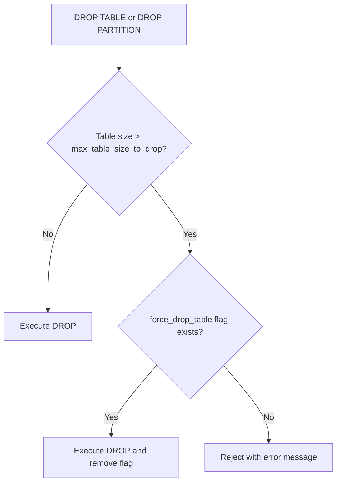

# How to Configure ClickHouse Max Table Size to Drop

Author: [nawazdhandala](https://www.github.com/nawazdhandala)

Tags: ClickHouse, Configuration, Safety, Administration, Server

Description: Learn how to configure max_table_size_to_drop and max_partition_size_to_drop in ClickHouse to protect large tables from accidental deletion.

---

ClickHouse has a built-in safety mechanism that prevents accidental `DROP TABLE` and `DROP PARTITION` operations on large tables. The settings `max_table_size_to_drop` and `max_partition_size_to_drop` define size thresholds above which ClickHouse refuses the operation without an explicit override. This protects you from irreversible data loss caused by a mistyped query.

## How the Protection Works

When you run `DROP TABLE` or `TRUNCATE TABLE`, ClickHouse checks the table's total on-disk size against `max_table_size_to_drop`. If the table exceeds the threshold, ClickHouse refuses the command with an error.

```text
Code: 62. DB::Exception: Table clickhouse_db.large_events has size 250.00 GiB which is greater than
max_table_size_to_drop=50.00 GiB. Use flag file 'force_drop_table' or increase max_table_size_to_drop.
```

## Default Values

| Setting | Default |
|---|---|
| `max_table_size_to_drop` | 50 GB (53687091200 bytes) |
| `max_partition_size_to_drop` | 50 GB (53687091200 bytes) |

## Server-Level Configuration

Set the thresholds in config.xml:

```xml
<!-- /etc/clickhouse-server/config.d/drop-limits.xml -->
<clickhouse>
    <!-- Maximum table size that can be dropped without override (bytes) -->
    <!-- 0 means no limit - disable the protection -->
    <!-- Default: 53687091200 (50 GB) -->
    <max_table_size_to_drop>53687091200</max_table_size_to_drop>

    <!-- Maximum partition size that can be dropped without override (bytes) -->
    <max_partition_size_to_drop>53687091200</max_partition_size_to_drop>
</clickhouse>
```

To raise the limit to 500 GB:

```xml
<clickhouse>
    <max_table_size_to_drop>536870912000</max_table_size_to_drop>
    <max_partition_size_to_drop>536870912000</max_partition_size_to_drop>
</clickhouse>
```

To disable the protection entirely (not recommended for production):

```xml
<clickhouse>
    <max_table_size_to_drop>0</max_table_size_to_drop>
    <max_partition_size_to_drop>0</max_partition_size_to_drop>
</clickhouse>
```

## Overriding for a Single Drop Operation

When you need to drop a table that exceeds the limit, create a flag file in the ClickHouse server's data directory and then run the DROP within 5 minutes:

```bash
# Create the flag file
sudo touch /var/lib/clickhouse/flags/force_drop_table

# Now run the drop in clickhouse-client (within 5 minutes)
clickhouse-client --query "DROP TABLE my_database.large_events"

# The flag file is automatically removed after the operation
```

For dropping a specific partition:

```bash
sudo touch /var/lib/clickhouse/flags/force_drop_table
clickhouse-client --query "ALTER TABLE my_database.events DROP PARTITION '202401'"
```

## Operation Flow



## Checking Table Sizes

Before configuring thresholds, understand the size distribution of your tables:

```sql
SELECT
    database,
    table,
    formatReadableSize(sum(bytes_on_disk)) AS size,
    sum(bytes_on_disk) AS size_bytes
FROM system.parts
WHERE active
GROUP BY database, table
ORDER BY size_bytes DESC
LIMIT 20;
```

## Setting Different Limits per Environment

Use config.d with environment-specific files:

```bash
# Production - keep 50 GB limit
/etc/clickhouse-server/config.d/drop-limits-prod.xml

# Development - no limit (unsafe)
/etc/clickhouse-server/config.d/drop-limits-dev.xml
```

```xml
<!-- drop-limits-dev.xml - development only -->
<clickhouse>
    <max_table_size_to_drop>0</max_table_size_to_drop>
    <max_partition_size_to_drop>0</max_partition_size_to_drop>
</clickhouse>
```

## Audit Drops with system.query_log

After a DROP, confirm it was recorded:

```sql
SELECT
    event_time,
    user,
    query_kind,
    query
FROM system.query_log
WHERE type = 'QueryFinish'
  AND query ILIKE '%DROP%'
ORDER BY event_time DESC
LIMIT 10;
```

## Summary

`max_table_size_to_drop` and `max_partition_size_to_drop` protect against accidental deletion of large datasets. The defaults are 50 GB each. Raise the threshold in config.xml if your operational procedures require dropping larger tables regularly. For one-off drops that exceed the limit, create the `force_drop_table` flag file in `/var/lib/clickhouse/flags/` and run the DROP within 5 minutes. Set the threshold to 0 only in non-production environments.
