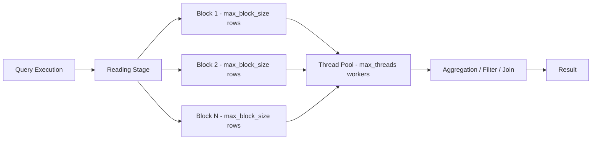

# How to Configure ClickHouse max_threads and max_block_size

Author: [nawazdhandala](https://www.github.com/nawazdhandala)

Tags: ClickHouse, Performance, Configuration, Tuning, Query, Setting

Description: Learn how to tune max_threads and max_block_size in ClickHouse to optimize query parallelism and memory usage for your specific workload and hardware.

---

## Introduction

Two of the most impactful per-query settings in ClickHouse are `max_threads` and `max_block_size`. `max_threads` controls how many CPU threads a single query uses, while `max_block_size` controls how many rows are processed in one pipeline block. Getting these right can dramatically improve query throughput and reduce memory spikes.

## How They Work



## Default Values

| Setting | Default | Notes |
|---|---|---|
| `max_threads` | Number of CPU cores | Auto-detected |
| `max_block_size` | 65536 rows | Per block in the pipeline |

## Checking Current Settings

```sql
SELECT name, value, description
FROM system.settings
WHERE name IN ('max_threads', 'max_block_size');
```

## Setting max_threads

### Per Query

```sql
SELECT
    event_type,
    count() AS cnt
FROM events
WHERE event_time >= today() - INTERVAL 7 DAY
GROUP BY event_type
SETTINGS max_threads = 8;
```

### Per User Profile (users.xml)

```xml
<profiles>
  <default>
    <max_threads>8</max_threads>
  </default>
  <analytics>
    <max_threads>16</max_threads>
  </analytics>
</profiles>
```

### Globally in config.xml

```xml
<clickhouse>
  <profiles>
    <default>
      <max_threads>8</max_threads>
    </default>
  </profiles>
</clickhouse>
```

## Tuning max_threads

- **OLAP queries on large datasets**: set `max_threads` to the number of physical cores.
- **Mixed concurrent workloads**: reduce `max_threads` to 4-8 to leave headroom for other queries.
- **Small queries**: lower `max_threads` (2-4) to reduce scheduling overhead.

```sql
-- Measure the effect of different thread counts
SET max_threads = 4;
SELECT count() FROM events WHERE event_time >= '2024-01-01';

SET max_threads = 16;
SELECT count() FROM events WHERE event_time >= '2024-01-01';
```

## Setting max_block_size

### Per Query

```sql
SELECT *
FROM events
LIMIT 1000000
SETTINGS max_block_size = 131072;
```

### Effect on Memory Usage

Larger blocks reduce per-block overhead (fewer pipeline flushes) but increase peak memory:

| `max_block_size` | Memory pressure | Pipeline overhead |
|---|---|---|
| 8192 | Low | High |
| 65536 (default) | Medium | Medium |
| 1048576 | High | Low |

## max_block_size for Aggregations

When aggregating over many distinct keys, a larger block size reduces hash table rebuild frequency:

```sql
SELECT
    toStartOfHour(event_time) AS hour,
    count() AS cnt
FROM events
GROUP BY hour
SETTINGS max_block_size = 262144, max_threads = 16;
```

## Monitoring Thread Usage

```sql
SELECT
    query_id,
    query,
    peak_memory_usage,
    read_rows,
    query_duration_ms
FROM system.query_log
WHERE type = 'QueryFinish'
  AND query_start_time >= now() - INTERVAL 1 HOUR
ORDER BY query_duration_ms DESC
LIMIT 10;
```

## Limiting Threads for Concurrent Users

Use settings profiles to cap threads per user, preventing single queries from monopolizing all cores:

```xml
<profiles>
  <restricted>
    <max_threads>4</max_threads>
    <max_block_size>65536</max_block_size>
  </restricted>
</profiles>

<users>
  <analyst>
    <profile>restricted</profile>
  </analyst>
</users>
```

## Summary

`max_threads` controls how many CPU threads ClickHouse uses per query; setting it to the number of physical cores maximizes parallelism for analytical queries. `max_block_size` sets how many rows are processed in each pipeline block, with larger values trading more memory for less scheduling overhead. Tune both settings in user profiles and override them per query via `SETTINGS` for workload-specific optimization.
