# How to Use maxIntersections() in ClickHouse

Author: [nawazdhandala](https://www.github.com/nawazdhandala)

Tags: ClickHouse, Aggregation, maxIntersections, Interval Overlap, Scheduling, Capacity Planning

Description: Learn how maxIntersections() computes the maximum number of simultaneously overlapping intervals in ClickHouse for capacity planning and conflict detection.

---

`maxIntersections()` is an aggregate function that computes the maximum number of intervals that overlap at any single point in time. Given a group of rows each defining an interval with a start and end value, it returns the peak concurrency: the highest number of those intervals that are simultaneously active. This is directly useful for capacity planning, scheduler analysis, and detecting resource conflicts.

## Function Signature

```text
maxIntersections(start, end)
```

Both `start` and `end` must be of the same numeric or DateTime type. The interval is considered half-open: `[start, end)`. ClickHouse counts how many intervals contain each boundary point and returns the maximum count.

## Conceptual Example

```mermaid
gantt
    dateFormat HH:mm
    axisFormat %H:%M
    section Intervals
    Session A   :a1, 10:00, 60m
    Session B   :a2, 10:30, 45m
    Session C   :a3, 10:45, 30m
    Session D   :a4, 11:30, 30m
```



In the timeline above, sessions A, B, and C overlap between 10:45 and 11:15, giving a peak of 3. Session D does not overlap with A, B, or C.

## Basic Usage

```sql
SELECT maxIntersections(start_time, end_time) AS peak_concurrent_sessions
FROM user_sessions
WHERE session_date = today();
```

## Finding Peak Concurrent Database Connections

```sql
SELECT
    toStartOfHour(start_time) AS hour,
    maxIntersections(start_time, end_time) AS peak_connections
FROM db_connections
WHERE start_time >= now() - INTERVAL 7 DAY
GROUP BY hour
ORDER BY hour;
```

## Server Capacity Planning

Determine whether your server pool ever exceeds a concurrency threshold.

```sql
SELECT
    server_id,
    maxIntersections(request_start, request_end) AS peak_concurrent_requests,
    peak_concurrent_requests > 100 AS capacity_exceeded
FROM server_requests
GROUP BY server_id
ORDER BY peak_concurrent_requests DESC;
```

## Conference Room Booking Conflict Detection

Find the maximum number of overlapping meeting reservations per room.

```sql
SELECT
    room_id,
    maxIntersections(starts_at, ends_at) AS max_overlapping_bookings,
    max_overlapping_bookings > 1 AS has_double_booking
FROM room_reservations
WHERE reservation_date = today()
GROUP BY room_id
HAVING has_double_booking = 1;
```

## Tracking Peak Active Users

For a SaaS product, compute the peak number of simultaneously active users per day.

```sql
SELECT
    toDate(session_start) AS session_date,
    maxIntersections(session_start, session_end) AS peak_concurrent_users
FROM user_sessions
WHERE session_start >= now() - INTERVAL 30 DAY
  AND session_end IS NOT NULL
GROUP BY session_date
ORDER BY session_date;
```

## Using maxIntersectionsPosition

The companion function `maxIntersectionsPosition()` returns the start value of the interval at which the maximum overlap occurs.

```sql
SELECT
    maxIntersections(start_time, end_time)         AS peak_count,
    maxIntersectionsPosition(start_time, end_time) AS peak_start_time
FROM user_sessions
WHERE session_date = today();
```

This tells you both how many sessions were concurrent and when that peak occurred.

## Combined Capacity Dashboard

```sql
SELECT
    toStartOfHour(start_time) AS hour,
    count() AS total_sessions_started,
    maxIntersections(start_time, end_time) AS peak_concurrent,
    avg(dateDiff('second', start_time, end_time)) AS avg_session_seconds
FROM user_sessions
WHERE start_time >= now() - INTERVAL 24 HOUR
GROUP BY hour
ORDER BY hour;
```

## Important Notes

The intervals are treated as half-open `[start, end)`. If `start = end` for a given row, that interval has zero length and contributes nothing to overlap. Ensure your end timestamps are strictly after start timestamps.

```sql
-- Validate no zero-length intervals before analysis
SELECT count() AS zero_length_intervals
FROM user_sessions
WHERE start_time >= end_time;
```

## Summary

`maxIntersections()` returns the peak number of simultaneously overlapping intervals in a group, making it a purpose-built aggregate for concurrency analysis, capacity planning, and double-booking detection. Pair it with `maxIntersectionsPosition()` to identify not just the peak magnitude but also the exact point at which it occurs. Group by time bucket (hour, day) for trend analysis over time.
