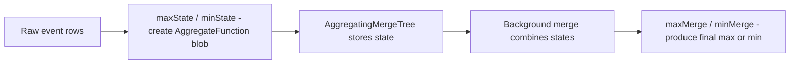

# How to Use maxMerge() and minMerge() in ClickHouse

Author: [OneUptime](https://www.github.com/OneUptime)

Tags: ClickHouse, SQL, Aggregate Function, AggregatingMergeTree, Materialized View

Description: Learn how to use maxMerge() and minMerge() in ClickHouse to combine pre-aggregated max and min states from AggregatingMergeTree tables and materialized views.

---

`maxMerge()` and `minMerge()` are the merge counterparts to `maxState()` and `minState()`. In ClickHouse's two-phase aggregation pattern, you first store intermediate aggregation state using `maxState()` or `minState()` in an `AggregateFunction` column, then query it back using `maxMerge()` or `minMerge()`. This pattern powers efficient incremental aggregation in materialized views and `AggregatingMergeTree` tables.

## The Two-Phase Aggregation Pattern



## Storing Max/Min State in an AggregatingMergeTree Table

```sql
-- Target table for pre-aggregated max/min metrics
CREATE TABLE hourly_metric_extremes
(
    stat_hour   DateTime,
    service     String,
    max_latency AggregateFunction(max, Float64),
    min_latency AggregateFunction(min, Float64),
    max_cpu     AggregateFunction(max, Float32),
    min_cpu     AggregateFunction(min, Float32)
)
ENGINE = AggregatingMergeTree()
ORDER BY (stat_hour, service);
```

## Populating via Materialized View

```sql
CREATE MATERIALIZED VIEW mv_hourly_metric_extremes
TO hourly_metric_extremes
AS
SELECT
    toStartOfHour(timestamp)            AS stat_hour,
    service_name                        AS service,
    maxState(toFloat64(response_time_ms)) AS max_latency,
    minState(toFloat64(response_time_ms)) AS min_latency,
    maxState(cpu_percent)               AS max_cpu,
    minState(cpu_percent)               AS min_cpu
FROM host_metrics
GROUP BY stat_hour, service;
```

## Querying with maxMerge() and minMerge()

```sql
-- Merge states to get final max and min per hour
SELECT
    stat_hour,
    service,
    maxMerge(max_latency)  AS peak_latency_ms,
    minMerge(min_latency)  AS best_latency_ms,
    maxMerge(max_cpu)      AS peak_cpu_pct,
    minMerge(min_cpu)      AS lowest_cpu_pct
FROM hourly_metric_extremes
WHERE stat_hour >= now() - INTERVAL 24 HOUR
GROUP BY stat_hour, service
ORDER BY stat_hour DESC;
```

## Backfilling Historical Data

```sql
-- Backfill the AggregatingMergeTree table from raw data
INSERT INTO hourly_metric_extremes
SELECT
    toStartOfHour(timestamp)            AS stat_hour,
    service_name                        AS service,
    maxState(toFloat64(response_time_ms)) AS max_latency,
    minState(toFloat64(response_time_ms)) AS min_latency,
    maxState(cpu_percent)               AS max_cpu,
    minState(cpu_percent)               AS min_cpu
FROM host_metrics
WHERE timestamp >= '2026-01-01' AND timestamp < '2026-03-31'
GROUP BY stat_hour, service;
```

## Daily and Weekly Rollups Using Merge States

```sql
-- Daily rollup table using hourly states as input
CREATE TABLE daily_metric_extremes
(
    stat_day    Date,
    service     String,
    max_latency AggregateFunction(max, Float64),
    min_latency AggregateFunction(min, Float64)
)
ENGINE = AggregatingMergeTree()
ORDER BY (stat_day, service);

-- Populate daily from hourly - states can be chained
INSERT INTO daily_metric_extremes
SELECT
    toDate(stat_hour)     AS stat_day,
    service,
    maxMergeState(max_latency) AS max_latency,
    minMergeState(min_latency) AS min_latency
FROM hourly_metric_extremes
GROUP BY stat_day, service;

-- Query daily extremes
SELECT
    stat_day,
    service,
    maxMerge(max_latency) AS daily_peak_latency_ms,
    minMerge(min_latency) AS daily_best_latency_ms
FROM daily_metric_extremes
WHERE stat_day >= today() - 30
GROUP BY stat_day, service
ORDER BY stat_day DESC;
```

## Combining maxMerge/minMerge with Other Aggregate Merges

```sql
-- Full SLA summary table
CREATE TABLE sla_summary
(
    stat_hour    DateTime,
    service      String,
    max_latency  AggregateFunction(max, Float64),
    min_latency  AggregateFunction(min, Float64),
    total_count  AggregateFunction(count, UInt64),
    error_count  AggregateFunction(sum, UInt64),
    p95_latency  AggregateFunction(quantile(0.95), Float64)
)
ENGINE = AggregatingMergeTree()
ORDER BY (stat_hour, service);

-- Query the full SLA summary
SELECT
    stat_hour,
    service,
    maxMerge(max_latency)           AS peak_ms,
    minMerge(min_latency)           AS best_ms,
    countMerge(total_count)         AS total_requests,
    sumMerge(error_count)           AS errors,
    quantileMerge(0.95)(p95_latency) AS p95_ms
FROM sla_summary
WHERE stat_hour >= now() - INTERVAL 24 HOUR
GROUP BY stat_hour, service
ORDER BY stat_hour DESC;
```

## maxMergeState() for Multi-Level Rollup Chains

When building tiered rollup tables, use `maxMergeState()` and `minMergeState()` to produce a new state from existing states, which can then be merged again at a higher level.

```sql
-- maxMergeState combines partial states into a new partial state
-- maxMerge produces the final scalar result

-- These two are equivalent:
-- Option A: scan raw data
SELECT maxMerge(maxState(latency)) FROM raw_table GROUP BY service;

-- Option B: use pre-aggregated hourly state
SELECT maxMerge(maxMergeState(max_latency)) FROM hourly_table GROUP BY service;
```

## Summary

`maxMerge()` and `minMerge()` deserialize and combine `AggregateFunction(max, T)` and `AggregateFunction(min, T)` state blobs into final scalar max and min values. Use them together with `maxState()`/`minState()` in materialized views backed by `AggregatingMergeTree` to maintain pre-computed extreme values that can be queried at millisecond latency regardless of the raw table size. For multi-level rollups, use `maxMergeState()` and `minMergeState()` to chain states across daily, weekly, or monthly aggregation tiers.
