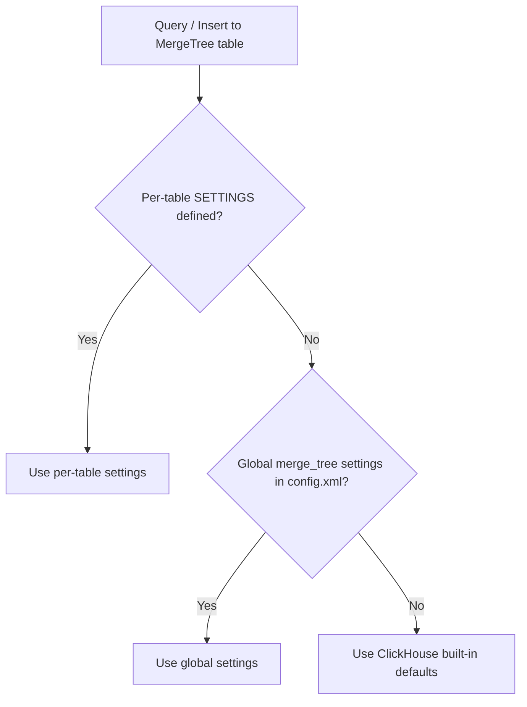

# How to Configure ClickHouse Merge Tree Settings Globally

Author: OneUptime Team

Tags: ClickHouse, Configuration, MergeTree, Storage, Performance

Description: Learn how to configure global MergeTree settings in ClickHouse's config.xml to apply default storage and merge behavior across all MergeTree tables.

---

MergeTree tables in ClickHouse have dozens of settings that control merge frequency, part sizes, TTL behavior, and storage efficiency. While you can set these per-table, configuring them globally in `config.xml` under `<merge_tree>` applies defaults to all MergeTree-family tables without requiring table-level ALTER statements.

## Global MergeTree Settings Location

```xml
<!-- /etc/clickhouse-server/config.d/merge-tree.xml -->
<clickhouse>
    <merge_tree>
        <!-- Settings go here -->
    </merge_tree>
</clickhouse>
```

Per-table settings in `CREATE TABLE ... SETTINGS ...` override the global defaults.

## Key Global Settings

### Part Size Limits

```xml
<clickhouse>
    <merge_tree>
        <!-- Minimum rows for a part to participate in a merge -->
        <min_rows_for_wide_part>512</min_rows_for_wide_part>

        <!-- Minimum bytes for a part to use wide format -->
        <min_bytes_for_wide_part>10485760</min_bytes_for_wide_part>

        <!-- Maximum part size after merge -->
        <max_bytes_to_merge_at_max_space_in_pool>161061273600</max_bytes_to_merge_at_max_space_in_pool>

        <!-- Merge parts smaller than this aggressively -->
        <max_bytes_to_merge_at_min_space_in_pool>1048576</max_bytes_to_merge_at_min_space_in_pool>
    </merge_tree>
</clickhouse>
```

### Part Count Limits

```xml
<clickhouse>
    <merge_tree>
        <!-- Warn when active parts exceed this threshold -->
        <parts_to_throw_insert>300</parts_to_throw_insert>

        <!-- Delay inserts (add latency) when parts exceed this threshold -->
        <parts_to_delay_insert>150</parts_to_delay_insert>

        <!-- Maximum number of active parts at which inserts are rejected entirely -->
        <max_delay_to_insert>1</max_delay_to_insert>
    </merge_tree>
</clickhouse>
```

### Replication Settings

```xml
<clickhouse>
    <merge_tree>
        <!-- Maximum number of replicated operations in a single batch -->
        <max_replicated_merges_in_queue>16</max_replicated_merges_in_queue>

        <!-- Retry delay for failed replication tasks (seconds) -->
        <zookeeper_session_expiry_check_period>60</zookeeper_session_expiry_check_period>
    </merge_tree>
</clickhouse>
```

### Cleanup and TTL

```xml
<clickhouse>
    <merge_tree>
        <!-- Check TTL rules every N seconds -->
        <merge_with_ttl_timeout>14400</merge_with_ttl_timeout>

        <!-- Enable TTL delete -->
        <ttl_only_drop_parts>0</ttl_only_drop_parts>

        <!-- Remove empty parts after TTL deletion -->
        <remove_empty_parts>1</remove_empty_parts>
    </merge_tree>
</clickhouse>
```

## Complete Example Configuration

```xml
<!-- /etc/clickhouse-server/config.d/merge-tree.xml -->
<clickhouse>
    <merge_tree>
        <!-- Part format thresholds -->
        <min_rows_for_wide_part>512</min_rows_for_wide_part>
        <min_bytes_for_wide_part>10485760</min_bytes_for_wide_part>

        <!-- Insert throttling thresholds -->
        <parts_to_delay_insert>150</parts_to_delay_insert>
        <parts_to_throw_insert>300</parts_to_throw_insert>

        <!-- Merge size limits -->
        <max_bytes_to_merge_at_max_space_in_pool>161061273600</max_bytes_to_merge_at_max_space_in_pool>

        <!-- TTL enforcement -->
        <merge_with_ttl_timeout>14400</merge_with_ttl_timeout>
        <ttl_only_drop_parts>1</ttl_only_drop_parts>

        <!-- Cleanup -->
        <remove_empty_parts>1</remove_empty_parts>
    </merge_tree>
</clickhouse>
```

## How Global vs Per-Table Settings Interact



## Applying Global Settings to Existing Tables

Note that changing `config.xml` global settings does NOT retroactively change existing tables that have explicit `SETTINGS` in their DDL. To apply a global change to an existing table:

```sql
-- Remove per-table override to inherit from global config
ALTER TABLE my_table
RESET SETTING parts_to_delay_insert;
```

Or set it explicitly:

```sql
ALTER TABLE my_table
MODIFY SETTING parts_to_delay_insert = 150;
```

## Viewing Current Table Settings

```sql
SELECT
    database,
    name,
    engine_full
FROM system.tables
WHERE engine LIKE '%MergeTree%'
  AND database = 'default'
LIMIT 10;
```

For detailed settings per table:

```sql
SELECT
    database,
    table,
    name,
    value
FROM system.merge_tree_settings
WHERE database = 'default'
ORDER BY table, name;
```

## Commonly Tuned Settings

| Setting | Default | When to Change |
|---|---|---|
| `parts_to_delay_insert` | 150 | Lower for write-heavy tables |
| `parts_to_throw_insert` | 300 | Raise if merges can't keep up |
| `merge_with_ttl_timeout` | 14400 | Lower if TTL must enforce quickly |
| `ttl_only_drop_parts` | 0 | Set to 1 for large-part TTL efficiency |
| `max_bytes_to_merge_at_max_space_in_pool` | 150 GB | Raise for larger tables |

## Summary

Use the `<merge_tree>` block in config.xml to set MergeTree defaults across all tables. Per-table `SETTINGS` always override global settings. Tune `parts_to_delay_insert`, `parts_to_throw_insert`, and `merge_with_ttl_timeout` based on your insert rate and TTL requirements. Use `system.merge_tree_settings` to inspect which settings are active per table.
