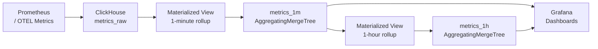

# How to Build a Metrics Aggregation System with ClickHouse

Author: [nawazdhandala](https://www.github.com/nawazdhandala)

Tags: ClickHouse, Metric, Analytics, Aggregation, MergeTree, Monitoring

Description: Learn how to design and build a metrics aggregation system in ClickHouse using MergeTree, materialized views, and pre-aggregation for scalable time series metrics storage.

---

ClickHouse is a natural fit for metrics storage. Its columnar layout, Delta and Gorilla codecs, and AggregatingMergeTree engine can store and aggregate billions of metric data points with sub-second query response times. This guide covers schema design, raw ingestion, rollup aggregation, and query patterns for a production metrics system.

## Architecture



## Raw Metrics Table

```sql
CREATE TABLE metrics_raw
(
    metric_name LowCardinality(String)        CODEC(LZ4),
    labels      Map(String, String)           CODEC(ZSTD(3)),
    value       Float64                       CODEC(Gorilla, LZ4),
    ts          DateTime64(3)                 CODEC(DoubleDelta, LZ4)
)
ENGINE = MergeTree()
PARTITION BY toYYYYMMDD(ts)
ORDER BY (metric_name, ts)
TTL toDateTime(ts) + INTERVAL 7 DAY
SETTINGS index_granularity = 8192;
```

Keep raw data for 7 days and rely on aggregates for longer retention.

## One-Minute Aggregate Table

```sql
CREATE TABLE metrics_1m
(
    metric_name LowCardinality(String),
    labels      Map(String, String),
    minute      DateTime,
    min_val     SimpleAggregateFunction(min,   Float64),
    max_val     SimpleAggregateFunction(max,   Float64),
    sum_val     SimpleAggregateFunction(sum,   Float64),
    count_val   SimpleAggregateFunction(sum,   UInt64)
)
ENGINE = AggregatingMergeTree()
PARTITION BY toYYYYMMDD(minute)
ORDER BY (metric_name, labels, minute)
TTL minute + INTERVAL 30 DAY;
```

## Materialized View: Raw to 1-Minute

```sql
CREATE MATERIALIZED VIEW metrics_raw_to_1m
TO metrics_1m
AS
SELECT
    metric_name,
    labels,
    toStartOfMinute(ts) AS minute,
    min(value)  AS min_val,
    max(value)  AS max_val,
    sum(value)  AS sum_val,
    count()     AS count_val
FROM metrics_raw
GROUP BY metric_name, labels, minute;
```

## One-Hour Aggregate Table and View

```sql
CREATE TABLE metrics_1h
(
    metric_name LowCardinality(String),
    labels      Map(String, String),
    hour        DateTime,
    min_val     SimpleAggregateFunction(min,   Float64),
    max_val     SimpleAggregateFunction(max,   Float64),
    sum_val     SimpleAggregateFunction(sum,   Float64),
    count_val   SimpleAggregateFunction(sum,   UInt64)
)
ENGINE = AggregatingMergeTree()
PARTITION BY toYYYYMM(hour)
ORDER BY (metric_name, labels, hour)
TTL hour + INTERVAL 365 DAY;

CREATE MATERIALIZED VIEW metrics_1m_to_1h
TO metrics_1h
AS
SELECT
    metric_name,
    labels,
    toStartOfHour(minute) AS hour,
    min(min_val)  AS min_val,
    max(max_val)  AS max_val,
    sum(sum_val)  AS sum_val,
    sum(count_val) AS count_val
FROM metrics_1m
GROUP BY metric_name, labels, hour;
```

## Inserting Metrics

```sql
INSERT INTO metrics_raw VALUES
    ('cpu_usage_pct',   {'host': 'web-01', 'region': 'us-east'}, 42.3, now64()),
    ('cpu_usage_pct',   {'host': 'web-02', 'region': 'us-east'}, 38.7, now64()),
    ('memory_usage_mb', {'host': 'web-01', 'region': 'us-east'}, 2048.0, now64());
```

The materialized view fires automatically and populates `metrics_1m`.

## Querying Average CPU Over Last Hour

```sql
SELECT
    toStartOfMinute(minute)   AS t,
    avg(sum_val / count_val)  AS avg_cpu
FROM metrics_1m
WHERE metric_name = 'cpu_usage_pct'
  AND labels['region'] = 'us-east'
  AND minute >= now() - INTERVAL 1 HOUR
GROUP BY t
ORDER BY t;
```

## Querying Max Memory Over Last 24 Hours

```sql
SELECT
    minute,
    labels['host'] AS host,
    max(max_val)   AS peak_memory_mb
FROM metrics_1m
WHERE metric_name = 'memory_usage_mb'
  AND minute >= now() - INTERVAL 24 HOUR
GROUP BY minute, host
ORDER BY minute, host;
```

## Percentile Approximation with Raw Data

For SLA queries that require percentiles, query raw data within a short window:

```sql
SELECT
    labels['host']              AS host,
    quantile(0.50)(value)       AS p50,
    quantile(0.95)(value)       AS p95,
    quantile(0.99)(value)       AS p99
FROM metrics_raw
WHERE metric_name = 'http_response_ms'
  AND ts >= now() - INTERVAL 5 MINUTE
GROUP BY host
ORDER BY host;
```

## Long-Term Trend from Hourly Aggregates

```sql
SELECT
    toDate(hour)       AS day,
    avg(sum_val / count_val) AS avg_cpu
FROM metrics_1h
WHERE metric_name = 'cpu_usage_pct'
  AND hour >= now() - INTERVAL 90 DAY
GROUP BY day
ORDER BY day;
```

## Ingestion Performance Check

```sql
-- Verify ingestion rate
SELECT
    toStartOfMinute(ts) AS minute,
    count()             AS rows_inserted
FROM metrics_raw
WHERE ts >= now() - INTERVAL 10 MINUTE
GROUP BY minute
ORDER BY minute;
```

## Checking Storage Efficiency

```sql
SELECT
    table,
    formatReadableSize(sum(data_compressed_bytes))   AS compressed,
    formatReadableSize(sum(data_uncompressed_bytes)) AS uncompressed,
    round(sum(data_uncompressed_bytes) / sum(data_compressed_bytes), 2) AS ratio
FROM system.parts
WHERE active = 1
  AND database = currentDatabase()
  AND table IN ('metrics_raw', 'metrics_1m', 'metrics_1h')
GROUP BY table
ORDER BY table;
```

## Summary

A ClickHouse metrics aggregation system uses a MergeTree table for raw ingestion with Gorilla codec on float columns, DoubleDelta on timestamps, and cascading materialized views into AggregatingMergeTree rollup tables. Raw data is kept for 7 days, one-minute aggregates for 30 days, and one-hour aggregates for one year. This layered approach keeps storage costs low while serving sub-second queries over any time horizon from minutes to years.
