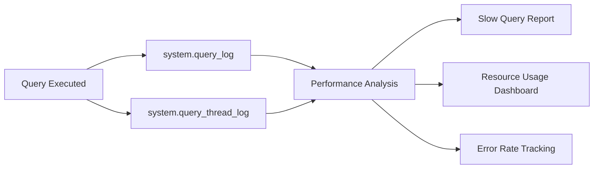
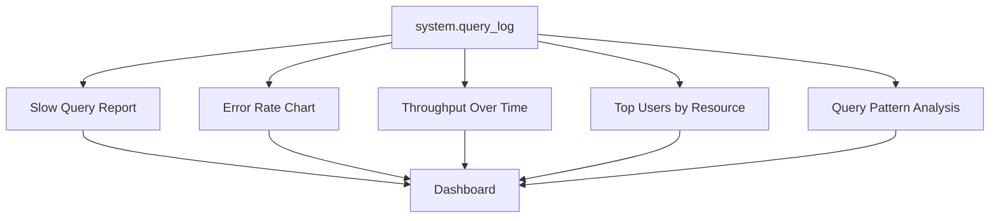

# How to Monitor Database Query Performance with ClickHouse

Author: [oneuptime](https://github.com/oneuptime)

Tags: ClickHouse, Monitoring, Performance, Database, Observability, Query

Description: Learn how to use ClickHouse system tables to monitor query performance, identify slow queries, track resource usage, and build a query performance dashboard.

## Overview

ClickHouse ships with a rich set of system tables that record detailed query execution metadata. You can use these tables to identify slow queries, find resource hogs, track error rates, and build dashboards that give your team full visibility into database performance - all without any external tooling.



## Enabling Query Logging

ClickHouse logs queries to `system.query_log` by default. Verify it is enabled in your configuration.

```xml
<!-- config.xml -->
<query_log>
    <database>system</database>
    <table>query_log</table>
    <flush_interval_milliseconds>7500</flush_interval_milliseconds>
    <max_size_rows>1048576</max_size_rows>
    <reserved_size_rows>8192</reserved_size_rows>
    <buffer_size_rows_flush_threshold>524288</buffer_size_rows_flush_threshold>
    <flush_on_crash>false</flush_on_crash>
    <partition_by>toYYYYMM(event_date)</partition_by>
    <ttl>event_date + INTERVAL 30 DAY DELETE</ttl>
</query_log>
```

You can also control logging per query or per user.

```sql
-- Enable query logging for a specific user
ALTER USER analyst SETTINGS log_queries = 1;

-- Set minimum query duration to log (avoid logging trivial queries)
ALTER USER analyst SETTINGS log_queries_min_duration_ms = 100;
```

## Exploring system.query_log

The `system.query_log` table has a `type` column with values `QueryStart`, `QueryFinish`, `ExceptionBeforeStart`, and `ExceptionWhileProcessing`. Always filter on `type = 'QueryFinish'` for completed queries.

```sql
-- Schema overview
SELECT
    name,
    type
FROM system.columns
WHERE database = 'system'
  AND table = 'query_log'
ORDER BY name;
```

Key columns to know:

```text
query_start_time     - when the query started
query_duration_ms    - total execution time in milliseconds
read_rows            - rows read from storage
read_bytes           - bytes read from storage
memory_usage         - peak memory usage in bytes
query                - the SQL text
user                 - who ran the query
exception            - error message if query failed
type                 - QueryFinish, ExceptionWhileProcessing, etc.
```

## Finding Slow Queries

```sql
-- Top 20 slowest queries in the last 24 hours
SELECT
    query_start_time,
    query_duration_ms,
    formatReadableSize(read_bytes)   AS data_read,
    formatReadableSize(memory_usage) AS memory_used,
    user,
    left(query, 200)                 AS query_preview
FROM system.query_log
WHERE type = 'QueryFinish'
  AND query_start_time >= now() - INTERVAL 24 HOUR
  AND query_duration_ms > 1000
ORDER BY query_duration_ms DESC
LIMIT 20;
```

## Aggregating Query Performance by Pattern

Grouping by a normalized query hash helps identify recurring slow queries even if parameter values differ.

```sql
-- Slowest query patterns (grouped by normalized query)
SELECT
    normalized_query_hash,
    count()                                          AS execution_count,
    avg(query_duration_ms)                           AS avg_duration_ms,
    max(query_duration_ms)                           AS max_duration_ms,
    quantile(0.95)(query_duration_ms)                AS p95_duration_ms,
    sum(read_rows)                                   AS total_rows_read,
    formatReadableSize(sum(read_bytes))              AS total_data_read,
    any(left(query, 300))                            AS sample_query
FROM system.query_log
WHERE type = 'QueryFinish'
  AND query_start_time >= now() - INTERVAL 7 DAY
GROUP BY normalized_query_hash
ORDER BY avg_duration_ms DESC
LIMIT 20;
```

## Tracking Query Volume and Error Rates

```sql
-- Query volume and error rate over time (5-minute buckets)
SELECT
    toStartOfFiveMinutes(query_start_time)           AS period,
    countIf(type = 'QueryFinish')                    AS successful_queries,
    countIf(type = 'ExceptionWhileProcessing')       AS failed_queries,
    round(
        countIf(type = 'ExceptionWhileProcessing') * 100.0
        / count(), 2
    )                                                AS error_rate_pct,
    avg(query_duration_ms)                           AS avg_duration_ms,
    quantile(0.99)(query_duration_ms)                AS p99_duration_ms
FROM system.query_log
WHERE query_start_time >= now() - INTERVAL 6 HOUR
GROUP BY period
ORDER BY period;
```

## Identifying Resource-Intensive Queries

```sql
-- Queries consuming the most memory
SELECT
    user,
    formatReadableSize(max(memory_usage))            AS peak_memory,
    avg(query_duration_ms)                           AS avg_duration_ms,
    count()                                          AS query_count,
    left(any(query), 200)                            AS sample_query
FROM system.query_log
WHERE type = 'QueryFinish'
  AND query_start_time >= now() - INTERVAL 24 HOUR
GROUP BY user, normalized_query_hash
ORDER BY peak_memory DESC
LIMIT 20;

-- Queries reading the most data
SELECT
    formatReadableSize(read_bytes)                   AS data_read,
    read_rows,
    query_duration_ms,
    user,
    left(query, 200)                                 AS query_preview
FROM system.query_log
WHERE type = 'QueryFinish'
  AND query_start_time >= now() - INTERVAL 24 HOUR
ORDER BY read_bytes DESC
LIMIT 20;
```

## Monitoring Active Queries

For real-time monitoring, use `system.processes` to see currently running queries.

```sql
-- Active queries right now
SELECT
    query_id,
    user,
    elapsed,
    formatReadableSize(memory_usage)                 AS memory,
    read_rows,
    read_bytes,
    left(query, 200)                                 AS query_preview
FROM system.processes
ORDER BY elapsed DESC;

-- Kill a specific long-running query
KILL QUERY WHERE query_id = 'abc123-def456';
```

## Building a Performance Dashboard

A useful query performance dashboard should expose the following metrics.

```sql
-- Dashboard query: performance summary for the last hour
SELECT
    count()                                          AS total_queries,
    countIf(type = 'ExceptionWhileProcessing')       AS failed_queries,
    avg(query_duration_ms)                           AS avg_duration_ms,
    quantile(0.50)(query_duration_ms)                AS p50_duration_ms,
    quantile(0.95)(query_duration_ms)                AS p95_duration_ms,
    quantile(0.99)(query_duration_ms)                AS p99_duration_ms,
    formatReadableSize(sum(read_bytes))              AS total_data_read,
    formatReadableSize(max(memory_usage))            AS peak_memory
FROM system.query_log
WHERE query_start_time >= now() - INTERVAL 1 HOUR;
```



## Setting Up Alerts

Export query metrics to your monitoring system to alert on anomalies.

```sql
-- Alert condition: p99 latency over 5 seconds in last 5 minutes
SELECT
    quantile(0.99)(query_duration_ms) AS p99_ms
FROM system.query_log
WHERE type = 'QueryFinish'
  AND query_start_time >= now() - INTERVAL 5 MINUTE
HAVING p99_ms > 5000;
```

You can poll this query from a monitoring script or use Grafana with the ClickHouse data source plugin to visualize and alert.

## Conclusion

ClickHouse's built-in system tables provide everything you need to monitor query performance without additional tooling. By regularly querying `system.query_log` and `system.processes`, you can identify slow queries, track error rates, and understand resource usage patterns across your cluster.

**Related Reading:**

- [How to Build a Log Analytics Platform with ClickHouse](https://oneuptime.com/blog/post/2026-03-31-clickhouse-build-log-analytics-platform/view)
- [How to Build a Real-Time Metrics Dashboard with ClickHouse](https://oneuptime.com/blog/post/2026-03-31-clickhouse-build-real-time-metrics-dashboard/view)
- [ClickHouse vs StarRocks Performance Comparison](https://oneuptime.com/blog/post/2026-03-31-clickhouse-vs-starrocks-performance/view)
