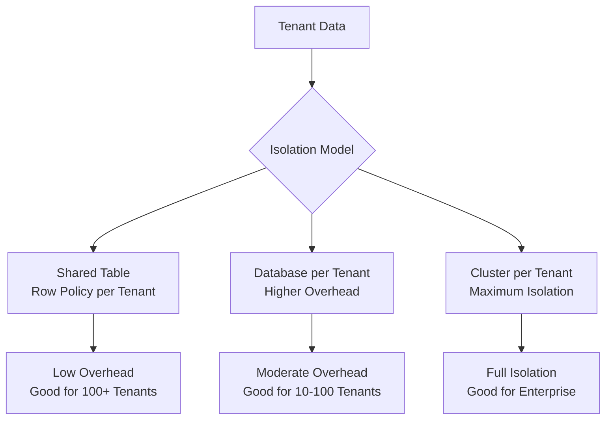

# How to Build a Multi-Tenant Analytics SaaS with ClickHouse

Author: [nawazdhandala](https://www.github.com/nawazdhandala)

Tags: ClickHouse, Multi-Tenant, SaaS, Analytics, Security, Isolation

Description: Learn how to build a multi-tenant analytics SaaS with ClickHouse using shared tables with tenant isolation, row policies, quotas, and per-tenant TTL for cost-efficient data separation.

---

Multi-tenant analytics SaaS platforms must store data from many customers in the same infrastructure while ensuring that each tenant can only access their own data, pay only for their own usage, and have their own retention policies. ClickHouse supports this through row policies, quotas, column-level access control, and TTL expressions that can vary per tenant.

## Architecture Options



For most SaaS products, the shared table model with row policies is the right balance of isolation and operational overhead.

## Shared Events Table with tenant_id

```sql
CREATE TABLE events
(
    tenant_id   UInt32                         CODEC(LZ4),
    event_id    UUID                           CODEC(LZ4),
    user_id     UInt64                         CODEC(LZ4),
    event_name  LowCardinality(String)         CODEC(LZ4),
    properties  Map(String, String)            CODEC(ZSTD(3)),
    ts          DateTime64(3)                  CODEC(DoubleDelta, LZ4)
)
ENGINE = MergeTree()
PARTITION BY (tenant_id, toYYYYMM(ts))
ORDER BY (tenant_id, ts)
TTL toDateTime(ts) + INTERVAL 1 YEAR
SETTINGS index_granularity = 8192;
```

Partitioning by `tenant_id` ensures each tenant's data lands in its own partition, enabling fast partition drops when a tenant cancels and data must be deleted (GDPR right to erasure).

## Tenant Management Table

```sql
CREATE TABLE tenants
(
    tenant_id       UInt32,
    name            String,
    plan            LowCardinality(String),
    retention_days  UInt32,
    created_at      DateTime
)
ENGINE = MergeTree()
ORDER BY tenant_id;
```

## Creating Per-Tenant Users

```sql
-- Create a read-only user for tenant 42
CREATE USER tenant_42_reader
    IDENTIFIED WITH sha256_password BY 'secure-password-here'
    DEFAULT DATABASE analytics;

-- Grant SELECT on the events table
GRANT SELECT ON analytics.events TO tenant_42_reader;
```

## Row Policy for Tenant Isolation

Row policies enforce that a tenant user can only see their own rows:

```sql
CREATE ROW POLICY tenant_42_policy ON analytics.events
    FOR SELECT
    USING tenant_id = 42
    TO tenant_42_reader;
```

Now when `tenant_42_reader` runs:

```sql
SELECT count() FROM analytics.events;
```

ClickHouse automatically appends `AND tenant_id = 42` to all queries, preventing cross-tenant data access.

## Automating Row Policy Creation

For many tenants, generate the DDL programmatically:

```sql
-- View existing row policies
SELECT * FROM system.row_policies;

-- Template for creating policies (run once per new tenant)
CREATE ROW POLICY tenant_{id}_policy ON analytics.events
    FOR SELECT USING tenant_id = {id}
    TO tenant_{id}_reader;
```

## Per-Tenant Quotas

Limit query resource consumption per tenant using ClickHouse quotas:

```sql
CREATE QUOTA tenant_42_quota
    FOR INTERVAL 1 HOUR
        MAX queries = 1000,
        MAX result_rows = 100000000,
        MAX execution_time = 300
    TO tenant_42_reader;
```

This prevents a single tenant from consuming disproportionate query resources.

## Per-Tenant TTL

Different tenants on different plans may have different retention periods. Use conditional TTL:

```sql
ALTER TABLE events
    MODIFY TTL
        toDateTime(ts) + INTERVAL 30 DAY  WHERE tenant_id IN (10, 11, 12), -- free plan
        toDateTime(ts) + INTERVAL 1 YEAR  WHERE tenant_id IN (42, 43),      -- pro plan
        toDateTime(ts) + INTERVAL 3 YEAR;                                   -- default
```

## Dropping a Tenant's Data (GDPR Erasure)

Because data is partitioned by `tenant_id`, deletion is a fast partition drop, not a slow mutation:

```sql
-- Drop all data for tenant 42
ALTER TABLE events
    DROP PARTITION ID 'tenant_42';
```

For non-partition-aligned deletion, use a mutation (slower):

```sql
ALTER TABLE events
    DELETE WHERE tenant_id = 42;
```

Prefer the partition approach for large-scale deletions.

## Per-Tenant Storage Usage

```sql
SELECT
    tenant_id,
    formatReadableSize(sum(data_compressed_bytes))   AS compressed,
    formatReadableSize(sum(data_uncompressed_bytes)) AS uncompressed,
    sum(rows)                                        AS total_rows
FROM system.parts
WHERE active = 1
  AND table = 'events'
  AND database = 'analytics'
GROUP BY tenant_id
ORDER BY compressed DESC;
```

This data feeds tenant billing dashboards -- each tenant is billed proportional to their compressed storage consumption.

## Tenant Activity View

```sql
SELECT
    tenant_id,
    toDate(ts)        AS day,
    count()           AS events,
    uniqExact(user_id) AS active_users
FROM events
WHERE ts >= now() - INTERVAL 30 DAY
GROUP BY tenant_id, day
ORDER BY tenant_id, day;
```

## Materialized View for Per-Tenant Daily Stats

```sql
CREATE TABLE tenant_daily_stats
(
    tenant_id  UInt32,
    day        Date,
    events     SimpleAggregateFunction(sum, UInt64),
    users      AggregateFunction(uniq, UInt64)
)
ENGINE = AggregatingMergeTree()
PARTITION BY toYYYYMM(day)
ORDER BY (tenant_id, day);

CREATE MATERIALIZED VIEW tenant_daily_mv
TO tenant_daily_stats
AS
SELECT
    tenant_id,
    toDate(ts)       AS day,
    count()          AS events,
    uniqState(user_id) AS users
FROM events
GROUP BY tenant_id, day;
```

## Summary

A multi-tenant analytics SaaS on ClickHouse uses a shared table with `tenant_id` as the leading partition and sort key, row policies to enforce tenant data isolation at the database layer, per-tenant quotas to prevent resource abuse, and conditional TTL for plan-based retention. Partition-level data deletion provides fast GDPR-compliant erasure. This model scales to hundreds of tenants on a single ClickHouse cluster with sub-second query performance.
