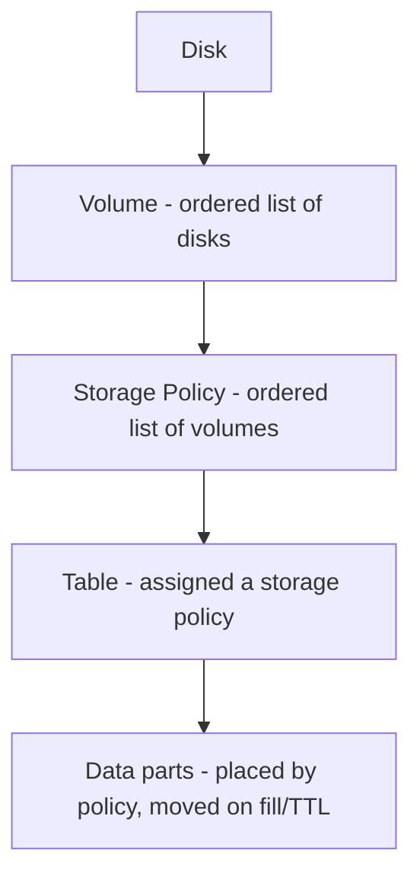

# How to Configure ClickHouse Multiple Disk Volumes

Author: OneUptime Team
Tags: ClickHouse, Configuration, Storage, Disk, Tiering
Description: Learn how to configure multiple disks and storage volumes in ClickHouse using storage_configuration to implement tiered storage and disk policies.

---

ClickHouse's `storage_configuration` block lets you define multiple physical disks and organize them into volumes with movement policies. This is the foundation of tiered storage: hot data on fast NVMe drives, warm data on cheaper HDDs, and cold data on object storage like S3. ClickHouse moves parts between tiers automatically based on age or fill level.

## Core Concepts



- A **Disk** is a single storage location (local path or S3 endpoint).
- A **Volume** is an ordered list of disks. Parts are distributed across disks in a volume using `round_robin` or `least_used`.
- A **Storage Policy** is an ordered list of volumes. Parts move from volume 0 (hot) to volume 1 (warm) to volume 2 (cold) as space fills or TTL rules trigger.

## Defining Disks

```xml
<!-- /etc/clickhouse-server/config.d/storage.xml -->
<clickhouse>
    <storage_configuration>
        <disks>
            <!-- Default local disk -->
            <default>
                <path>/var/lib/clickhouse/</path>
            </default>

            <!-- Fast NVMe disk -->
            <nvme>
                <path>/mnt/nvme/clickhouse/</path>
                <keep_free_space_bytes>10737418240</keep_free_space_bytes>
            </nvme>

            <!-- HDD disk -->
            <hdd>
                <path>/mnt/hdd/clickhouse/</path>
                <keep_free_space_bytes>10737418240</keep_free_space_bytes>
            </hdd>
        </disks>
    </storage_configuration>
</clickhouse>
```

`keep_free_space_bytes` reserves space to prevent a disk from filling completely.

## Defining Volumes and a Policy

```xml
<clickhouse>
    <storage_configuration>
        <disks>
            <nvme>
                <path>/mnt/nvme/clickhouse/</path>
                <keep_free_space_bytes>5368709120</keep_free_space_bytes>
            </nvme>
            <hdd>
                <path>/mnt/hdd/clickhouse/</path>
                <keep_free_space_bytes>5368709120</keep_free_space_bytes>
            </hdd>
        </disks>

        <policies>
            <hot_to_warm>
                <volumes>
                    <hot>
                        <disk>nvme</disk>
                        <!-- Move to next volume when disk is 90% full -->
                        <max_data_part_size_bytes>1073741824</max_data_part_size_bytes>
                    </hot>
                    <warm>
                        <disk>hdd</disk>
                    </warm>
                </volumes>
                <!-- Move to next volume when this fraction of space is used -->
                <move_factor>0.1</move_factor>
            </hot_to_warm>
        </policies>
    </storage_configuration>
</clickhouse>
```

## Assigning a Policy to a Table

```sql
CREATE TABLE events
(
    ts       DateTime,
    user_id  UInt64,
    action   String
)
ENGINE = MergeTree
PARTITION BY toYYYYMM(ts)
ORDER BY (ts, user_id)
SETTINGS storage_policy = 'hot_to_warm';
```

Or change an existing table:

```sql
ALTER TABLE events
MODIFY SETTING storage_policy = 'hot_to_warm';
```

## TTL-Based Automatic Movement

Move partitions to a different volume after a time period:

```sql
ALTER TABLE events
MODIFY TTL ts + INTERVAL 30 DAY TO VOLUME 'warm';
```

This automatically moves parts older than 30 days from the hot NVMe volume to the warm HDD volume without any manual intervention.

## Striped Volumes (JBOD)

Spread data across multiple disks in a single volume for combined capacity:

```xml
<volumes>
    <main>
        <disk>disk1</disk>
        <disk>disk2</disk>
        <disk>disk3</disk>
        <disk>disk4</disk>
    </main>
</volumes>
```

Parts are distributed across disks using the `least_used` strategy by default.

## Viewing Disk Usage

```sql
SELECT
    name,
    path,
    formatReadableSize(free_space) AS free,
    formatReadableSize(total_space) AS total,
    formatReadableSize(total_space - free_space) AS used
FROM system.disks;
```

```sql
-- See which parts are on which disk
SELECT
    table,
    disk_name,
    count() AS parts,
    formatReadableSize(sum(bytes_on_disk)) AS size
FROM system.parts
WHERE active
GROUP BY table, disk_name
ORDER BY table, disk_name;
```

## Summary

Configure multiple disks and volumes in the `<storage_configuration>` block of config.xml. Define policies with ordered volumes to implement hot/warm/cold tiering. Assign policies to tables at creation time or via `ALTER TABLE`. Use TTL rules to automate movement of aging data from fast to cheap storage. Monitor with `system.disks` and `system.parts`.
