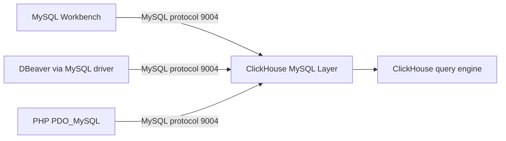

# How to Configure ClickHouse MySQL Protocol Compatibility

Author: OneUptime Team

Tags: ClickHouse, Configuration, MySQL, Protocol, Compatibility

Description: Learn how to enable and configure the ClickHouse MySQL protocol compatibility layer so MySQL clients and tools can connect to ClickHouse.

---

ClickHouse ships with a MySQL-compatible protocol interface. When enabled, tools like MySQL Workbench, DBeaver, Tableau (via MySQL connector), and standard MySQL client libraries can connect to ClickHouse as if it were a MySQL server. This is useful for migration scenarios and for tooling that supports MySQL but not native ClickHouse.

## Enabling the MySQL Interface

```xml
<!-- /etc/clickhouse-server/config.d/mysql-port.xml -->
<clickhouse>
    <mysql_port>9004</mysql_port>
</clickhouse>
```

Restart ClickHouse and verify:

```bash
ss -tlnp | grep 9004
```

## Authentication Requirements

The MySQL protocol in ClickHouse requires `double_sha1_password` authentication. When creating or updating users:

```sql
CREATE USER mysql_user
    IDENTIFIED WITH double_sha1_password BY 'mypassword';

GRANT SELECT, INSERT ON my_database.* TO mysql_user;
```

If you use SHA256 passwords (the default), MySQL clients cannot authenticate. This is a protocol limitation.

## Connecting with the MySQL CLI

```bash
mysql \
  --host=clickhouse.example.com \
  --port=9004 \
  --user=mysql_user \
  --password=mypassword \
  --database=default
```

## Connecting from Python with mysql-connector

```python
import mysql.connector

conn = mysql.connector.connect(
    host="clickhouse.example.com",
    port=9004,
    user="mysql_user",
    password="mypassword",
    database="default",
)

cursor = conn.cursor()
cursor.execute("SELECT count() FROM events WHERE ts >= today() - 1")
for row in cursor.fetchall():
    print(row)

conn.close()
```

## Supported SQL Features

The MySQL interface supports a subset of MySQL-compatible SQL. ClickHouse implements enough of the MySQL protocol for basic SELECT/INSERT/SHOW queries:

```sql
-- Supported
SHOW DATABASES;
SHOW TABLES;
SHOW CREATE TABLE my_table;
SELECT * FROM my_table LIMIT 10;
INSERT INTO my_table VALUES (...);
DESCRIBE my_table;

-- Not supported
CREATE INDEX ...
ALTER TABLE ... ADD INDEX ...
TRANSACTION / COMMIT / ROLLBACK
```

## Connecting DBeaver

1. Add a new connection in DBeaver.
2. Select `MySQL` as the driver.
3. Host: your ClickHouse host.
4. Port: `9004`.
5. Database: your ClickHouse database.
6. Username: a user with `double_sha1_password`.
7. Password: the user's password.

## Architecture



## Known Limitations

| Feature | Status |
|---|---|
| Transactions | Not supported |
| Stored procedures | Not supported |
| MySQL-specific functions | Partial - common ones work |
| `AUTO_INCREMENT` | Not supported |
| Foreign keys | Not supported |
| ClickHouse-specific syntax | Available via MySQL connection |
| `GROUP BY` without aggregates | Behaves like ClickHouse, not MySQL |

## Monitoring MySQL Connections

```sql
SELECT *
FROM system.processes
WHERE interface = 'MySQL';
```

## Security Considerations

- The MySQL port uses the same ClickHouse access control (users.xml / SQL-based RBAC).
- Restrict port 9004 to trusted hosts using firewall rules.
- Do not expose it to the public internet.

```bash
ufw allow from 10.0.0.0/8 to any port 9004 proto tcp
```

## Summary

Enable ClickHouse's MySQL protocol interface with `mysql_port` in config.xml. Create users with `double_sha1_password` to satisfy the protocol's authentication requirements. Use this interface for MySQL-compatible clients, BI tools, and migration scenarios. Be aware of feature limitations and prefer the native TCP or HTTP interfaces for production ClickHouse-aware applications.
