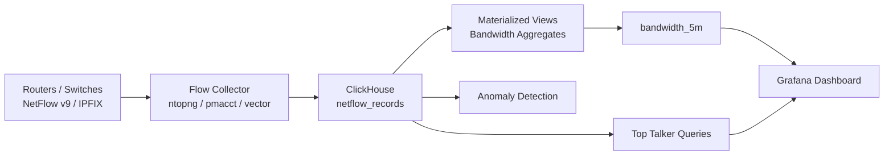

# How to Use ClickHouse for Network Traffic Analysis

Author: [nawazdhandala](https://www.github.com/nawazdhandala)

Tags: ClickHouse, Network, Analytics, NetFlow, Traffic, Security

Description: Learn how to use ClickHouse for network traffic analysis with NetFlow and sFlow ingestion, top talker queries, anomaly detection, and bandwidth utilization reports.

---

Network traffic analysis requires storing and querying billions of flow records to identify top talkers, detect anomalies, and correlate traffic with security events. ClickHouse's columnar storage and fast aggregations handle NetFlow and sFlow data at line rate, turning raw flow records into operational insights.

## Architecture



## NetFlow Records Table

```sql
CREATE TABLE netflow_records
(
    sampler_ip       IPv4                           CODEC(LZ4),
    src_ip           IPv4                           CODEC(LZ4),
    dst_ip           IPv4                           CODEC(LZ4),
    src_port         UInt16                         CODEC(LZ4),
    dst_port         UInt16                         CODEC(LZ4),
    protocol         UInt8                          CODEC(LZ4),
    src_as           UInt32                         CODEC(LZ4),
    dst_as           UInt32                         CODEC(LZ4),
    in_iface         UInt32                         CODEC(LZ4),
    out_iface        UInt32                         CODEC(LZ4),
    bytes            UInt64                         CODEC(Delta(8), LZ4),
    packets          UInt64                         CODEC(Delta(8), LZ4),
    flow_start       DateTime                       CODEC(DoubleDelta, LZ4),
    flow_end         DateTime                       CODEC(DoubleDelta, LZ4),
    tcp_flags        UInt8                          CODEC(LZ4),
    tos              UInt8                          CODEC(LZ4),
    direction        LowCardinality(String)         CODEC(LZ4)
)
ENGINE = MergeTree()
PARTITION BY toYYYYMMDD(flow_start)
ORDER BY (sampler_ip, flow_start, src_ip, dst_ip)
TTL flow_start + INTERVAL 90 DAY
SETTINGS index_granularity = 8192;
```

Using `IPv4` type instead of String saves 3 bytes per address and allows efficient CIDR filtering with `isIPAddressInRange`.

## Inserting Flow Records

Flow data is typically ingested via a collector that writes to ClickHouse over HTTP:

```bash
curl -X POST 'http://localhost:8123/?query=INSERT+INTO+netflow_records+FORMAT+JSONEachRow' \
  --data-binary '{"sampler_ip":"10.0.0.1","src_ip":"192.168.1.10","dst_ip":"8.8.8.8","src_port":54321,"dst_port":443,"protocol":6,"bytes":15360,"packets":12,"flow_start":"2024-01-15 10:00:00","flow_end":"2024-01-15 10:00:05","tcp_flags":24,"tos":0,"direction":"egress"}'
```

## Top Source IP Addresses by Bytes (Last Hour)

```sql
SELECT
    src_ip,
    sum(bytes)   AS total_bytes,
    sum(packets) AS total_packets,
    formatReadableSize(total_bytes) AS human_bytes
FROM netflow_records
WHERE flow_start >= now() - INTERVAL 1 HOUR
GROUP BY src_ip
ORDER BY total_bytes DESC
LIMIT 20;
```

## Top Destination Ports (Protocol Distribution)

```sql
SELECT
    dst_port,
    protocol,
    count()      AS flows,
    sum(bytes)   AS total_bytes
FROM netflow_records
WHERE flow_start >= now() - INTERVAL 1 HOUR
GROUP BY dst_port, protocol
ORDER BY total_bytes DESC
LIMIT 20;
```

## Bandwidth Utilization by Interface Over Time

```sql
SELECT
    toStartOfFiveMinutes(flow_start) AS window,
    in_iface,
    sum(bytes) * 8 / 300             AS avg_bps  -- bits per second over 5-min window
FROM netflow_records
WHERE flow_start >= now() - INTERVAL 24 HOUR
GROUP BY window, in_iface
ORDER BY window, in_iface;
```

## CIDR-Based Filtering (Internal vs External Traffic)

```sql
-- Traffic leaving the internal network
SELECT
    src_ip,
    dst_ip,
    sum(bytes) AS bytes_out
FROM netflow_records
WHERE flow_start >= now() - INTERVAL 1 HOUR
  AND isIPAddressInRange(src_ip, '10.0.0.0/8')
  AND NOT isIPAddressInRange(dst_ip, '10.0.0.0/8')
GROUP BY src_ip, dst_ip
ORDER BY bytes_out DESC
LIMIT 20;
```

## Top Talker Pairs (src_ip + dst_ip)

```sql
SELECT
    src_ip,
    dst_ip,
    sum(bytes)   AS total_bytes,
    count()      AS flow_count,
    formatReadableSize(total_bytes) AS human_bytes
FROM netflow_records
WHERE flow_start >= now() - INTERVAL 24 HOUR
GROUP BY src_ip, dst_ip
ORDER BY total_bytes DESC
LIMIT 20;
```

## Anomaly Detection: Traffic Spikes

Compare the last 5 minutes to the average of the prior hour to detect sudden spikes:

```sql
WITH
    recent AS (
        SELECT sum(bytes) AS bytes_5m
        FROM netflow_records
        WHERE flow_start >= now() - INTERVAL 5 MINUTE
    ),
    baseline AS (
        SELECT avg(interval_bytes) AS avg_bytes_per_5m
        FROM (
            SELECT
                toStartOfFiveMinutes(flow_start) AS w,
                sum(bytes) AS interval_bytes
            FROM netflow_records
            WHERE flow_start BETWEEN now() - INTERVAL 1 HOUR AND now() - INTERVAL 5 MINUTE
            GROUP BY w
        )
    )
SELECT
    r.bytes_5m,
    b.avg_bytes_per_5m,
    round(r.bytes_5m / b.avg_bytes_per_5m, 2) AS spike_ratio
FROM recent r
CROSS JOIN baseline b;
```

A `spike_ratio` above 3 indicates an unusual traffic event worth investigating.

## Port Scan Detection

```sql
SELECT
    src_ip,
    count(DISTINCT dst_port) AS distinct_ports_contacted,
    count()                   AS total_flows
FROM netflow_records
WHERE flow_start >= now() - INTERVAL 10 MINUTE
  AND protocol = 6  -- TCP
GROUP BY src_ip
HAVING distinct_ports_contacted > 100
ORDER BY distinct_ports_contacted DESC;
```

## Pre-Aggregated Bandwidth View

```sql
CREATE TABLE bandwidth_5m
(
    window      DateTime,
    direction   LowCardinality(String),
    protocol    UInt8,
    bytes       SimpleAggregateFunction(sum, UInt64),
    packets     SimpleAggregateFunction(sum, UInt64),
    flows       SimpleAggregateFunction(sum, UInt64)
)
ENGINE = AggregatingMergeTree()
PARTITION BY toYYYYMMDD(window)
ORDER BY (window, direction, protocol)
TTL window + INTERVAL 1 YEAR;

CREATE MATERIALIZED VIEW bandwidth_5m_mv
TO bandwidth_5m
AS
SELECT
    toStartOfFiveMinutes(flow_start) AS window,
    direction,
    protocol,
    sum(bytes)   AS bytes,
    sum(packets) AS packets,
    count()      AS flows
FROM netflow_records
GROUP BY window, direction, protocol;
```

## Querying Bandwidth Trends (Last 7 Days)

```sql
SELECT
    window,
    direction,
    sum(bytes) * 8 / 300 AS avg_bps
FROM bandwidth_5m
WHERE window >= now() - INTERVAL 7 DAY
GROUP BY window, direction
ORDER BY window;
```

## Summary

ClickHouse handles NetFlow and sFlow data efficiently using the `IPv4` type for compact IP storage, `Delta` codec on byte and packet counters, and `DoubleDelta` on flow timestamps. Top-talker queries, CIDR-range filters with `isIPAddressInRange`, and 5-minute bandwidth aggregation materialized views deliver operational network visibility. Spike detection queries comparing recent windows to rolling baselines provide lightweight anomaly alerting without additional infrastructure.
