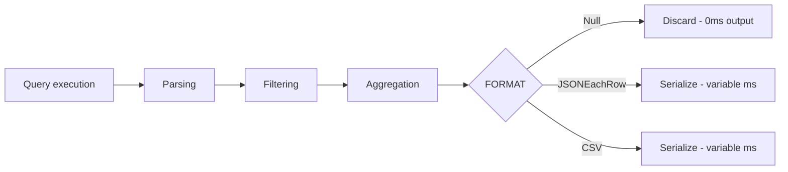

# How to Use Null Format in ClickHouse for Discard Output

Author: OneUptime Team

Tags: ClickHouse, Format, Null, Benchmarking, Performance

Description: Learn how ClickHouse's Null format discards all output, making it ideal for benchmarking query execution speed without I/O overhead.

---

The `Null` format in ClickHouse reads and discards all data without serializing it. Using `FORMAT Null` on a SELECT query executes the full query pipeline - parsing, filtering, aggregation - but skips all output serialization. This makes it the ideal tool for benchmarking pure query performance.

## Why Null Format Exists

When benchmarking ClickHouse queries, output serialization can dominate the total time for large result sets. By using `FORMAT Null` you isolate execution time from I/O time.



## Basic Usage

```sql
SELECT count(), sum(revenue), avg(latency_ms)
FROM events
WHERE ts >= today() - 30
FORMAT Null;
```

The query runs fully but produces no output. The `clickhouse-client` still shows query statistics:

```text
0 rows in set. Elapsed: 0.342 sec. Processed 192.03 million rows, 1.54 GB (561.49 million rows/s., 4.50 GB/s.)
```

## Benchmarking with Null Format

Compare the same query with and without output to understand serialization overhead:

```bash
# With Null - pure execution time
time clickhouse-client \
  --query "SELECT user_id, sum(revenue) FROM orders GROUP BY user_id FORMAT Null"

# With CSV - execution + serialization time
time clickhouse-client \
  --query "SELECT user_id, sum(revenue) FROM orders GROUP BY user_id FORMAT CSV" \
  > /dev/null
```

## Using clickhouse-benchmark with Null

`clickhouse-benchmark` uses `Null` format internally. You can also run custom scripts:

```bash
clickhouse-benchmark \
  --concurrency=4 \
  --iterations=100 \
  --query "SELECT user_id, count() FROM events WHERE ts >= today() - 7 GROUP BY user_id FORMAT Null"
```

## Testing Query Plan Without Output

Use `Null` to test that a query compiles and executes correctly without scrolling through millions of rows:

```sql
-- Verify the query runs without error
SELECT
    toStartOfHour(ts) AS hour,
    browser,
    sum(page_views) AS views,
    uniqExact(user_id) AS unique_users
FROM web_analytics
WHERE ts BETWEEN '2024-01-01' AND '2024-01-31'
GROUP BY hour, browser
ORDER BY hour, views DESC
FORMAT Null;
```

## INSERT INTO ... FORMAT Null

You can also use `Null` as an input format for INSERT, which discards all input data:

```sql
INSERT INTO discard_table FORMAT Null;
```

This is useful when testing the INSERT pipeline overhead without actually storing data.

## system.query_log Analysis After Null Queries

After running with `FORMAT Null`, check `system.query_log` for detailed execution metrics:

```sql
SELECT
    query_duration_ms,
    read_rows,
    read_bytes,
    memory_usage,
    query
FROM system.query_log
WHERE type = 'QueryFinish'
  AND query ILIKE '%FORMAT Null%'
ORDER BY event_time DESC
LIMIT 10;
```

## Combining with EXPLAIN for Query Analysis

```sql
EXPLAIN PIPELINE
SELECT user_id, sum(revenue)
FROM orders
GROUP BY user_id
FORMAT Null;
```

This prints the execution pipeline without running the query.

## Null vs /dev/null Redirect

| Method | Skips serialization | Shows query stats | Works over HTTP |
|---|---|---|---|
| `FORMAT Null` | Yes | Yes | Yes |
| `> /dev/null` | No | Yes | No |

`FORMAT Null` is superior because ClickHouse skips block serialization entirely, not just the terminal write.

## Summary

Use `FORMAT Null` to benchmark ClickHouse query execution time in isolation from output serialization overhead. It is the correct tool for performance profiling, pipeline testing, and any scenario where you want to drive the full execution path without generating output. Check `system.query_log` after each run to capture detailed timing and resource metrics.
