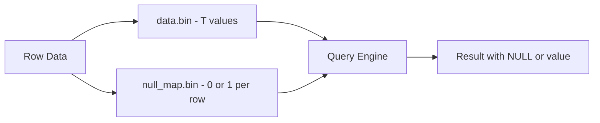
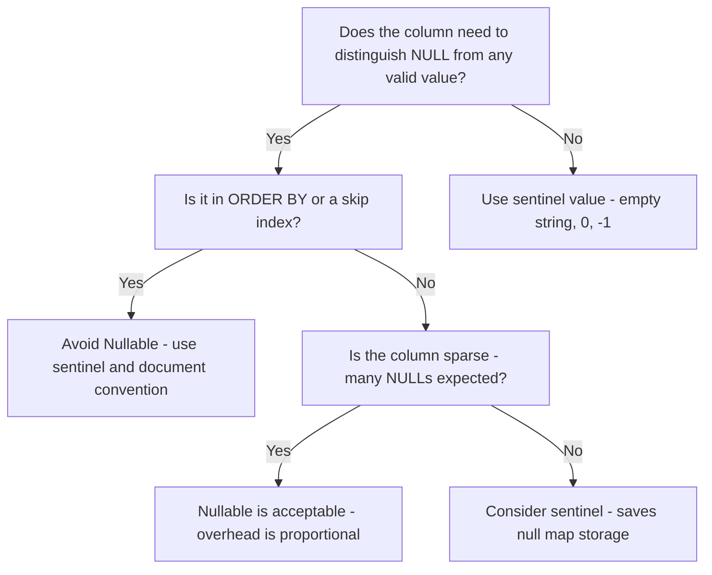

# How to Use Nullable Columns Efficiently in ClickHouse

Author: [nawazdhandala](https://www.github.com/nawazdhandala)

Tags: ClickHouse, SQL, Nullable, Performance, Schema Design

Description: Learn how to use Nullable columns efficiently in ClickHouse, understand their performance overhead, and know when to use sentinel values instead for optimal query speed.

---

`Nullable(T)` in ClickHouse wraps any base type so that a column can store SQL NULL alongside regular values. While convenient, Nullable columns carry a storage and performance cost that accumulates quickly at scale. Understanding how ClickHouse implements Nullable internally will help you decide when to use it and when a sentinel value is the better choice.

## How ClickHouse Stores Nullable Values

Every `Nullable(T)` column is stored as two on-disk files: the data file for the underlying type `T` and a separate null map file (one byte per row). This doubles the number of file handles per column and means every read must consult the null map before returning a value.



## Schema Example

```sql
-- Nullable column - flexible but carries overhead
CREATE TABLE events
(
    event_id    UInt64,
    event_time  DateTime,
    user_id     Nullable(UInt64),   -- can be NULL for anonymous users
    duration_ms Nullable(Float64),  -- can be NULL if not measured
    region      Nullable(String)    -- can be NULL if unknown
)
ENGINE = MergeTree()
ORDER BY (event_time, event_id);
```

## Querying Nullable Columns

NULL comparisons require `isNull()` / `isNotNull()` or `IS NULL` / `IS NOT NULL`. Equality operators do not match NULL.

```sql
-- Correct: use isNull() to find missing values
SELECT count() FROM events WHERE isNull(user_id);

-- Correct: filter out NULLs before aggregating
SELECT avg(duration_ms) FROM events WHERE isNotNull(duration_ms);

-- Use ifNull to substitute a default
SELECT
    event_id,
    ifNull(region, 'unknown') AS region_label
FROM events;

-- Use coalesce for multiple fallbacks
SELECT
    event_id,
    coalesce(region, 'unknown') AS region_safe
FROM events;
```

## Performance Impact: Benchmark Comparison

Nullable columns are excluded from primary key and skip index optimization paths in several cases. Avoid them in ORDER BY keys.

```sql
-- Slower: Nullable column in filter
SELECT count() FROM events WHERE user_id = 42;

-- Faster: Non-nullable equivalent with sentinel
CREATE TABLE events_fast
(
    event_id    UInt64,
    event_time  DateTime,
    user_id     UInt64   DEFAULT 0,  -- 0 means anonymous
    duration_ms Float64  DEFAULT -1, -- -1 means not measured
    region      String   DEFAULT ''  -- empty means unknown
)
ENGINE = MergeTree()
ORDER BY (event_time, event_id);

SELECT count() FROM events_fast WHERE user_id = 42;
```

## When Nullable Is Worth It

```sql
-- Good use case: sparse optional metadata where NULL is semantically distinct from any value
CREATE TABLE sensor_readings
(
    sensor_id    UInt32,
    read_time    DateTime,
    temperature  Float32,
    humidity     Nullable(Float32),  -- sensor may not have humidity probe
    battery_pct  Nullable(UInt8)     -- not all sensors report battery
)
ENGINE = MergeTree()
ORDER BY (sensor_id, read_time);

-- Query: find sensors that never report humidity
SELECT DISTINCT sensor_id
FROM sensor_readings
GROUP BY sensor_id
HAVING countIf(isNotNull(humidity)) = 0;
```

## Aggregation and NULL Propagation

ClickHouse aggregate functions ignore NULL values, matching SQL standard behavior.

```sql
-- avg(), sum(), min(), max() all skip NULLs automatically
SELECT
    avg(duration_ms)    AS avg_duration,   -- NULLs excluded from avg
    sum(duration_ms)    AS total_duration, -- NULLs treated as 0 in sum
    count(duration_ms)  AS non_null_count, -- counts only non-NULL rows
    count()             AS all_rows
FROM events;
```

## Materialized Columns as a Bridge

If source data has NULLs but you want fast non-nullable queries, use a materialized column.

```sql
ALTER TABLE events
    ADD COLUMN region_safe String
    MATERIALIZED ifNull(region, 'unknown');

-- Rebuild materialized values for existing rows
ALTER TABLE events UPDATE region_safe = ifNull(region, 'unknown') WHERE 1;

-- Now query the materialized column, which is non-nullable and indexable
SELECT count(), region_safe
FROM events
GROUP BY region_safe
ORDER BY count() DESC;
```

## ARRAY JOIN and Nullable

`ARRAY JOIN` does not expand NULL arrays. Ensure arrays are not Nullable if you rely on ARRAY JOIN to produce rows.

```sql
-- This works: non-nullable array
SELECT event_id, tag
FROM events
ARRAY JOIN tags AS tag;

-- Use assumeNotNull() when you must work with Nullable arrays
SELECT event_id, tag
FROM events
ARRAY JOIN assumeNotNull(nullable_tags) AS tag;
```

## Decision Flowchart



## Summary

`Nullable(T)` in ClickHouse stores an extra null-map file alongside the data file, adding I/O overhead on every read and disqualifying the column from certain index optimizations. Use Nullable when NULL is semantically distinct from any valid value and the column is not part of your sort key or skip index. For high-frequency filter columns, replace Nullable with a non-nullable type and a documented sentinel value such as `0`, `''`, or `-1`. Where you must store Nullable but want fast queries, add a non-nullable materialized column derived with `ifNull()` and query that instead.
