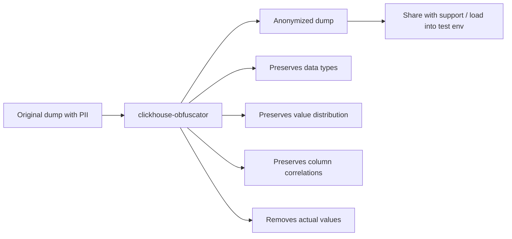

# How to Use clickhouse-obfuscator for Data Anonymization

Author: [nawazdhandala](https://www.github.com/nawazdhandala)

Tags: ClickHouse, Data Anonymization, Privacy, CLI, GDPR, Developer Tools

Description: Use clickhouse-obfuscator to anonymize ClickHouse table dumps by replacing sensitive values with statistically similar but fake data, safe for sharing with support or testing.

---

## Introduction

`clickhouse-obfuscator` is a tool that takes ClickHouse data dumps and replaces sensitive values with statistically similar but anonymized values. String columns are replaced with strings of the same length and character distribution. Numeric columns are replaced with values in a similar range. The result looks like real data but contains no actual PII, making it safe to share with the ClickHouse support team or use in test environments.

## How Obfuscation Works



## Installation

`clickhouse-obfuscator` ships with ClickHouse:

```bash
which clickhouse-obfuscator
# /usr/bin/clickhouse-obfuscator

# Or via unified binary
clickhouse obfuscator --help
```

## Basic Workflow

**Step 1: Export a table dump**

```bash
clickhouse-client \
    --query "SELECT * FROM orders FORMAT Native" \
    > /tmp/orders.native
```

**Step 2: Obfuscate the dump**

```bash
clickhouse-obfuscator \
    --input-format Native \
    --output-format Native \
    --seed 42 \
    --table orders \
    < /tmp/orders.native \
    > /tmp/orders_obfuscated.native
```

**Step 3: Load into a test server**

```bash
clickhouse-client \
    --query "INSERT INTO orders FORMAT Native" \
    < /tmp/orders_obfuscated.native
```

## Obfuscating Multiple Tables

```bash
for table in orders customers events; do
    clickhouse-client \
        --query "SELECT * FROM $table FORMAT Native" \
        > /tmp/${table}.native

    clickhouse-obfuscator \
        --input-format Native \
        --output-format Native \
        --seed 12345 \
        --table $table \
        < /tmp/${table}.native \
        > /tmp/${table}_obfuscated.native

    echo "Obfuscated $table"
done
```

## Obfuscating TSV Data

```bash
# Export as TSV
clickhouse-client \
    --query "
        SELECT
            order_id,
            customer_email,
            amount,
            order_date
        FROM orders
        FORMAT TSV
    " > /tmp/orders.tsv

# Obfuscate TSV
clickhouse-obfuscator \
    --input-format TSV \
    --output-format TSV \
    --seed 42 \
    --structure "order_id UInt64, customer_email String, amount Float64, order_date Date" \
    < /tmp/orders.tsv \
    > /tmp/orders_obfuscated.tsv
```

## Key Obfuscation Behaviors

| Column Type | Obfuscation Behavior |
|---|---|
| `String` | Random string of same byte length, same character class |
| `UInt*` / `Int*` | Random value in similar numeric range |
| `Float*` | Random value with similar magnitude |
| `Date` / `DateTime` | Random date in similar range |
| `Enum` | Random valid enum value |
| `LowCardinality(String)` | Random value from same set |
| `FixedString(N)` | Random N-byte string |
| `UUID` | Random UUID |
| `IPv4` / `IPv6` | Random IP address |

## Preserving Seed Consistency

Use the same `--seed` value to produce the same obfuscated output from the same input. This ensures that if you share an obfuscated dump and a colleague re-runs obfuscation, they get the same results:

```bash
clickhouse-obfuscator \
    --seed 999 \
    --input-format Native \
    --output-format Native \
    < orders.native \
    > orders_anon.native
```

## Obfuscating Specific Columns Only

To keep some columns as-is (e.g., non-sensitive numeric IDs) while obfuscating others, export only the sensitive columns and obfuscate them:

```bash
clickhouse-client \
    --query "
        SELECT
            order_id,          -- keep as-is
            customer_email,    -- will be obfuscated
            customer_phone     -- will be obfuscated
        FROM orders
        FORMAT Native
    " | clickhouse-obfuscator \
        --input-format Native \
        --output-format Native \
        --structure "order_id UInt64, customer_email String, customer_phone String" \
        > /tmp/sensitive_columns_anon.native
```

## Verifying Obfuscation

Check that emails no longer appear in the output:

```bash
clickhouse-client \
    --query "SELECT customer_email FROM orders FORMAT TSV" \
    > /tmp/original_emails.txt

clickhouse-obfuscator \
    --input-format TSV \
    --output-format TSV \
    --seed 42 \
    --structure "customer_email String" \
    < /tmp/original_emails.txt \
    > /tmp/obfuscated_emails.txt

# Verify no original email appears in the obfuscated output
grep -f /tmp/original_emails.txt /tmp/obfuscated_emails.txt | wc -l
# Expected: 0
```

## GDPR Use Cases

- **Test environment seeding**: populate a staging ClickHouse with production-scale data shapes without PII.
- **Support tickets**: share reproducible data dumps with the ClickHouse team without exposing customer data.
- **Developer datasets**: give developers a realistic dataset that matches production cardinality and distribution.

## Summary

`clickhouse-obfuscator` takes ClickHouse data in Native or TSV format and produces an anonymized version where string values are replaced by random strings of the same length, numeric values are replaced by values of similar magnitude, and dates are shifted. The statistical shape of the data is preserved but all actual values are replaced. Use it to safely share data with support teams, create test datasets from production dumps, and comply with data minimization requirements.
