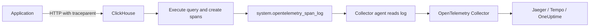

# How to Configure ClickHouse OpenTelemetry Settings

Author: OneUptime Team

Tags: ClickHouse, Configuration, OpenTelemetry, Tracing, Observability

Description: Learn how to configure ClickHouse's built-in OpenTelemetry trace context propagation and the opentelemetry_span_log for distributed tracing.

---

ClickHouse has built-in support for OpenTelemetry trace context propagation. It can receive trace context from incoming requests, create spans for query execution, and export those spans to the `system.opentelemetry_span_log` table. This enables end-to-end distributed tracing across your application and ClickHouse queries.

## How ClickHouse Handles OpenTelemetry

ClickHouse does not act as an OpenTelemetry exporter to a collector directly. Instead, it:

1. Accepts `traceparent` headers on HTTP requests (W3C trace context).
2. Propagates trace context through distributed queries.
3. Writes span data to `system.opentelemetry_span_log`.

You read spans from `system.opentelemetry_span_log` and forward them to your collector.



## Configuring opentelemetry_span_log

Enable span logging in config.xml:

```xml
<!-- /etc/clickhouse-server/config.d/opentelemetry.xml -->
<clickhouse>
    <opentelemetry_span_log>
        <database>system</database>
        <table>opentelemetry_span_log</table>
        <flush_interval_milliseconds>7500</flush_interval_milliseconds>
        <max_size_rows>1048576</max_size_rows>
        <reserved_size_rows>8192</reserved_size_rows>
        <ttl>event_date + INTERVAL 3 DAY</ttl>
    </opentelemetry_span_log>
</clickhouse>
```

## Enabling Trace Context Propagation

ClickHouse reads the W3C `traceparent` header from HTTP requests automatically. No additional configuration is needed. For native TCP connections, pass the trace context in query settings:

```sql
SET opentelemetry_tracestate = 'vendorname=value';
SET opentelemetry_traceparent = '00-4bf92f3577b34da6a3ce929d0e0e4736-00f067aa0ba902b7-01';
SELECT count() FROM events;
```

## Sending Requests with Trace Context via HTTP

```bash
curl -s \
  -H "traceparent: 00-4bf92f3577b34da6a3ce929d0e0e4736-00f067aa0ba902b7-01" \
  "http://localhost:8123/?query=SELECT+count()+FROM+events"
```

ClickHouse will create a child span for this query with the parent trace ID `4bf92f3577b34da6a3ce929d0e0e4736`.

## Reading Spans from system.opentelemetry_span_log

```sql
SELECT
    trace_id,
    span_id,
    parent_span_id,
    operation_name,
    start_time_us,
    finish_time_us,
    (finish_time_us - start_time_us) / 1000 AS duration_ms,
    attribute
FROM system.opentelemetry_span_log
WHERE event_time >= now() - INTERVAL 1 HOUR
ORDER BY start_time_us DESC
LIMIT 20;
```

## Exporting Spans to a Collector

Use a Vector or Fluent Bit pipeline to read from `system.opentelemetry_span_log` and forward to an OpenTelemetry Collector:

```yaml
# vector.yaml - read ClickHouse spans and forward to OTLP
sources:
  clickhouse_spans:
    type: clickhouse
    endpoint: "http://localhost:8123"
    query: |
      SELECT
        trace_id,
        span_id,
        parent_span_id,
        operation_name,
        start_time_us,
        finish_time_us,
        attribute
      FROM system.opentelemetry_span_log
      WHERE event_time >= now() - INTERVAL 1 MINUTE
      FORMAT JSONEachRow

sinks:
  otlp_collector:
    type: http
    uri: "http://otel-collector:4318/v1/traces"
    encoding:
      codec: json
```

## opentelemetry_start_trace_probability

You can configure ClickHouse to start new root spans for a percentage of queries even when no incoming trace context is present:

```xml
<clickhouse>
    <opentelemetry_start_trace_probability>0.01</opentelemetry_start_trace_probability>
</clickhouse>
```

A value of `0.01` means 1% of queries get a new trace started. This is useful for sampling background query performance without instrumenting every client.

## Span Attributes

ClickHouse spans include attributes such as:

| Attribute | Description |
|---|---|
| `db.system` | `clickhouse` |
| `db.statement` | The SQL query text |
| `db.user` | Authenticated user |
| `net.peer.ip` | Client IP address |
| `clickhouse.read_rows` | Rows read during query |
| `clickhouse.written_rows` | Rows written |

## Summary

ClickHouse propagates OpenTelemetry trace context from HTTP `traceparent` headers and writes spans to `system.opentelemetry_span_log`. Configure the span log with an appropriate TTL and flush interval. Use Vector, Fluent Bit, or a custom agent to forward spans from the log table to your OpenTelemetry Collector. Set `opentelemetry_start_trace_probability` to sample untraced background queries.
