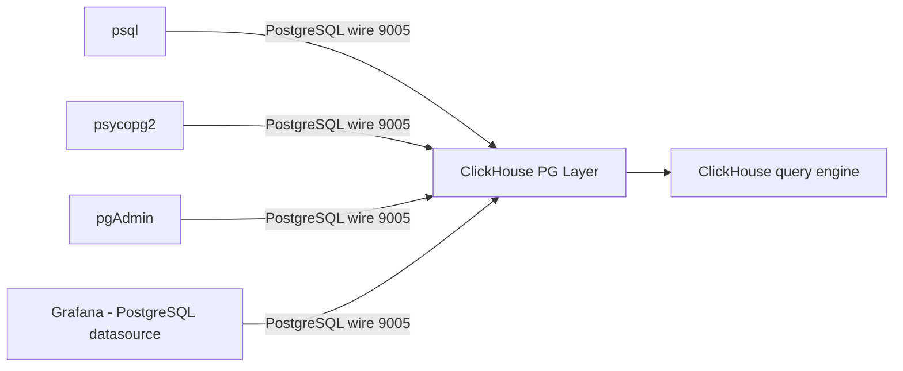

# How to Configure ClickHouse PostgreSQL Protocol Compatibility

Author: [nawazdhandala](https://www.github.com/nawazdhandala)

Tags: ClickHouse, Configuration, PostgreSQL, Protocol, Compatibility

Description: Learn how to enable and configure the ClickHouse PostgreSQL protocol interface so psql and PostgreSQL clients can connect to ClickHouse.

---

ClickHouse includes a PostgreSQL wire protocol interface. When enabled, tools like `psql`, pgAdmin, and PostgreSQL-based drivers can connect to ClickHouse as if it were a PostgreSQL server. This is valuable for integrating ClickHouse into stacks that already use PostgreSQL tooling without requiring driver changes.

## Enabling the PostgreSQL Interface

```xml
<!-- /etc/clickhouse-server/config.d/postgresql-port.xml -->
<clickhouse>
    <postgresql_port>9005</postgresql_port>
</clickhouse>
```

Restart ClickHouse and verify:

```bash
ss -tlnp | grep 9005
```

## Connecting with psql

```bash
psql \
  --host=clickhouse.example.com \
  --port=9005 \
  --user=default \
  --dbname=default
```

ClickHouse accepts the PostgreSQL wire protocol handshake and responds with compatible protocol messages.

## Authentication

The PostgreSQL interface uses the same users as the rest of ClickHouse. No special password type is needed (unlike the MySQL interface which requires `double_sha1_password`). SHA256 passwords work fine.

```sql
CREATE USER pg_user IDENTIFIED BY 'mypassword';
GRANT SELECT ON my_database.* TO pg_user;
```

## Connecting from Python with psycopg2

```python
import psycopg2

conn = psycopg2.connect(
    host="clickhouse.example.com",
    port=9005,
    user="default",
    password="mypassword",
    database="default",
)

cur = conn.cursor()
cur.execute("SELECT count() FROM events WHERE ts >= today() - 1")
print(cur.fetchone())
conn.close()
```

## Connecting from Node.js with pg

```javascript
const { Client } = require('pg');

const client = new Client({
    host: 'clickhouse.example.com',
    port: 9005,
    user: 'default',
    password: 'mypassword',
    database: 'default',
});

await client.connect();
const res = await client.query('SELECT count() FROM events LIMIT 1');
console.log(res.rows[0]);
await client.end();
```

## Architecture



## Using Grafana with the PostgreSQL Datasource

You can configure a Grafana datasource pointing at ClickHouse's PostgreSQL port:

1. Datasource type: `PostgreSQL`.
2. Host: `clickhouse.example.com:9005`.
3. Database: `default`.
4. User/Password: ClickHouse credentials.
5. SSL Mode: `disable` or `require` depending on your TLS setup.

This lets you use Grafana's built-in SQL editor with ClickHouse without the dedicated ClickHouse plugin.

## Supported SQL via PostgreSQL Interface

The interface supports standard SELECT queries with ClickHouse syntax:

```sql
-- Working through psql
SELECT
    toStartOfHour(ts) AS hour,
    count()           AS events
FROM default.events
WHERE ts >= now() - INTERVAL '1 hour'
GROUP BY hour
ORDER BY hour;
```

PostgreSQL-specific features like transactions, sequences, and stored procedures are not supported.

## System Catalog Compatibility

ClickHouse maps some PostgreSQL system catalog queries to ClickHouse equivalents:

```sql
-- Via psql - these work
\dt          -- lists tables
\d my_table  -- describes table columns
```

## Known Limitations

| Feature | Status |
|---|---|
| Transactions (BEGIN/COMMIT) | Not supported |
| Prepared statements | Partial support |
| COPY protocol | Not supported |
| PostgreSQL extensions | Not supported |
| Information_schema queries | Partial support |
| `pg_catalog` tables | Partial mapping |

## Security

Restrict the PostgreSQL port to trusted network ranges:

```bash
ufw allow from 10.0.0.0/8 to any port 9005 proto tcp
```

## Monitoring PostgreSQL Connections

```sql
SELECT *
FROM system.processes
WHERE interface = 'PostgreSQL';
```

## Summary

Enable ClickHouse's PostgreSQL protocol interface with `postgresql_port`. Standard ClickHouse credentials work without any special password type. Connect with `psql`, `psycopg2`, `pg` (Node.js), or Grafana's PostgreSQL datasource. Use this interface to integrate ClickHouse into PostgreSQL-based toolchains and visualisation stacks. Be aware that PostgreSQL-specific features like transactions and COPY are not supported.
