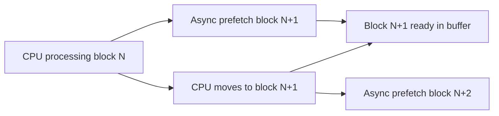

# How to Use prefetch_buffer_size in ClickHouse

Author: [nawazdhandala](https://www.github.com/nawazdhandala)

Tags: ClickHouse, Performance, Configuration, I/O, Tuning, Setting

Description: Learn how to configure prefetch_buffer_size and related prefetch settings in ClickHouse to improve sequential read performance for large table scans on disk and object storage.

---

## Introduction

ClickHouse reads column data sequentially when scanning MergeTree tables. Prefetching reduces I/O wait time by asynchronously reading upcoming data blocks while the CPU processes the current block. The `prefetch_buffer_size` setting controls how much data is buffered ahead of the current read position.

## How Prefetching Works



Without prefetch, the CPU waits for each disk read. With prefetch, disk reads overlap with CPU processing, hiding I/O latency.

## Relevant Settings

| Setting | Scope | Default | Description |
|---|---|---|---|
| `prefetch_buffer_size` | Query / Profile | 1048576 (1 MiB) | Read-ahead buffer per stream |
| `local_filesystem_read_prefetch` | Query / Profile | false | Enable prefetch for local disk reads |
| `remote_filesystem_read_prefetch` | Query / Profile | true | Enable prefetch for remote disks (S3, GCS) |
| `filesystem_prefetch_step_bytes` | Query / Profile | 0 | Step size for prefetch advancement |
| `filesystem_prefetch_max_memory_usage` | Query / Profile | 0 | Cap memory used by prefetch buffers |

## Checking Current Settings

```sql
SELECT name, value, description
FROM system.settings
WHERE name LIKE '%prefetch%';
```

## Configuring Prefetch for Local Disk Reads

Local NVMe drives benefit from prefetch when column files are large:

```sql
SELECT
    user_id,
    sum(purchase_amount) AS total
FROM orders
GROUP BY user_id
SETTINGS
    local_filesystem_read_prefetch = 1,
    prefetch_buffer_size = 4194304;    -- 4 MiB
```

In a user profile (`users.xml`):

```xml
<profiles>
  <analytics>
    <local_filesystem_read_prefetch>1</local_filesystem_read_prefetch>
    <prefetch_buffer_size>4194304</prefetch_buffer_size>
  </analytics>
</profiles>
```

## Configuring Prefetch for S3 Reads

Remote object storage has high per-request latency. Prefetch hides this latency by issuing reads in advance:

```sql
SELECT count()
FROM events
WHERE event_time >= '2024-01-01'
SETTINGS
    remote_filesystem_read_prefetch = 1,
    prefetch_buffer_size = 16777216,           -- 16 MiB
    filesystem_prefetch_step_bytes = 4194304;  -- Advance in 4 MiB steps
```

## Limiting Memory Used by Prefetch

For concurrent workloads, cap total prefetch memory to avoid OOM:

```sql
SELECT count()
FROM events
SETTINGS
    remote_filesystem_read_prefetch = 1,
    prefetch_buffer_size = 8388608,
    filesystem_prefetch_max_memory_usage = 536870912;  -- 512 MiB total
```

## Benchmarking Prefetch

Compare query duration with and without prefetch:

```bash
# Without prefetch
clickhouse-client -q "
    SELECT count()
    FROM events
    WHERE event_time >= '2024-01-01'
    SETTINGS remote_filesystem_read_prefetch = 0
" --time

# With prefetch
clickhouse-client -q "
    SELECT count()
    FROM events
    WHERE event_time >= '2024-01-01'
    SETTINGS remote_filesystem_read_prefetch = 1,
             prefetch_buffer_size = 16777216
" --time
```

## Monitoring I/O Performance

```sql
SELECT
    query,
    query_duration_ms,
    read_bytes,
    ProfileEvents['ReadBufferFromS3Bytes']    AS s3_bytes_read,
    ProfileEvents['ReadBufferFromS3Microseconds'] AS s3_time_us
FROM system.query_log
WHERE type = 'QueryFinish'
  AND tables LIKE '%events%'
ORDER BY event_time DESC
LIMIT 5;
```

## Sizing Recommendations

| Storage type | Recommended `prefetch_buffer_size` |
|---|---|
| Local NVMe | 1-4 MiB |
| Local HDD | 4-16 MiB (higher latency) |
| S3 / GCS (same region) | 8-32 MiB |
| S3 / GCS (cross-region) | 32-64 MiB |

Larger buffers reduce latency at the cost of more RAM. Use `filesystem_prefetch_max_memory_usage` to cap total consumption.

## Summary

`prefetch_buffer_size` and related prefetch settings let ClickHouse issue asynchronous reads ahead of the current processing position, hiding I/O latency for both local disk and remote object storage scans. Enable `local_filesystem_read_prefetch` for NVMe scans and `remote_filesystem_read_prefetch` for S3/GCS reads. Tune the buffer size based on storage latency, and cap total memory with `filesystem_prefetch_max_memory_usage` on multi-query servers.
