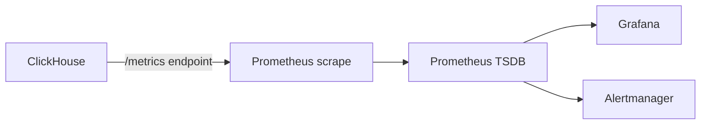

# How to Configure Prometheus Metrics Export from ClickHouse

Author: [nawazdhandala](https://www.github.com/nawazdhandala)

Tags: ClickHouse, Prometheus, Monitoring, Metric, Observability, Configuration

Description: Configure ClickHouse to expose Prometheus metrics over HTTP so Prometheus can scrape query performance, replication lag, cache hit rates, and resource usage metrics.

---

## Introduction

ClickHouse has a built-in Prometheus metrics endpoint. When enabled, it exposes hundreds of metrics from `system.metrics`, `system.events`, and `system.asynchronous_metrics` in the Prometheus text format. Prometheus can scrape this endpoint and you can build dashboards and alerts in Grafana.

## Metrics Endpoint Architecture



## Step 1: Enable the Prometheus Endpoint

Create `/etc/clickhouse-server/config.d/prometheus.xml`:

```xml
<clickhouse>
  <prometheus>
    <endpoint>/metrics</endpoint>
    <port>9363</port>
    <metrics>true</metrics>
    <events>true</events>
    <asynchronous_metrics>true</asynchronous_metrics>
    <errors>true</errors>
    <status_info>true</status_info>
  </prometheus>
</clickhouse>
```

Reload or restart:

```bash
systemctl reload clickhouse-server
```

## Step 2: Verify the Endpoint

```bash
curl http://localhost:9363/metrics | head -40
```

Expected output:

```text
# HELP ClickHouseMetrics_Query Number of executing queries
# TYPE ClickHouseMetrics_Query gauge
ClickHouseMetrics_Query 3
# HELP ClickHouseMetrics_Merge Number of executing background merges
# TYPE ClickHouseMetrics_Merge gauge
ClickHouseMetrics_Merge 1
# HELP ClickHouseEvents_Query Number of queries to be interpreted and potentially executed
# TYPE ClickHouseEvents_Query counter
ClickHouseEvents_Query 12345
```

## Step 3: Configure Prometheus to Scrape ClickHouse

In `prometheus.yml`:

```yaml
scrape_configs:
  - job_name: clickhouse
    scrape_interval: 15s
    scrape_timeout: 10s
    static_configs:
      - targets:
          - clickhouse-01:9363
          - clickhouse-02:9363
          - clickhouse-03:9363
    relabel_configs:
      - source_labels: [__address__]
        target_label: instance
```

Reload Prometheus:

```bash
curl -X POST http://localhost:9090/-/reload
```

## Key Metrics to Monitor

### Query Performance

```promql
# Active queries right now
ClickHouseMetrics_Query

# Query rate (queries per second)
rate(ClickHouseEvents_Query[5m])

# Slow query rate (queries taking > 1 second)
rate(ClickHouseEvents_QueryTimeMicroseconds[5m]) / 1e6
```

### Memory

```promql
# Total memory used by ClickHouse
ClickHouseAsyncMetrics_MemoryResident

# Memory used by queries
ClickHouseMetrics_MemoryTracking

# Mark cache size
ClickHouseAsyncMetrics_MarkCacheBytes
```

### Merges

```promql
# Number of active background merges
ClickHouseMetrics_Merge

# Parts count across all tables
ClickHouseAsyncMetrics_NumberOfTables
```

### Replication

```promql
# Replication queue depth
ClickHouseMetrics_ReplicatedChecks

# Replication queue size
ClickHouseAsyncMetrics_ReplicasMaxAbsoluteDelay
```

### Cache Hit Rates

```promql
# Mark cache hit rate
rate(ClickHouseEvents_MarkCacheHits[5m]) /
(rate(ClickHouseEvents_MarkCacheHits[5m]) + rate(ClickHouseEvents_MarkCacheMisses[5m]))
```

### S3 Read Metrics

```promql
# S3 bytes read rate
rate(ClickHouseEvents_ReadBufferFromS3Bytes[5m])

# S3 request count rate
rate(ClickHouseEvents_S3ReadRequestsCount[5m])
```

## Alerting Rules

```yaml
# prometheus/rules/clickhouse.yml
groups:
  - name: clickhouse
    rules:
      - alert: ClickHouseTooManyParts
        expr: ClickHouseAsyncMetrics_MaxPartCountForPartition > 300
        for: 5m
        labels:
          severity: warning
        annotations:
          summary: "Too many parts in a partition on {{ $labels.instance }}"

      - alert: ClickHouseHighMemoryUsage
        expr: ClickHouseMetrics_MemoryTracking > 50e9
        for: 2m
        labels:
          severity: critical
        annotations:
          summary: "ClickHouse memory usage over 50 GiB on {{ $labels.instance }}"

      - alert: ClickHouseReplicationLag
        expr: ClickHouseAsyncMetrics_ReplicasMaxAbsoluteDelay > 300
        for: 5m
        labels:
          severity: warning
        annotations:
          summary: "Replication lag over 5 minutes on {{ $labels.instance }}"
```

## Exposing Metrics via the HTTP Interface (Alternative)

If you prefer not to open port 9363, query ClickHouse's built-in HTTP handler:

```bash
curl "http://localhost:8123/?query=SELECT+metric,value+FROM+system.metrics+FORMAT+Prometheus"
```

## Disabling Specific Metric Groups

To reduce scrape size, disable unneeded metric groups:

```xml
<prometheus>
  <endpoint>/metrics</endpoint>
  <port>9363</port>
  <metrics>true</metrics>
  <events>true</events>
  <asynchronous_metrics>false</asynchronous_metrics>
  <errors>false</errors>
</prometheus>
```

## Summary

ClickHouse exposes a Prometheus-compatible `/metrics` endpoint on a dedicated port (default 9363). Enable it by adding a `<prometheus>` block to config with the port and which metric groups to include. Configure Prometheus to scrape the endpoint, then use PromQL to build queries for active queries, memory usage, replication lag, cache hit rates, and merge queue depth. Add alerting rules for critical thresholds like too many parts and high replication lag.
