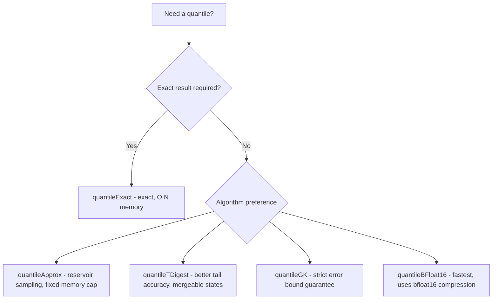

# How to Use quantileApprox() in ClickHouse

Author: [OneUptime](https://www.github.com/OneUptime)

Tags: ClickHouse, SQL, Aggregate Function, Quantile, Statistics

Description: Learn how to use quantileApprox() in ClickHouse to compute fast approximate quantiles using reservoir sampling, with configurable sample size for accuracy control.

---

`quantileApprox(accuracy)(level)(value)` - actually `quantileApprox(level)(value)` in its simplest form - computes approximate quantiles using reservoir sampling. It maintains a random sample of the data and computes the quantile from that sample, making it memory-bounded and fast for interactive queries on very large tables. This is distinct from the GK and T-Digest algorithms: reservoir sampling is simple, predictable in memory, and well-suited for exploratory analysis.

## Syntax

```sql
-- Basic usage: approximate quantile using default sample size
SELECT quantileApprox(level)(value_column) FROM table_name;

-- With explicit accuracy parameter (sample size)
SELECT quantileApprox(accuracy, level)(value_column) FROM table_name;

-- level is a Float64 from 0 to 1
-- accuracy controls reservoir size (higher = more accurate but more memory)
```

## Basic Example

```sql
-- Approximate p95 latency - fast and memory efficient
SELECT quantileApprox(0.95)(response_time_ms) AS approx_p95_ms
FROM request_logs
WHERE log_date = today();
```

## Accuracy Parameter

The `accuracy` parameter controls the reservoir sample size. A value of 10000 means ClickHouse keeps at most 10000 samples before computing the quantile.

```sql
-- Compare accuracy levels
SELECT
    quantileApprox(100, 0.95)(response_time_ms)   AS p95_n100,
    quantileApprox(1000, 0.95)(response_time_ms)  AS p95_n1000,
    quantileApprox(10000, 0.95)(response_time_ms) AS p95_n10000,
    quantileExact(0.95)(response_time_ms)         AS p95_exact,
    count()                                       AS total_rows
FROM request_logs
WHERE log_date = today();
```

## Multiple Quantiles in One Query

```sql
SELECT
    service_name,
    quantileApprox(0.50)(response_time_ms) AS approx_p50,
    quantileApprox(0.75)(response_time_ms) AS approx_p75,
    quantileApprox(0.90)(response_time_ms) AS approx_p90,
    quantileApprox(0.95)(response_time_ms) AS approx_p95,
    quantileApprox(0.99)(response_time_ms) AS approx_p99,
    count()                                AS total_requests
FROM request_logs
WHERE log_date >= today() - 7
GROUP BY service_name
ORDER BY approx_p95 DESC;
```

## Choosing Between Approximate Quantile Functions



## Hourly Percentile Trends

```sql
-- Hourly p95 and p99 for dashboards using fast approximate function
SELECT
    toStartOfHour(timestamp) AS hour,
    service_name,
    quantileApprox(0.95)(response_time_ms) AS p95_ms,
    quantileApprox(0.99)(response_time_ms) AS p99_ms,
    count() AS request_count
FROM request_logs
WHERE timestamp >= now() - INTERVAL 48 HOUR
GROUP BY hour, service_name
ORDER BY hour DESC;
```

## Comparing Response Time Distributions Across Regions

```sql
SELECT
    region,
    quantileApprox(0.50)(response_time_ms) AS median_ms,
    quantileApprox(0.95)(response_time_ms) AS p95_ms,
    quantileApprox(0.99)(response_time_ms) AS p99_ms,
    count() AS requests
FROM request_logs
WHERE log_date >= today() - 14
GROUP BY region
ORDER BY p95_ms DESC;
```

## Incremental Aggregation with -State and -Merge

```sql
CREATE TABLE hourly_approx_quantiles
(
    stat_hour  DateTime,
    service    String,
    p95_state  AggregateFunction(quantileApprox(0.95), Float64),
    p99_state  AggregateFunction(quantileApprox(0.99), Float64)
)
ENGINE = AggregatingMergeTree()
ORDER BY (stat_hour, service);

CREATE MATERIALIZED VIEW mv_hourly_approx_quantiles
TO hourly_approx_quantiles
AS
SELECT
    toStartOfHour(timestamp)                                   AS stat_hour,
    service_name                                               AS service,
    quantileApproxState(0.95)(toFloat64(response_time_ms))    AS p95_state,
    quantileApproxState(0.99)(toFloat64(response_time_ms))    AS p99_state
FROM request_logs
GROUP BY stat_hour, service;

-- Query merged percentiles
SELECT
    stat_hour,
    service,
    quantileApproxMerge(0.95)(p95_state) AS p95_ms,
    quantileApproxMerge(0.99)(p99_state) AS p99_ms
FROM hourly_approx_quantiles
WHERE stat_hour >= now() - INTERVAL 24 HOUR
GROUP BY stat_hour, service
ORDER BY stat_hour DESC;
```

## Error Estimation

```sql
-- Measure how far quantileApprox deviates from exact on a sample
SELECT
    quantileApprox(10000, 0.99)(response_time_ms)            AS approx_p99,
    quantileExact(0.99)(response_time_ms)                    AS exact_p99,
    abs(quantileApprox(10000, 0.99)(response_time_ms)
        - quantileExact(0.99)(response_time_ms))             AS abs_error_ms,
    count()                                                  AS n
FROM request_logs
WHERE log_date = today();
```

## Summary

`quantileApprox(accuracy, level)(value)` computes approximate quantiles using reservoir sampling, keeping at most `accuracy` samples in memory. It is memory-bounded and predictable, making it suitable for exploratory analysis and dashboard queries where a best-effort approximation is acceptable. For strict error guarantees, use `quantileGK`; for better tail accuracy, use `quantileTDigest`; for exact results regardless of memory, use `quantileExact`. All quantile functions in ClickHouse support the `-State` and `-Merge` suffix pattern for materialized view incremental aggregation.
