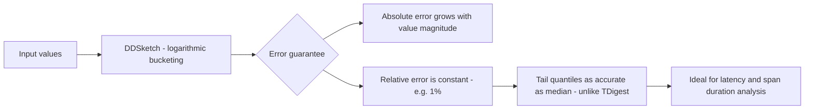

# How to Use quantileDD() in ClickHouse

Author: [OneUptime](https://www.github.com/OneUptime)

Tags: ClickHouse, SQL, Aggregate Function, Quantile, Statistics

Description: Learn how to use quantileDD() in ClickHouse, which implements the DDSketch algorithm for accurate approximate quantiles with relative error guarantees.

---

`quantileDD(relative_accuracy, level)(value)` computes approximate quantiles using the DDSketch (Distributed Discrete Sketch) algorithm. Unlike T-Digest or GK, DDSketch provides a relative error guarantee: the returned quantile is within `relative_accuracy * quantile_value` of the true result. This means tail quantiles like p99 are as relatively accurate as median estimates, which is the key advantage over T-Digest where tail accuracy degrades.

## Syntax

```sql
-- relative_accuracy: the relative error bound (e.g. 0.01 = 1% relative error)
-- level: the quantile to compute (e.g. 0.99 for p99)
SELECT quantileDD(relative_accuracy, level)(value_column) FROM table_name;
```

A relative error of 0.01 means: if the true p99 is 500ms, the returned value is within 500 * 0.01 = 5ms.

## Basic Example

```sql
-- p99 with 1% relative error guarantee
SELECT quantileDD(0.01, 0.99)(response_time_ms) AS p99_ms
FROM request_logs
WHERE log_date = today();
```

## Understanding Relative vs Absolute Error

```sql
-- DDSketch: relative error scales with the value
-- If true p99 = 500ms, relative_accuracy=0.01 => error <= 5ms
-- If true p99 = 5000ms, relative_accuracy=0.01 => error <= 50ms

-- Compare DDSketch to exact and TDigest
SELECT
    quantileDD(0.01, 0.99)(response_time_ms)    AS p99_dd_1pct_relative,
    quantileDD(0.001, 0.99)(response_time_ms)   AS p99_dd_01pct_relative,
    quantileTDigest(0.99)(response_time_ms)     AS p99_tdigest,
    quantileExact(0.99)(response_time_ms)       AS p99_exact
FROM request_logs
WHERE log_date = today();
```

## Multiple Quantiles in One Scan

```sql
SELECT
    service_name,
    quantileDD(0.01, 0.50)(response_time_ms) AS p50_ms,
    quantileDD(0.01, 0.75)(response_time_ms) AS p75_ms,
    quantileDD(0.01, 0.90)(response_time_ms) AS p90_ms,
    quantileDD(0.01, 0.95)(response_time_ms) AS p95_ms,
    quantileDD(0.01, 0.99)(response_time_ms) AS p99_ms,
    quantileDD(0.01, 0.999)(response_time_ms) AS p999_ms,
    count() AS total_requests
FROM request_logs
WHERE log_date >= today() - 7
GROUP BY service_name
ORDER BY p99_ms DESC;
```

## DDSketch Algorithm Properties



## Hourly SLA Dashboard

```sql
-- Track p99 and p999 latency with relative error bounds
SELECT
    toStartOfHour(timestamp) AS hour,
    service_name,
    quantileDD(0.01, 0.95)(response_time_ms)  AS p95_ms,
    quantileDD(0.01, 0.99)(response_time_ms)  AS p99_ms,
    quantileDD(0.01, 0.999)(response_time_ms) AS p999_ms,
    count()                                   AS request_count
FROM request_logs
WHERE timestamp >= now() - INTERVAL 24 HOUR
GROUP BY hour, service_name
ORDER BY hour DESC;
```

## Incremental Aggregation with -State and -Merge

```sql
CREATE TABLE hourly_dd_quantiles
(
    stat_hour  DateTime,
    service    String,
    p99_state  AggregateFunction(quantileDD(0.01, 0.99), Float64),
    p999_state AggregateFunction(quantileDD(0.01, 0.999), Float64)
)
ENGINE = AggregatingMergeTree()
ORDER BY (stat_hour, service);

CREATE MATERIALIZED VIEW mv_hourly_dd_quantiles
TO hourly_dd_quantiles
AS
SELECT
    toStartOfHour(timestamp)                                   AS stat_hour,
    service_name                                               AS service,
    quantileDDState(0.01, 0.99)(toFloat64(response_time_ms))  AS p99_state,
    quantileDDState(0.01, 0.999)(toFloat64(response_time_ms)) AS p999_state
FROM request_logs
GROUP BY stat_hour, service;

-- Query
SELECT
    stat_hour,
    service,
    quantileDDMerge(0.01, 0.99)(p99_state)   AS p99_ms,
    quantileDDMerge(0.01, 0.999)(p999_state) AS p999_ms
FROM hourly_dd_quantiles
WHERE stat_hour >= now() - INTERVAL 24 HOUR
GROUP BY stat_hour, service
ORDER BY stat_hour DESC;
```

## Comparing Algorithms for Tail Accuracy

```sql
-- DDSketch maintains relative accuracy at tails, TDigest may degrade
SELECT
    quantileDD(0.01, 0.999)(response_time_ms)    AS p999_dd,
    quantileTDigest(0.999)(response_time_ms)     AS p999_tdigest,
    quantileGK(0.001, 0.999)(response_time_ms)   AS p999_gk,
    quantileExact(0.999)(response_time_ms)       AS p999_exact
FROM request_logs
WHERE log_date = today();
```

## Summary

`quantileDD(relative_accuracy, level)(value)` implements the DDSketch algorithm, which provides a relative error guarantee: the error is at most `relative_accuracy * |true_quantile|`. This makes tail quantiles (p99, p999) as relatively accurate as the median, unlike T-Digest which can degrade at distribution tails. Use DDSketch when you need consistent relative accuracy across all quantile levels, especially for latency or duration data spanning multiple orders of magnitude. The `-State` and `-Merge` suffix pattern enables incremental aggregation in materialized views.
