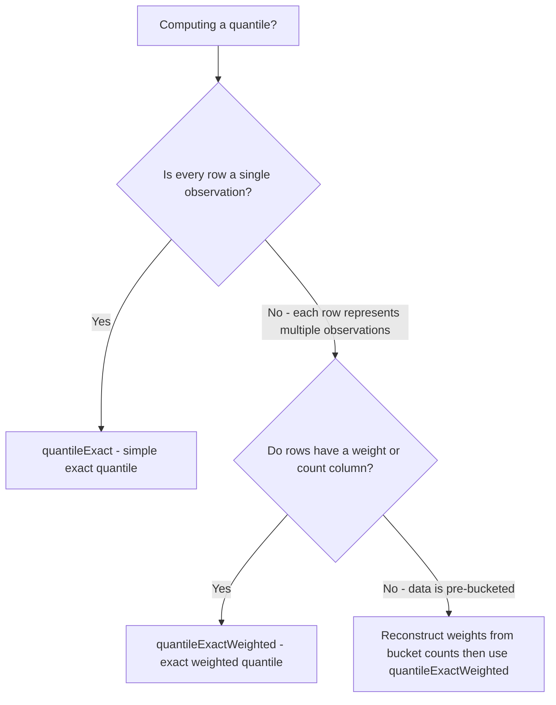

# How to Use quantileExactWeighted() in ClickHouse

Author: [nawazdhandala](https://www.github.com/nawazdhandala)

Tags: ClickHouse, SQL, Aggregate Function, Quantile, Statistics

Description: Learn how to use quantileExactWeighted() in ClickHouse to compute exact quantiles where each value carries a numeric weight, ideal for pre-aggregated or sampled data.

---

`quantileExactWeighted(level)(value, weight)` computes an exact quantile from a weighted dataset. Each value contributes `weight` times to the distribution, equivalent to having that many copies of the value. This is the right function when your data is already pre-aggregated (e.g., from a summary table), or when you have sampled data where each row represents multiple observations.

## Syntax

```sql
-- Exact weighted quantile
SELECT quantileExactWeighted(level)(value_column, weight_column) FROM table_name;

-- level is a Float64 from 0 to 1
-- weight must be a non-negative integer (UInt* types)
```

## When to Use quantileExactWeighted vs quantileExact



## Basic Example

```sql
-- Pre-aggregated summary table: each row is a latency bucket with a count
CREATE TABLE latency_summary
(
    event_date   Date,
    service      String,
    latency_ms   Float64,
    request_count UInt64
);

-- Exact p95 treating request_count as weight
SELECT
    service,
    quantileExactWeighted(0.95)(latency_ms, request_count) AS p95_ms
FROM latency_summary
WHERE event_date = today()
GROUP BY service
ORDER BY p95_ms DESC;
```

## Sampled Data with Sampling Rate

```sql
-- If each row has a sampling_rate (e.g. 0.1 = 1 in 10 requests sampled),
-- weight = 1 / sampling_rate to reconstruct the full distribution
SELECT
    service_name,
    quantileExactWeighted(0.99)(
        response_time_ms,
        toUInt64(1.0 / sampling_rate)  -- weight represents unsampled count
    ) AS p99_reconstructed
FROM sampled_request_logs
WHERE log_date = today()
GROUP BY service_name;
```

## Multiple Percentiles from a Pre-Aggregated Table

```sql
SELECT
    service,
    quantileExactWeighted(0.50)(latency_ms, request_count) AS median_ms,
    quantileExactWeighted(0.75)(latency_ms, request_count) AS p75_ms,
    quantileExactWeighted(0.90)(latency_ms, request_count) AS p90_ms,
    quantileExactWeighted(0.95)(latency_ms, request_count) AS p95_ms,
    quantileExactWeighted(0.99)(latency_ms, request_count) AS p99_ms,
    sum(request_count)                                     AS total_requests
FROM latency_summary
WHERE event_date >= today() - 30
GROUP BY service
ORDER BY p95_ms DESC;
```

## Comparing Weighted vs Unweighted on Pre-Aggregated Data

```sql
-- Unweighted quantileExact would treat each unique latency bucket as one observation
-- quantileExactWeighted correctly respects the count per bucket
SELECT
    quantileExact(0.95)(latency_ms)                           AS p95_wrong,    -- incorrect for pre-agg
    quantileExactWeighted(0.95)(latency_ms, request_count)    AS p95_correct,  -- correct
    sum(request_count)                                        AS total
FROM latency_summary
WHERE event_date = today();
```

## Weighted Quantile of User Engagement Metrics

```sql
-- Users have different session counts; weight their scores by sessions
SELECT
    user_segment,
    quantileExactWeighted(0.50)(
        engagement_score,
        toUInt64(session_count)
    ) AS weighted_median_engagement,
    quantileExactWeighted(0.90)(
        engagement_score,
        toUInt64(session_count)
    ) AS weighted_p90_engagement
FROM user_profiles
WHERE profile_month = '2026-03-01'
GROUP BY user_segment;
```

## Incremental Aggregation with -State and -Merge

```sql
CREATE TABLE hourly_weighted_quantiles
(
    stat_hour  DateTime,
    service    String,
    p99_state  AggregateFunction(quantileExactWeighted(0.99), Float64, UInt64)
)
ENGINE = AggregatingMergeTree()
ORDER BY (stat_hour, service);

CREATE MATERIALIZED VIEW mv_hourly_weighted_quantiles
TO hourly_weighted_quantiles
AS
SELECT
    toStartOfHour(timestamp)  AS stat_hour,
    service_name              AS service,
    quantileExactWeightedState(0.99)(
        toFloat64(response_time_ms),
        toUInt64(request_count)
    ) AS p99_state
FROM pre_aggregated_metrics
GROUP BY stat_hour, service;

-- Query merged state
SELECT
    stat_hour,
    service,
    quantileExactWeightedMerge(0.99)(p99_state) AS p99_ms
FROM hourly_weighted_quantiles
WHERE stat_hour >= now() - INTERVAL 24 HOUR
GROUP BY stat_hour, service
ORDER BY stat_hour DESC;
```

## Summary

`quantileExactWeighted(level)(value, weight)` computes an exact quantile where each value contributes `weight` times to the distribution. Use it when your input data is pre-aggregated (each row represents multiple observations) or when each row carries a sampling weight. Applying plain `quantileExact` to pre-aggregated data produces a wrong result because it treats each distinct latency bucket as a single observation rather than respecting the count. `quantileExactWeighted` corrects this by building the proper weighted empirical CDF before extracting the quantile.
