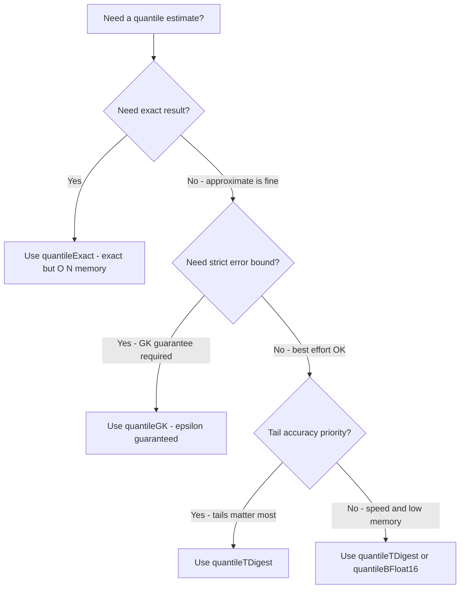

# How to Use quantileGK() in ClickHouse

Author: [OneUptime](https://www.github.com/OneUptime)

Tags: ClickHouse, SQL, Aggregate Function, Quantile, Statistics

Description: Learn how to use quantileGK() in ClickHouse, which implements the Greenwald-Khanna algorithm for accurate approximate quantiles with a guaranteed error bound.

---

`quantileGK(accuracy, level)(value)` computes an approximate quantile using the Greenwald-Khanna (GK) streaming algorithm. Unlike `quantileTDigest`, which approximates with variable accuracy, GK provides a strict epsilon-accuracy guarantee: the returned quantile is within `accuracy` of the true rank. This makes it the right choice when you need a provable error bound rather than a best-effort approximation.

## Syntax

```sql
-- Single quantile with accuracy epsilon and level phi
SELECT quantileGK(accuracy, level)(value_column) FROM table_name;

-- accuracy: epsilon error bound, e.g. 0.01 means within 1% of the true rank
-- level: the quantile to compute, e.g. 0.95 for the 95th percentile
```

## Basic Example

```sql
-- p95 latency with a 1% accuracy guarantee
SELECT quantileGK(0.01, 0.95)(response_time_ms) AS p95_latency_ms
FROM request_logs
WHERE log_date = today();
```

This guarantees the returned value is within 1% of the true 95th percentile rank.

## Accuracy vs Memory Trade-off

The GK algorithm uses more memory as `accuracy` decreases (tighter bound).

```sql
-- Compare different accuracy levels
SELECT
    quantileGK(0.05, 0.95)(response_time_ms)  AS p95_accuracy_5pct,
    quantileGK(0.01, 0.95)(response_time_ms)  AS p95_accuracy_1pct,
    quantileGK(0.001, 0.95)(response_time_ms) AS p95_accuracy_01pct,
    quantileExact(0.95)(response_time_ms)     AS p95_exact
FROM request_logs
WHERE log_date = today();
```

## Multiple Quantiles in One Scan

```sql
-- Full percentile profile with GK algorithm
SELECT
    service_name,
    quantileGK(0.01, 0.50)(response_time_ms) AS p50_ms,
    quantileGK(0.01, 0.75)(response_time_ms) AS p75_ms,
    quantileGK(0.01, 0.90)(response_time_ms) AS p90_ms,
    quantileGK(0.01, 0.95)(response_time_ms) AS p95_ms,
    quantileGK(0.01, 0.99)(response_time_ms) AS p99_ms,
    count() AS request_count
FROM request_logs
WHERE log_date >= today() - 7
GROUP BY service_name
ORDER BY p95_ms DESC;
```

## When to Choose quantileGK vs Other Quantile Functions



## SLA Monitoring with Error Bound

```sql
-- Compute p99 with 0.5% accuracy - suitable for SLA alerting
SELECT
    toStartOfHour(timestamp) AS hour,
    service_name,
    quantileGK(0.005, 0.99)(response_time_ms) AS p99_ms,
    countIf(response_time_ms > 1000)           AS over_sla_count,
    count()                                    AS total
FROM request_logs
WHERE timestamp >= now() - INTERVAL 24 HOUR
GROUP BY hour, service_name
ORDER BY hour DESC;
```

## Incremental Aggregation with -State and -Merge

```sql
CREATE TABLE hourly_quantile_gk
(
    stat_hour   DateTime,
    service     String,
    p95_state   AggregateFunction(quantileGK(0.01, 0.95), Float64),
    p99_state   AggregateFunction(quantileGK(0.01, 0.99), Float64)
)
ENGINE = AggregatingMergeTree()
ORDER BY (stat_hour, service);

CREATE MATERIALIZED VIEW mv_hourly_quantile_gk
TO hourly_quantile_gk
AS
SELECT
    toStartOfHour(timestamp)                                  AS stat_hour,
    service_name                                              AS service,
    quantileGKState(0.01, 0.95)(toFloat64(response_time_ms)) AS p95_state,
    quantileGKState(0.01, 0.99)(toFloat64(response_time_ms)) AS p99_state
FROM request_logs
GROUP BY stat_hour, service;

-- Query
SELECT
    stat_hour,
    service,
    quantileGKMerge(0.01, 0.95)(p95_state) AS p95_ms,
    quantileGKMerge(0.01, 0.99)(p99_state) AS p99_ms
FROM hourly_quantile_gk
GROUP BY stat_hour, service
ORDER BY stat_hour DESC;
```

## Comparing GK to TDigest Accuracy

```sql
-- Side-by-side comparison: GK vs TDigest vs Exact for validation
SELECT
    quantileGK(0.01, 0.99)(response_time_ms)      AS p99_gk_1pct,
    quantileTDigest(0.99)(response_time_ms)        AS p99_tdigest,
    quantileExact(0.99)(response_time_ms)          AS p99_exact,
    abs(quantileGK(0.01, 0.99)(response_time_ms)
        - quantileExact(0.99)(response_time_ms))   AS gk_error_ms,
    count()                                        AS n
FROM request_logs
WHERE log_date = today();
```

## Summary

`quantileGK(accuracy, level)(value)` implements the Greenwald-Khanna streaming algorithm, providing a provable epsilon-accuracy guarantee: the result rank will not deviate by more than `accuracy` from the true rank. Use it when you need a mathematical guarantee on approximation quality rather than best-effort accuracy, such as for SLA reporting, compliance monitoring, or scenarios where the cost of an inaccurate percentile is high. For best-effort approximation with good tail accuracy, prefer `quantileTDigest`; for exact results at higher memory cost, use `quantileExact`.
