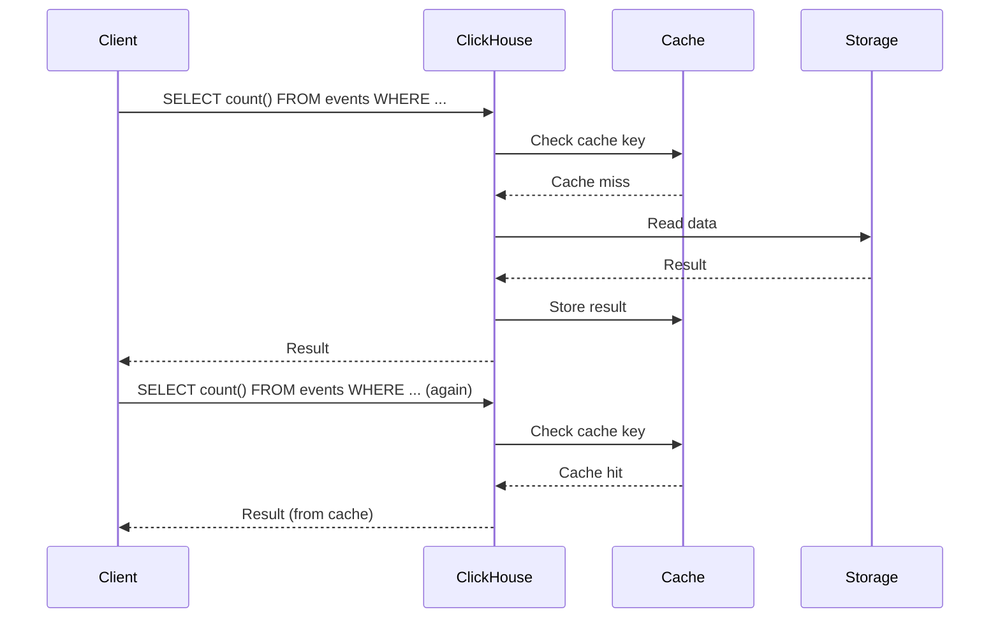

# How to Use query_cache in ClickHouse for Query Result Caching

Author: [nawazdhandala](https://www.github.com/nawazdhandala)

Tags: ClickHouse, Query Cache, Performance, Caching, Setting, Optimization

Description: Learn how to enable and configure the query_cache in ClickHouse to cache full query results in memory, reducing latency for repeated dashboard and reporting queries.

---

## Introduction

ClickHouse 23.5 introduced a query result cache (`query_cache`) that stores the complete output of SELECT queries in memory. Subsequent identical queries are served from cache without touching the storage layer. This is especially useful for dashboards and reports that repeatedly run the same aggregation queries.

## How query_cache Works



## Enabling Query Cache

Query cache is enabled per query or per profile. Enable it globally in `users.xml`:

```xml
<profiles>
  <default>
    <use_query_cache>true</use_query_cache>
    <query_cache_ttl>60</query_cache_ttl>
    <query_cache_max_size_in_bytes>10485760</query_cache_max_size_in_bytes>
    <query_cache_max_entries>100</query_cache_max_entries>
  </default>
</profiles>
```

## Configuring Cache Size

Set the global cache size in `config.xml`:

```xml
<clickhouse>
  <query_cache>
    <max_size_in_bytes>1073741824</max_size_in_bytes>
    <max_entries>1024</max_entries>
    <max_entry_size_in_bytes>10485760</max_entry_size_in_bytes>
    <max_entry_rows>30000000</max_entry_rows>
  </query_cache>
</clickhouse>
```

## Using Cache Per Query

Enable the cache for a specific query with `SETTINGS`:

```sql
SELECT
    toStartOfHour(event_time) AS hour,
    count()                   AS events
FROM events
WHERE event_time >= today() - INTERVAL 7 DAY
GROUP BY hour
ORDER BY hour
SETTINGS use_query_cache = true,
         query_cache_ttl = 300;
```

## Forcing a Fresh Result (Bypass Cache)

```sql
SELECT count()
FROM events
SETTINGS use_query_cache = false;
```

## Sharing Cache Entries Between Users

By default each user has their own cache namespace. To share results across users:

```sql
SELECT count()
FROM events
SETTINGS use_query_cache = true,
         query_cache_share_between_users = true;
```

Only share cache between users if all users are allowed to see all data (no row-level security).

## Inspecting the Query Cache

```sql
SELECT
    query,
    result_size,
    entry_expiry_ts,
    hits
FROM system.query_cache
ORDER BY hits DESC;
```

## Clearing the Cache

```sql
SYSTEM DROP QUERY CACHE;
```

## Cache Key Rules

The cache key is the full normalized query text. Even whitespace differences create a new cache entry. Use `normalizeQuery()` to understand how ClickHouse normalizes:

```sql
SELECT normalizeQuery('SELECT count() FROM events WHERE event_time >= today() - INTERVAL 7 DAY');
```

## When NOT to Use query_cache

- Queries on tables with very frequent inserts where data changes faster than the TTL.
- Queries using `now()`, `today()`, or `rand()` without explicitly allowing nondeterministic functions.
- Very large result sets that exceed `max_entry_size_in_bytes`.

## Monitoring Cache Effectiveness

```sql
SELECT
    metric,
    value
FROM system.metrics
WHERE metric IN ('QueryCacheHits', 'QueryCacheMisses');
```

## Summary

The ClickHouse query cache stores full SELECT results in memory and serves them to subsequent identical queries without reading storage. Enable it globally in user profiles with `use_query_cache = true`, set a TTL and size limit in `config.xml`, and monitor hit rates via `system.metrics`. It delivers the biggest benefit for dashboards and BI tools that issue the same aggregation queries repeatedly within a short time window.
