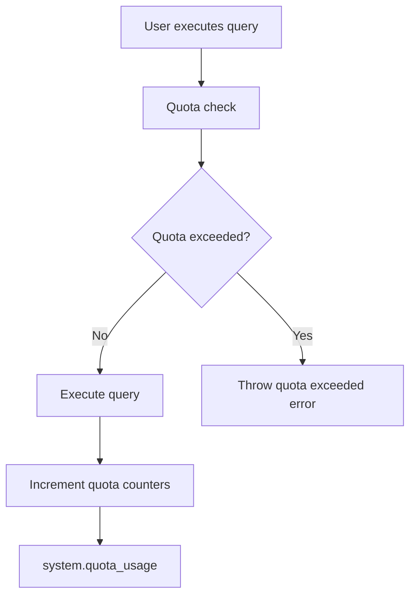

# How to Use system.quota_usage in ClickHouse

Author: [nawazdhandala](https://www.github.com/nawazdhandala)

Tags: ClickHouse, Quota, Monitoring, Security, Resource Management, System Table

Description: Use system.quota_usage to monitor how much of their quota each ClickHouse user has consumed, and learn how to create and tune quotas for effective resource governance.

---

## Introduction

ClickHouse quotas limit how much resource (queries, rows read, bytes read, execution time) each user can consume in a time interval. The `system.quota_usage` table shows current consumption against each quota limit, making it easy to monitor resource usage and enforce fair use policies.

## Quota System Architecture



## Defining Quotas

### Via users.xml

```xml
<quotas>
  <default>
    <interval>
      <duration>3600</duration>       <!-- 1 hour window -->
      <queries>1000</queries>
      <errors>100</errors>
      <result_rows>1000000000</result_rows>
      <read_rows>10000000000</read_rows>
      <execution_time>3600</execution_time>
    </interval>
    <!-- 24-hour window -->
    <interval>
      <duration>86400</duration>
      <queries>10000</queries>
      <read_rows>100000000000</read_rows>
      <execution_time>86400</execution_time>
    </interval>
  </default>
</quotas>
```

### Via SQL (requires access_management = 1)

```sql
CREATE QUOTA analyst_quota
    FOR INTERVAL 1 HOUR
        MAX QUERIES = 500,
        MAX ERRORS = 50,
        MAX READ ROWS = 5000000000,
        MAX READ BYTES = 107374182400,
        MAX EXECUTION TIME = 1800
    FOR INTERVAL 1 DAY
        MAX QUERIES = 5000,
        MAX READ ROWS = 50000000000
    TO analyst_role;
```

## Viewing Current Quota Usage

```sql
-- Your own quota usage
SELECT
    quota_name,
    quota_key,
    start_time,
    end_time,
    duration,
    queries,
    max_queries,
    errors,
    max_errors,
    result_rows,
    max_result_rows,
    read_rows,
    max_read_rows,
    read_bytes,
    max_read_bytes,
    execution_time,
    max_execution_time
FROM system.quota_usage;
```

## Viewing All Users' Quota Usage (Admin)

```sql
-- All users' usage (requires admin privileges)
SELECT
    quota_name,
    quota_key,
    start_time,
    end_time,
    queries,
    max_queries,
    read_rows,
    max_read_rows,
    execution_time,
    max_execution_time
FROM system.quotas_usage;
```

## Monitoring Quota Approaching Limits

```sql
SELECT
    quota_key AS user_or_key,
    quota_name,
    round(queries / max_queries * 100, 1)          AS queries_pct,
    round(read_rows / max_read_rows * 100, 1)       AS read_rows_pct,
    round(execution_time / max_execution_time * 100, 1) AS time_pct,
    end_time
FROM system.quotas_usage
WHERE max_queries > 0
ORDER BY queries_pct DESC;
```

## What a Quota Exceeded Error Looks Like

```
DB::Exception: Quota for user `analyst` for 3600s has been exceeded:
queries = 1001/1000. Interval will end at 2024-06-01 15:00:00.
Name: default. (QUOTA_EXCEEDED)
```

## Keyed Quotas (Per Client IP or Custom Key)

Quotas can be scoped per user or per key (e.g., per client IP):

```xml
<quotas>
  <per_ip>
    <keyed_by_ip>true</keyed_by_ip>
    <interval>
      <duration>3600</duration>
      <queries>200</queries>
    </interval>
  </per_ip>
</quotas>
```

```sql
CREATE QUOTA per_ip_quota
    KEYED BY client_address
    FOR INTERVAL 1 HOUR
        MAX QUERIES = 200
    TO ALL;
```

## Resetting Quota Counters

Quotas reset automatically when the interval expires. To inspect when the current interval ends:

```sql
SELECT
    quota_key,
    end_time,
    end_time - now() AS seconds_until_reset
FROM system.quotas_usage;
```

## Listing All Defined Quotas

```sql
-- List quota definitions
SELECT name, storage
FROM system.quotas;
```

## Viewing Quota Assignments

```sql
SELECT
    quota_name,
    apply_to_all,
    apply_to_list,
    apply_to_except
FROM system.quota_limits;
```

## Practical Alert: Quota Usage Over 80%

Export this query to Grafana or Prometheus via the HTTP interface on a schedule:

```sql
SELECT
    quota_key,
    quota_name,
    round(queries / nullIf(max_queries, 0) * 100, 1) AS queries_used_pct
FROM system.quotas_usage
WHERE max_queries > 0
  AND (queries / max_queries) > 0.8;
```

## Summary

`system.quota_usage` shows each user's current resource consumption against their quota limits for the active interval. Define quotas in `users.xml` or with `CREATE QUOTA` SQL, assign them to users or roles, and query `system.quotas_usage` as an admin to monitor all users. Key metrics to watch are queries, read_rows, and execution_time relative to their max values. Build alerts when usage exceeds 80% to proactively manage heavy users before they hit limits.
