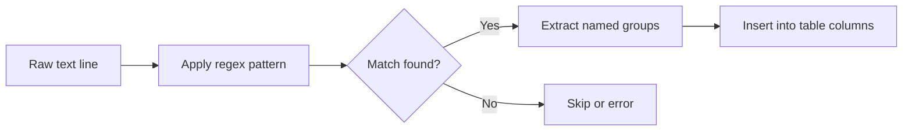

# How to Use Regexp Format in ClickHouse for Pattern-Based Parsing

Author: OneUptime Team

Tags: ClickHouse, Format, Regexp, Parsing, DataIngestion

Description: Learn how to use the Regexp input format in ClickHouse to parse unstructured text using named capture groups and regular expressions.

---

The `Regexp` format in ClickHouse lets you ingest unstructured or semi-structured text by defining a regular expression with named capture groups that map directly to table columns. This is especially useful for parsing legacy log files, custom delimited text, or any input that does not conform to a standard delimiter.

## How the Regexp Format Works

When you specify `FORMAT Regexp`, ClickHouse applies your regular expression to each line of input. Each named capture group `(?P<name>...)` is matched to a column by name.



## Setting the Format Regex

Before using the Regexp format you must set the `format_regexp` setting. You can do this per-query using the `SETTINGS` clause.

```sql
SET format_regexp = '^(?P<ts>\\d{4}-\\d{2}-\\d{2} \\d{2}:\\d{2}:\\d{2}) (?P<level>\\w+) (?P<msg>.+)$';
```

Or pass it directly in the query:

```sql
INSERT INTO app_logs (ts, level, msg)
SELECT ts, level, msg
FROM input('ts String, level String, msg String')
FORMAT Regexp
SETTINGS format_regexp = '^(?P<ts>[^ ]+) (?P<level>\\w+) (?P<msg>.+)$';
```

## Creating a Target Table

```sql
CREATE TABLE app_logs
(
    ts       DateTime,
    level    LowCardinality(String),
    msg      String
)
ENGINE = MergeTree
ORDER BY ts;
```

## Inserting Data via clickhouse-client

Pipe a log file directly into ClickHouse:

```bash
clickhouse-client \
  --query "INSERT INTO app_logs FORMAT Regexp" \
  --format_regexp '^(?P<ts>\d{4}-\d{2}-\d{2}T\d{2}:\d{2}:\d{2}) \[(?P<level>\w+)\] (?P<msg>.+)$' \
  < /var/log/app/app.log
```

Sample input lines:

```text
2024-06-01T12:00:01 [INFO] Server started on port 8080
2024-06-01T12:00:05 [WARN] High memory usage detected
2024-06-01T12:01:22 [ERROR] Connection timeout to upstream
```

## Handling Non-Matching Lines

By default a line that does not match the regex raises an error. Use `format_regexp_skip_unmatched` to silently drop non-matching lines:

```sql
SET format_regexp = '^(?P<ts>[^ ]+) (?P<level>\\w+) (?P<msg>.+)$';
SET format_regexp_skip_unmatched = 1;
```

This is helpful when log files contain header lines or blank lines intermixed with log entries.

## Using Escaping Rules

The `format_regexp_escaping_rule` setting controls how captured values are decoded. Options include `Raw`, `CSV`, `JSON`, `Escaped`, `Quoted`, and `XML`.

```sql
SET format_regexp_escaping_rule = 'Escaped';
```

Use `Escaped` when captured values may contain backslash-escaped characters.

## Reading from Files with the file() Function

```sql
SELECT *
FROM file('/data/logs/app-*.log', 'Regexp', 'ts String, level String, msg String')
SETTINGS format_regexp = '^(?P<ts>[^ ]+) (?P<level>\\w+) (?P<msg>.+)$';
```

This reads all matching log files from the directory without an explicit INSERT step.

## Practical Example: Nginx Access Logs

Parse the default Nginx combined log format:

```sql
CREATE TABLE nginx_access
(
    remote_addr    String,
    time_local     String,
    request        String,
    status         UInt16,
    body_bytes_sent UInt64,
    http_referer   String,
    http_user_agent String
)
ENGINE = MergeTree
ORDER BY time_local;

INSERT INTO nginx_access FORMAT Regexp
SETTINGS format_regexp = '^(?P<remote_addr>\\S+) \\S+ \\S+ \\[(?P<time_local>[^\\]]+)\\] "(?P<request>[^"]*)" (?P<status>\\d+) (?P<body_bytes_sent>\\d+) "(?P<http_referer>[^"]*)" "(?P<http_user_agent>[^"]*)"$';
```

## Performance Tips

- Compile your regex offline and test it with `SELECT match()` before using it in bulk inserts.
- Keep named groups minimal; unused groups still have matching cost.
- For very high-volume ingestion consider pre-processing with the ClickHouse `Executable` table engine or an external pipeline.

```sql
-- Test the regex match before bulk insert
SELECT match(
    '127.0.0.1 - - [01/Jun/2024:12:00:01 +0000] "GET /health HTTP/1.1" 200 0 "-" "curl/7.81"',
    '^(?P<remote_addr>\\S+) \\S+ \\S+ \\[(?P<time_local>[^\\]]+)\\].*$'
);
```

## Summary

The `Regexp` format is a flexible tool for ingesting text that does not fit standard delimiters. Key takeaways are: set `format_regexp` with named capture groups matching column names, use `format_regexp_skip_unmatched` to tolerate imperfect input, and validate your pattern with `match()` before committing to bulk loads.
