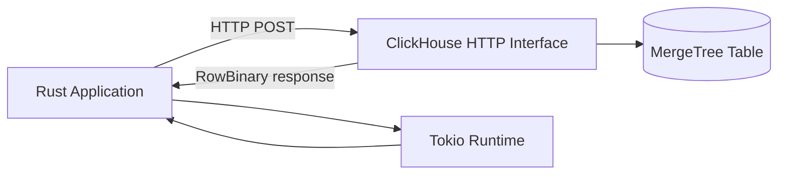

# How to Use the ClickHouse Rust Client

Author: [nawazdhandala](https://www.github.com/nawazdhandala)

Tags: ClickHouse, Rust, Client, Integration, Database

Description: Learn how to connect to ClickHouse from Rust using the clickhouse crate, run typed queries, insert rows, and stream large result sets efficiently.

---

## Introduction

The `clickhouse` crate is the primary Rust client for ClickHouse. It uses the native HTTP interface and provides a strongly-typed, ergonomic API built on top of `tokio` and `hyper`. Rows are serialized and deserialized using `serde`, making integration with your existing Rust data structures straightforward.

This guide covers adding the dependency, connecting, running queries, inserting data, and handling errors.

## Architecture Overview



## Adding the Dependency

In `Cargo.toml`:

```toml
[dependencies]
clickhouse = { version = "0.12", features = ["uuid", "time"] }
tokio = { version = "1", features = ["full"] }
serde = { version = "1", features = ["derive"] }
```

## Connecting to ClickHouse

```rust
use clickhouse::Client;

#[tokio::main]
async fn main() {
    let client = Client::default()
        .with_url("http://localhost:8123")
        .with_user("default")
        .with_password("")
        .with_database("default");

    println!("Connected");
}
```

### ClickHouse Cloud (TLS)

```rust
let client = Client::default()
    .with_url("https://abc123.us-east-1.aws.clickhouse.cloud:8443")
    .with_user("default")
    .with_password("your_password");
```

## Defining Row Types

Derive `Row` and `serde::Deserialize` for query results, and `serde::Serialize` for inserts:

```rust
use clickhouse::Row;
use serde::{Deserialize, Serialize};

#[derive(Debug, Row, Deserialize)]
struct Event {
    user_id: u64,
    event:   String,
    ts:      u32, // Unix timestamp
}

#[derive(Debug, Row, Serialize)]
struct EventInsert {
    user_id: u64,
    event:   String,
    ts:      u32,
}
```

## Running SELECT Queries

### Fetch all rows into a Vec

```rust
use clickhouse::Client;

async fn get_events(client: &Client) -> clickhouse::error::Result<Vec<Event>> {
    let events = client
        .query("SELECT user_id, event, toUnixTimestamp(ts) AS ts FROM events LIMIT 100")
        .fetch_all::<Event>()
        .await?;
    Ok(events)
}
```

### Stream rows one by one

```rust
use futures::StreamExt;

async fn stream_events(client: &Client) -> clickhouse::error::Result<()> {
    let mut cursor = client
        .query("SELECT user_id, event, toUnixTimestamp(ts) AS ts FROM events")
        .fetch::<Event>()?;

    while let Some(row) = cursor.next().await? {
        println!("{row:?}");
    }
    Ok(())
}
```

### Scalar value

```rust
let count: u64 = client
    .query("SELECT count() FROM events")
    .fetch_one::<u64>()
    .await?;
println!("Total events: {count}");
```

## Parameterized Queries

Use `bind` to safely pass parameters:

```rust
let user_id: u64 = 42;
let event_type = "purchase";

let events = client
    .query("SELECT user_id, event FROM events WHERE user_id = ? AND event = ?")
    .bind(user_id)
    .bind(event_type)
    .fetch_all::<Event>()
    .await?;
```

## Inserting Data

Use an `Inserter` for bulk inserts. This batches rows and sends them efficiently:

```rust
async fn insert_events(client: &Client) -> clickhouse::error::Result<()> {
    let mut insert = client.insert::<EventInsert>("events")?;

    insert.write(&EventInsert { user_id: 101, event: "page_view".into(), ts: 1705312800 }).await?;
    insert.write(&EventInsert { user_id: 102, event: "click".into(),     ts: 1705312860 }).await?;
    insert.write(&EventInsert { user_id: 101, event: "purchase".into(),  ts: 1705312920 }).await?;

    insert.end().await?;
    Ok(())
}
```

### High-throughput inserter with auto-flush

```rust
use clickhouse::inserter::Inserter;
use std::time::Duration;

async fn bulk_insert(client: &Client, rows: Vec<EventInsert>) -> clickhouse::error::Result<()> {
    let mut inserter = client
        .inserter::<EventInsert>("events")?
        .with_max_rows(100_000)
        .with_period(Some(Duration::from_secs(5)));

    for row in rows {
        inserter.write(&row).await?;
        inserter.commit().await?;
    }

    inserter.end().await?;
    Ok(())
}
```

## DDL Execution

```rust
client
    .query(
        "CREATE TABLE IF NOT EXISTS events
         (
             user_id UInt64,
             event   String,
             ts      DateTime
         )
         ENGINE = MergeTree()
         ORDER BY (user_id, ts)"
    )
    .execute()
    .await?;
```

## Query with Settings

```rust
let result = client
    .query("SELECT * FROM events")
    .with_option("max_threads", "4")
    .with_option("max_block_size", "65536")
    .fetch_all::<Event>()
    .await?;
```

## Error Handling

```rust
use clickhouse::error::Error;

match client.query("SELECT * FROM nonexistent").fetch_all::<Event>().await {
    Ok(rows) => println!("Got {} rows", rows.len()),
    Err(Error::BadResponse(msg)) => eprintln!("ClickHouse error: {msg}"),
    Err(e) => eprintln!("Unexpected error: {e}"),
}
```

## Full Example

```rust
use clickhouse::Client;
use clickhouse::Row;
use serde::{Deserialize, Serialize};

#[derive(Debug, Row, Deserialize, Serialize)]
struct PageView {
    user_id: u64,
    url:     String,
    ts:      u32,
}

#[tokio::main]
async fn main() -> clickhouse::error::Result<()> {
    let client = Client::default()
        .with_url("http://localhost:8123")
        .with_user("default")
        .with_password("")
        .with_database("analytics");

    // Create table
    client.query(
        "CREATE TABLE IF NOT EXISTS page_views
         (user_id UInt64, url String, ts DateTime)
         ENGINE = MergeTree() ORDER BY (user_id, ts)"
    ).execute().await?;

    // Insert rows
    let mut insert = client.insert::<PageView>("page_views")?;
    insert.write(&PageView { user_id: 1, url: "/home".into(),    ts: 1705312800 }).await?;
    insert.write(&PageView { user_id: 2, url: "/pricing".into(), ts: 1705312860 }).await?;
    insert.end().await?;

    // Query
    let rows = client
        .query("SELECT user_id, url, toUnixTimestamp(ts) AS ts FROM page_views LIMIT 10")
        .fetch_all::<PageView>()
        .await?;

    for row in rows {
        println!("{row:?}");
    }

    Ok(())
}
```

## Summary

The `clickhouse` Rust crate provides a type-safe, async-first interface to ClickHouse. Key points:
- Add `clickhouse` to `Cargo.toml` with appropriate feature flags for UUID and time types.
- Derive `Row` plus `Deserialize` on read structs, `Serialize` on write structs.
- Use `.fetch_all()` for small result sets and `.fetch()` cursor for streaming large ones.
- Use `insert()` for single batches and `inserter()` with `with_max_rows` for high-throughput ingestion.
- Pass query parameters with `.bind()` rather than string interpolation to avoid SQL injection.
