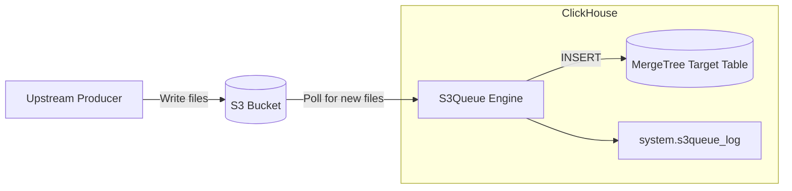

# How to Use ClickHouse S3Queue Table Engine for S3 Streaming

Author: [nawazdhandala](https://www.github.com/nawazdhandala)

Tags: ClickHouse, S3, Streaming, Ingestion, Cloud

Description: Learn how to use the ClickHouse S3Queue table engine to continuously ingest new files from an S3 bucket into ClickHouse as a streaming data source.

---

## Introduction

The `S3Queue` table engine is a ClickHouse table engine that monitors an S3 bucket (or S3-compatible storage) for new files and automatically ingests them into a target table as they arrive. Unlike a one-shot `S3` table function, `S3Queue` tracks which files have already been processed, making it suitable for streaming ingestion from object storage pipelines.

Common use cases include ingesting log files, event data, or data lake dumps written to S3 by upstream producers.

## Architecture Overview



## Prerequisites

- ClickHouse 23.6+ (S3Queue is experimental in earlier versions)
- An S3 bucket accessible from the ClickHouse server
- IAM credentials or instance role with `s3:GetObject`, `s3:ListBucket` permissions

## Enable the Feature Flag

```sql
SET allow_experimental_s3queue = 1;
```

Or set it globally in `config.xml`:

```xml
<clickhouse>
    <s3queue_enable_logging_to_s3queue_log>1</s3queue_enable_logging_to_s3queue_log>
</clickhouse>
```

## Creating the Target Table

First, create the destination table with the final schema:

```sql
CREATE TABLE events_target
(
    user_id    UInt64,
    event      String,
    properties String,
    ts         DateTime
)
ENGINE = MergeTree()
ORDER BY (user_id, ts);
```

## Creating the S3Queue Table

```sql
CREATE TABLE events_queue
(
    user_id    UInt64,
    event      String,
    properties String,
    ts         DateTime
)
ENGINE = S3Queue(
    's3://my-bucket/events/**.json',
    'JSONEachRow'
)
SETTINGS
    mode = 'unordered',
    s3queue_max_processed_files_before_commit = 100,
    s3queue_polling_min_timeout_ms = 1000,
    s3queue_polling_max_timeout_ms = 10000;
```

## Creating the Materialized View to Route Data

Use a materialized view to pipe data from `S3Queue` to the target table:

```sql
CREATE MATERIALIZED VIEW events_mv TO events_target
AS SELECT * FROM events_queue;
```

Once this view exists, ClickHouse will automatically ingest new matching files from S3 and insert them into `events_target`.

## S3 Path Patterns

| Pattern | Matches |
|---|---|
| `s3://bucket/logs/*.csv` | All CSVs directly under `logs/` |
| `s3://bucket/events/**.json` | All JSONs in `events/` recursively |
| `s3://bucket/dt={2024-01-*}/*.parquet` | Date-partitioned Parquet files |

## Engine Modes

| Mode | Behavior |
|---|---|
| `unordered` | Files are processed in any order; best for most use cases |
| `ordered` | Files are processed in lexicographic order; useful when file names encode time |

```sql
ENGINE = S3Queue('s3://bucket/logs/**.csv', 'CSVWithNames')
SETTINGS mode = 'ordered';
```

## With AWS Authentication

Using access key and secret:

```sql
CREATE TABLE events_queue (...)
ENGINE = S3Queue(
    's3://my-bucket/events/**.json',
    'your-access-key-id',
    'your-secret-access-key',
    'JSONEachRow'
);
```

Using IAM role (when running on EC2/ECS with an instance profile, no credentials needed):

```sql
CREATE TABLE events_queue (...)
ENGINE = S3Queue(
    's3://my-bucket/events/**.json',
    'JSONEachRow'
);
```

## Handling CSV Files

```sql
CREATE TABLE csv_queue
(
    id         UInt64,
    name       String,
    value      Float64,
    created_at DateTime
)
ENGINE = S3Queue(
    's3://my-bucket/imports/**.csv',
    'CSVWithNames'
)
SETTINGS
    mode = 'unordered',
    s3queue_polling_min_timeout_ms = 5000;
```

## Monitoring Ingestion Progress

Check the processing log:

```sql
SELECT
    file_name,
    rows_processed,
    status,
    processing_start_time,
    processing_end_time
FROM system.s3queue_log
ORDER BY processing_start_time DESC
LIMIT 20;
```

Check for errors:

```sql
SELECT file_name, status, last_exception
FROM system.s3queue_log
WHERE status = 'Failed'
ORDER BY processing_start_time DESC;
```

## Key Settings Reference

| Setting | Default | Description |
|---|---|---|
| `mode` | `unordered` | File processing order mode |
| `s3queue_max_processed_files_before_commit` | 100 | Flush after N files |
| `s3queue_polling_min_timeout_ms` | 1000 | Min poll interval |
| `s3queue_polling_max_timeout_ms` | 10000 | Max poll interval (backoff) |
| `s3queue_max_rows_per_file` | 0 (unlimited) | Row limit per file |
| `s3queue_cleanup_interval_min_ms` | 60000 | How often to clean tracking state |
| `s3queue_buckets` | 1 | Number of parallel buckets for distributed processing |

## Distributed S3Queue (Multiple Replicas)

When running on a ClickHouse cluster, use `s3queue_buckets` to partition work across nodes so each file is processed only once:

```sql
CREATE TABLE events_queue ON CLUSTER my_cluster (...)
ENGINE = S3Queue(
    's3://my-bucket/events/**.json',
    'JSONEachRow'
)
SETTINGS
    mode = 'unordered',
    s3queue_buckets = 4;  -- one per shard/replica
```

## Comparison with s3() Table Function

| Feature | S3Queue Engine | s3() Table Function |
|---|---|---|
| Continuous ingestion | Yes | No (one-shot) |
| Tracks processed files | Yes | No |
| Deduplication across runs | Yes | No |
| Use case | Streaming pipelines | Ad hoc queries |

## Summary

The `S3Queue` engine turns an S3 bucket into a continuous data source for ClickHouse. Key takeaways:
- Create a target `MergeTree` table first, then an `S3Queue` table with matching schema, then wire them with a materialized view.
- Use `mode = 'ordered'` when file names encode time or sequence; use `unordered` otherwise.
- Monitor `system.s3queue_log` for file-level ingestion status and errors.
- For distributed clusters, set `s3queue_buckets` equal to the number of nodes to distribute file processing.
- Enable `allow_experimental_s3queue = 1` on ClickHouse versions before 24.1.
