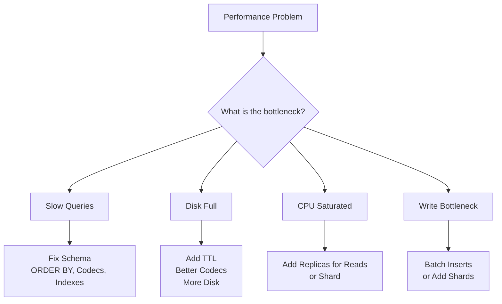

# How to Scale ClickHouse to Billions of Rows

Author: [nawazdhandala](https://www.github.com/nawazdhandala)

Tags: ClickHouse, Scaling, Performance, Cluster, Sharding, Replication

Description: Learn how to scale ClickHouse to billions of rows using sharding, replication, distributed tables, materialized views, and hardware tuning strategies.

---

ClickHouse can query billions of rows in under a second on a single node with the right schema design. When a single node reaches its capacity limits, horizontal scaling through sharding and replication extends throughput and storage linearly. This guide covers both single-node optimization and multi-node cluster design for billion-row workloads.

## When Single Node Is Enough

Before scaling horizontally, optimize the single node:



A single modern server (32 cores, 128 GB RAM, NVMe SSD) can handle:
- 1-5 billion rows in active storage
- 1-10 million rows/second ingest
- Sub-second queries scanning 100M+ rows

## Schema Fundamentals at Billion Scale

```sql
CREATE TABLE events
(
    tenant_id   UInt32                 CODEC(LZ4),
    event_name  LowCardinality(String) CODEC(LZ4),
    user_id     UInt64                 CODEC(LZ4),
    ts          DateTime               CODEC(DoubleDelta, LZ4),
    value       Float64                CODEC(Gorilla, LZ4),
    properties  Map(String, String)    CODEC(ZSTD(3))
)
ENGINE = MergeTree()
PARTITION BY toYYYYMM(ts)
ORDER BY (tenant_id, event_name, ts)
SETTINGS index_granularity = 8192;
```

Critical decisions:
- `ORDER BY` must match your most frequent filter pattern
- `PARTITION BY` controls how much data a query must scan when time-range filtering
- Codecs reduce disk I/O, which is often the real bottleneck

## Checking Current Table Size

```sql
SELECT
    table,
    formatReadableSize(sum(data_compressed_bytes))   AS compressed,
    formatReadableSize(sum(data_uncompressed_bytes)) AS uncompressed,
    sum(rows)                                        AS total_rows,
    count()                                          AS parts
FROM system.parts
WHERE active = 1
  AND database = currentDatabase()
GROUP BY table
ORDER BY compressed DESC;
```

## Skip Indexes for Low-Selectivity Columns

When the ORDER BY cannot prune enough data, add a skip index:

```sql
ALTER TABLE events
    ADD INDEX idx_user_id user_id TYPE minmax GRANULARITY 1;

ALTER TABLE events
    ADD INDEX idx_event_name event_name TYPE set(100) GRANULARITY 1;

ALTER TABLE events MATERIALIZE INDEX idx_user_id;
ALTER TABLE events MATERIALIZE INDEX idx_event_name;
```

## Sampling for Approximate Queries

At billion scale, approximate queries can answer dashboard questions instantly:

```sql
-- Approximate unique users (sample 1%)
SELECT uniqExact(user_id) * 100 AS approx_unique_users
FROM events SAMPLE 0.01
WHERE ts >= now() - INTERVAL 30 DAY;

-- Or use built-in approximate functions
SELECT uniqCombined(user_id) AS approx_unique_users
FROM events
WHERE ts >= now() - INTERVAL 30 DAY;
```

## Distributed Cluster Setup

For workloads that exceed a single node, configure sharding:

```xml
<!-- /etc/clickhouse-server/config.d/remote_servers.xml -->
<clickhouse>
    <remote_servers>
        <analytics_cluster>
            <shard>
                <replica>
                    <host>ch-node-1</host>
                    <port>9000</port>
                </replica>
                <replica>
                    <host>ch-node-2</host>
                    <port>9000</port>
                </replica>
            </shard>
            <shard>
                <replica>
                    <host>ch-node-3</host>
                    <port>9000</port>
                </replica>
                <replica>
                    <host>ch-node-4</host>
                    <port>9000</port>
                </replica>
            </shard>
        </analytics_cluster>
    </remote_servers>
</clickhouse>
```

## Replicated and Distributed Tables

```sql
-- Create the local replicated table on each node
CREATE TABLE events_local ON CLUSTER analytics_cluster
(
    tenant_id  UInt32                 CODEC(LZ4),
    event_name LowCardinality(String) CODEC(LZ4),
    user_id    UInt64                 CODEC(LZ4),
    ts         DateTime               CODEC(DoubleDelta, LZ4),
    value      Float64                CODEC(Gorilla, LZ4)
)
ENGINE = ReplicatedMergeTree(
    '/clickhouse/tables/{shard}/events',
    '{replica}'
)
PARTITION BY toYYYYMM(ts)
ORDER BY (tenant_id, event_name, ts);

-- Create the distributed table that fans out to all shards
CREATE TABLE events ON CLUSTER analytics_cluster
AS events_local
ENGINE = Distributed(
    analytics_cluster,
    currentDatabase(),
    events_local,
    cityHash64(tenant_id)  -- shard key
);
```

The `cityHash64(tenant_id)` shard key routes all data for a given tenant to the same shard, enabling efficient per-tenant scans.

## Ingest at Scale: Async INSERT

```sql
-- Enable async inserts to batch small writes server-side
SET async_insert = 1;
SET wait_for_async_insert = 0;
SET async_insert_max_data_size = 10000000; -- 10 MB
SET async_insert_busy_timeout_ms = 200;
```

This allows clients to send individual rows and have ClickHouse batch them automatically.

## Parallelizing Heavy Queries

```sql
-- Increase threads for large analytical queries
SET max_threads = 32;
SET max_block_size = 65536;

SELECT
    toDate(ts)         AS day,
    count()            AS events,
    uniqExact(user_id) AS users
FROM events
WHERE ts >= now() - INTERVAL 365 DAY
GROUP BY day
ORDER BY day;
```

## Monitoring Merge Performance

Large tables accumulate parts that need merging. Monitor this:

```sql
SELECT
    table,
    count()                           AS active_parts,
    sum(rows)                         AS total_rows,
    max(modification_time)            AS last_merge
FROM system.parts
WHERE active = 1
  AND database = currentDatabase()
GROUP BY table
ORDER BY active_parts DESC;
```

Too many parts (>1000 per partition) indicate that merges are falling behind ingest rate.

## Compressing Old Partitions

Force a merge to recompress data written with suboptimal codecs:

```sql
OPTIMIZE TABLE events PARTITION '202401' FINAL;
```

## Summary

Scaling ClickHouse to billions of rows starts with schema fundamentals: ORDER BY matching query patterns, DoubleDelta and Gorilla codecs, and LowCardinality on repeated strings. When a single node is exhausted, add shards with Distributed + ReplicatedMergeTree, choosing a shard key that collocates related data. Async INSERT handles high-volume write paths. Skip indexes and sampling provide additional query acceleration on very large tables.
