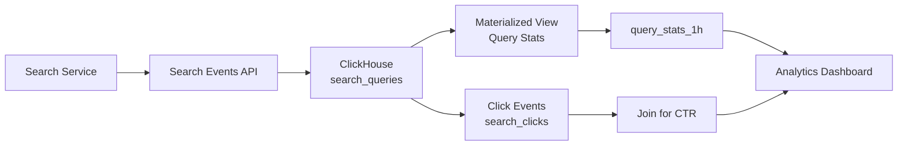

# How to Use ClickHouse for Search Analytics

Author: [nawazdhandala](https://www.github.com/nawazdhandala)

Tags: ClickHouse, Search, Analytics, Query, Ranking, Conversion

Description: Learn how to use ClickHouse for search analytics including query volume trends, zero-result rates, click-through analysis, query ranking, and search conversion tracking.

---

Search analytics answers questions like "what are users searching for?", "which queries return no results?", and "how often do users click a result vs refine their search?" ClickHouse's columnar aggregations and `uniqExact` function handle the high volume and high cardinality of search query data efficiently.

## Architecture



## Search Queries Table

```sql
CREATE TABLE search_queries
(
    query_id     UUID                           CODEC(LZ4),
    user_id      UInt64                         CODEC(LZ4),
    session_id   UInt64                         CODEC(LZ4),
    query        String                         CODEC(ZSTD(3)),
    query_norm   String                         CODEC(ZSTD(3)), -- lowercased, trimmed
    result_count UInt32                         CODEC(LZ4),
    filters      Map(String, String)            CODEC(ZSTD(3)),
    platform     LowCardinality(String)         CODEC(LZ4),
    country      LowCardinality(FixedString(2)) CODEC(LZ4),
    latency_ms   UInt32                         CODEC(Delta(4), LZ4),
    ts           DateTime64(3)                  CODEC(DoubleDelta, LZ4)
)
ENGINE = MergeTree()
PARTITION BY toYYYYMM(ts)
ORDER BY (ts, query_norm)
TTL toDateTime(ts) + INTERVAL 2 YEAR
SETTINGS index_granularity = 8192;
```

## Search Clicks Table

```sql
CREATE TABLE search_clicks
(
    click_id     UUID   CODEC(LZ4),
    query_id     UUID   CODEC(LZ4),
    user_id      UInt64 CODEC(LZ4),
    result_rank  UInt8,
    result_id    String CODEC(ZSTD(3)),
    ts           DateTime64(3) CODEC(DoubleDelta, LZ4)
)
ENGINE = MergeTree()
PARTITION BY toYYYYMM(ts)
ORDER BY (query_id, ts)
TTL toDateTime(ts) + INTERVAL 2 YEAR;
```

## Top Search Queries (Last 7 Days)

```sql
SELECT
    query_norm,
    count()             AS searches,
    uniqExact(user_id)  AS unique_users,
    avg(result_count)   AS avg_results,
    avg(latency_ms)     AS avg_latency_ms
FROM search_queries
WHERE ts >= now() - INTERVAL 7 DAY
GROUP BY query_norm
ORDER BY searches DESC
LIMIT 50;
```

## Zero-Result Queries

```sql
SELECT
    query_norm,
    count()            AS searches,
    uniqExact(user_id) AS unique_users
FROM search_queries
WHERE result_count = 0
  AND ts >= now() - INTERVAL 7 DAY
GROUP BY query_norm
ORDER BY searches DESC
LIMIT 30;
```

Zero-result queries are direct signals for content gaps or search configuration issues.

## Zero-Result Rate Over Time

```sql
SELECT
    toDate(ts)                                     AS day,
    count()                                        AS total_searches,
    countIf(result_count = 0)                      AS zero_results,
    round(100.0 * zero_results / total_searches, 2) AS zero_result_pct
FROM search_queries
WHERE ts >= now() - INTERVAL 30 DAY
GROUP BY day
ORDER BY day;
```

## Click-Through Rate per Query

```sql
SELECT
    q.query_norm,
    count()                                          AS searches,
    countIf(c.click_id != toUUID('00000000-0000-0000-0000-000000000000')) AS clicked_searches,
    round(100.0 * clicked_searches / searches, 2)    AS ctr_pct
FROM search_queries q
LEFT JOIN search_clicks c ON q.query_id = c.query_id
WHERE q.ts >= now() - INTERVAL 7 DAY
GROUP BY q.query_norm
HAVING searches > 100
ORDER BY ctr_pct ASC
LIMIT 30;
```

Queries with low CTR but high volume are candidates for relevance improvements.

## Average Click Rank (Mean Position of Clicked Results)

```sql
SELECT
    q.query_norm,
    count()                AS total_clicks,
    avg(c.result_rank)     AS avg_click_rank,
    min(c.result_rank)     AS best_rank_clicked
FROM search_clicks c
JOIN search_queries q ON c.query_id = q.query_id
WHERE c.ts >= now() - INTERVAL 7 DAY
GROUP BY q.query_norm
HAVING total_clicks > 50
ORDER BY avg_click_rank DESC
LIMIT 30;
```

High average click rank means users are not finding relevant results in the top positions.

## Query Volume Trend

```sql
SELECT
    toStartOfHour(ts) AS hour,
    count()           AS searches
FROM search_queries
WHERE ts >= now() - INTERVAL 7 DAY
GROUP BY hour
ORDER BY hour;
```

## Search Latency Percentiles

```sql
SELECT
    quantile(0.50)(latency_ms) AS p50_ms,
    quantile(0.95)(latency_ms) AS p95_ms,
    quantile(0.99)(latency_ms) AS p99_ms,
    max(latency_ms)            AS max_ms
FROM search_queries
WHERE ts >= now() - INTERVAL 1 HOUR;
```

## Hourly Query Stats Aggregation

```sql
CREATE TABLE query_stats_1h
(
    query_norm  String,
    hour        DateTime,
    searches    SimpleAggregateFunction(sum, UInt64),
    zero_result SimpleAggregateFunction(sum, UInt64),
    clicks      SimpleAggregateFunction(sum, UInt64)
)
ENGINE = AggregatingMergeTree()
PARTITION BY toYYYYMM(hour)
ORDER BY (query_norm, hour)
TTL hour + INTERVAL 2 YEAR;

CREATE MATERIALIZED VIEW query_stats_mv
TO query_stats_1h
AS
SELECT
    query_norm,
    toStartOfHour(ts) AS hour,
    count()           AS searches,
    countIf(result_count = 0) AS zero_result,
    0 AS clicks
FROM search_queries
GROUP BY query_norm, hour;
```

## Trending Queries (Rising Volume)

```sql
SELECT
    query_norm,
    sum(searches)                                              AS last_7d,
    sumIf(searches, hour >= now() - INTERVAL 1 DAY)           AS last_1d,
    round(100.0 * last_1d * 7 / nullIf(last_7d, 0) - 100, 1) AS trend_pct
FROM query_stats_1h
WHERE hour >= now() - INTERVAL 7 DAY
GROUP BY query_norm
HAVING last_7d > 1000
ORDER BY trend_pct DESC
LIMIT 20;
```

## Search Conversion Rate by Country

```sql
SELECT
    q.country,
    count()              AS searches,
    uniqExact(q.user_id) AS unique_users,
    countIf(result_count = 0) AS zero_results,
    round(100.0 * zero_results / searches, 2) AS zero_pct
FROM search_queries q
WHERE q.ts >= now() - INTERVAL 30 DAY
GROUP BY q.country
ORDER BY searches DESC
LIMIT 30;
```

## Summary

ClickHouse is well-suited for search analytics at scale. Store raw search query events with ZSTD on query strings and DoubleDelta on timestamps, then build materialized views for hourly aggregates. Use `uniqExact` for accurate unique user counts per query, track zero-result rates as a content gap signal, and join with click events to compute CTR and mean click rank. These metrics directly inform search relevance tuning.
