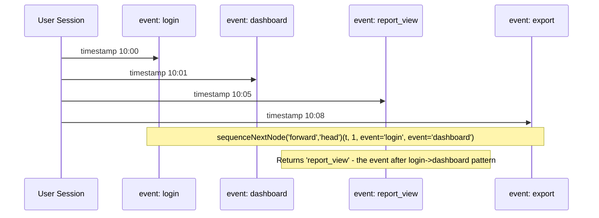

# How to Use sequenceNextNode() in ClickHouse

Author: [OneUptime](https://www.github.com/OneUptime)

Tags: ClickHouse, SQL, Aggregate Function, Sequence Analysis, User Behavior

Description: Learn how to use sequenceNextNode() in ClickHouse to find the next event a user visits after matching a sequence pattern, enabling path analysis and funnel drop-off investigation.

---

`sequenceNextNode()` is a powerful aggregate function for path analysis. Given a sequence of user events ordered by time, it finds the first event that occurs after a specified pattern match, telling you what users did next. This is invaluable for funnel analysis, drop-off investigation, and understanding what paths users take after a key action.

## Syntax

```sql
sequenceNextNode(direction, base)(timestamp, event_cond, pattern_cond1, pattern_cond2, ...)
```

Parameters:
- `direction`: `'forward'` (look for next event after pattern) or `'backward'` (look for previous event before pattern)
- `base`: `'head'` (pattern starts at first event), `'tail'` (pattern starts at last event), or `'first_match'` / `'last_match'`
- `timestamp`: the time column (must be sortable)
- `event_cond`: condition that qualifies rows as candidates for the result
- `pattern_cond1...N`: conditions that define the sequence to match, in order

## Basic Example: What Do Users Do After Login?

```sql
-- Find the next page users visit after a successful login
SELECT
    user_id,
    sequenceNextNode('forward', 'head')(
        event_time,
        1,                              -- any event qualifies as result
        event_name = 'login_success'    -- pattern: must start with login
    ) AS next_page_after_login
FROM user_events
WHERE event_date >= today() - 7
GROUP BY user_id;
```

## Funnel Drop-off: What Happens After Users Reach the Cart?

```sql
-- What do users do after adding to cart but NOT checking out?
SELECT
    next_event,
    count() AS user_count
FROM (
    SELECT
        user_id,
        sequenceNextNode('forward', 'head')(
            event_time,
            1,
            event_name = 'add_to_cart'
        ) AS next_event
    FROM user_events
    WHERE event_date >= today() - 30
    GROUP BY user_id
    HAVING countIf(event_name = 'checkout_complete') = 0  -- users who did NOT convert
)
WHERE next_event IS NOT NULL
GROUP BY next_event
ORDER BY user_count DESC
LIMIT 20;
```

## Multi-Step Pattern: Next Action After a Two-Step Sequence

```sql
-- Users who viewed a product then added to cart - what did they do next?
SELECT
    next_event,
    count() AS user_count
FROM (
    SELECT
        user_id,
        sequenceNextNode('forward', 'head')(
            event_time,
            1,
            event_name = 'product_view',
            event_name = 'add_to_cart'
        ) AS next_event
    FROM user_events
    WHERE event_date >= today() - 30
    GROUP BY user_id
)
WHERE next_event IS NOT NULL
GROUP BY next_event
ORDER BY user_count DESC;
```

## Using 'backward' Direction: What Led to an Error?

```sql
-- What did users do immediately before encountering an error?
SELECT
    prev_event,
    count() AS occurrence_count
FROM (
    SELECT
        user_id,
        sequenceNextNode('backward', 'tail')(
            event_time,
            1,
            event_name = 'error_page'
        ) AS prev_event
    FROM user_events
    WHERE event_date >= today() - 7
    GROUP BY user_id
    HAVING countIf(event_name = 'error_page') > 0
)
WHERE prev_event IS NOT NULL
GROUP BY prev_event
ORDER BY occurrence_count DESC
LIMIT 15;
```

## Path Analysis: Building a Transition Matrix

```sql
-- Build event-to-event transition counts for a Markov chain analysis
SELECT
    current_event,
    next_event,
    count() AS transitions
FROM (
    SELECT
        user_id,
        event_name AS current_event,
        sequenceNextNode('forward', 'head')(
            event_time,
            1,
            event_name = event_name  -- match any single event, get what follows
        ) AS next_event
    FROM user_events
    WHERE event_date >= today() - 30
    GROUP BY user_id, event_name, toStartOfHour(event_time)
)
WHERE next_event IS NOT NULL
GROUP BY current_event, next_event
ORDER BY current_event, transitions DESC;
```

## Workflow Diagram



## Comparing Paths Across User Segments

```sql
-- Compare what premium vs free users do after viewing pricing page
SELECT
    user_tier,
    next_event,
    count() AS user_count
FROM (
    SELECT
        u.user_tier,
        sequenceNextNode('forward', 'head')(
            e.event_time,
            1,
            e.event_name = 'pricing_page_view'
        ) AS next_event
    FROM user_events e
    JOIN users u USING (user_id)
    WHERE e.event_date >= today() - 30
    GROUP BY u.user_tier, e.user_id
)
WHERE next_event IS NOT NULL
GROUP BY user_tier, next_event
ORDER BY user_tier, user_count DESC;
```

## Summary

`sequenceNextNode()` returns the value of a specified event condition that comes immediately after (or before, with `backward` direction) a matched multi-step pattern in a user's event stream. It is ideal for path analysis, funnel drop-off investigation, and building Markov-chain transition matrices over event logs. The `forward`/`backward` direction and `head`/`tail`/`first_match`/`last_match` base parameter give flexible control over which end of the session the pattern anchors to. Combine it with `GROUP BY user_id` and aggregate over result values to understand population-level behavior after key events.
