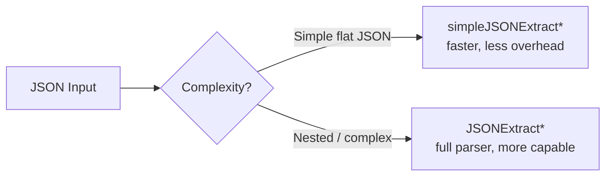

# How to Use simpleJSONExtractInt() and simpleJSONExtractFloat() in ClickHouse

Author: [nawazdhandala](https://www.github.com/nawazdhandala)

Tags: ClickHouse, SQL, JSON, simpleJSONExtractInt, simpleJSONExtractFloat, Function

Description: Learn how to extract numeric values from simple JSON strings in ClickHouse using simpleJSONExtractInt() and simpleJSONExtractFloat() for fast, lightweight parsing.

---

ClickHouse provides two families of JSON extraction functions: the full `JSONExtract*` family (which supports nested paths and full JSON spec) and the `simpleJSON*` family (which uses a lightweight parser optimized for simple, flat JSON objects). `simpleJSONExtractInt()` and `simpleJSONExtractFloat()` are the numeric variants of the latter.

## How simpleJSON Functions Work

The `simpleJSON*` functions use a simplified parser that is faster than the full JSON parser but has limitations:

- Supports only flat (non-nested) key lookups
- The key must be a direct field of the top-level object
- Does not support array indexing
- Whitespace handling is lenient but the structure must be simple

These functions are best for high-throughput log processing where JSON structure is simple and performance matters.

## Syntax

```sql
simpleJSONExtractInt(json, field_name)
simpleJSONExtractFloat(json, field_name)
```

Both functions take exactly two arguments: the JSON string and a single field name string.

## Performance Comparison



## Examples

### Basic Integer Extraction

```sql
SELECT simpleJSONExtractInt('{"status": 200, "count": 42}', 'count') AS count_val;
```

```text
count_val
42
```

### Basic Float Extraction

```sql
SELECT simpleJSONExtractFloat('{"latency": 3.14, "cpu": 87.5}', 'latency') AS latency;
```

```text
latency
3.14
```

### Returns 0 for Missing Keys

When the key does not exist, both functions return `0`:

```sql
SELECT
    simpleJSONExtractInt('{"a": 1}', 'b')   AS missing_int,
    simpleJSONExtractFloat('{"a": 1}', 'b') AS missing_float;
```

```text
missing_int  missing_float
0            0
```

### Using in Aggregations

```sql
SELECT
    sum(simpleJSONExtractInt(log_line, 'bytes_sent'))   AS total_bytes,
    avg(simpleJSONExtractFloat(log_line, 'duration_ms')) AS avg_duration
FROM (
    SELECT '{"bytes_sent": 1024, "duration_ms": 12.5}' AS log_line
    UNION ALL SELECT '{"bytes_sent": 512,  "duration_ms": 8.2}'  AS log_line
    UNION ALL SELECT '{"bytes_sent": 2048, "duration_ms": 25.1}' AS log_line
);
```

```text
total_bytes  avg_duration
3584         15.266...
```

### Complete Working Example

Process HTTP access logs stored as flat JSON strings:

```sql
CREATE TABLE http_logs
(
    log_id    UInt64,
    log_json  String,
    logged_at DateTime DEFAULT now()
) ENGINE = MergeTree()
ORDER BY log_id;

INSERT INTO http_logs (log_id, log_json) VALUES
    (1, '{"status": 200, "bytes": 4096, "duration": 23.5}'),
    (2, '{"status": 404, "bytes": 512,  "duration": 5.1}'),
    (3, '{"status": 200, "bytes": 8192, "duration": 45.2}'),
    (4, '{"status": 500, "bytes": 256,  "duration": 2.3}');

SELECT
    simpleJSONExtractInt(log_json, 'status')      AS status_code,
    sum(simpleJSONExtractInt(log_json, 'bytes'))  AS total_bytes,
    avg(simpleJSONExtractFloat(log_json, 'duration')) AS avg_duration_ms
FROM http_logs
GROUP BY status_code
ORDER BY status_code;
```

```text
status_code  total_bytes  avg_duration_ms
200          12288        34.35
404          512          5.1
500          256          2.3
```

## Summary

`simpleJSONExtractInt()` and `simpleJSONExtractFloat()` are fast, lightweight functions for extracting numeric values from flat JSON objects in ClickHouse. They are ideal for high-volume log analytics where JSON structure is predictable and simple. For complex or nested JSON, use the full `JSONExtractInt()` and `JSONExtractFloat()` functions instead. Both simple variants return `0` when the key is not found.
