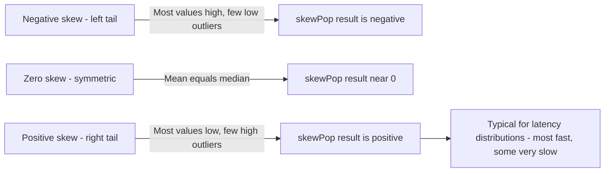

# How to Use skewSamp() and skewPop() in ClickHouse

Author: [OneUptime](https://www.github.com/OneUptime)

Tags: ClickHouse, SQL, Aggregate Function, Statistics, Distribution Analysis

Description: Learn how to use skewSamp() and skewPop() in ClickHouse to measure the asymmetry of a distribution, detecting whether data is skewed left or right.

---

Skewness quantifies the asymmetry of a distribution around its mean. A perfectly symmetric distribution has zero skewness. Positive skewness indicates a long right tail (most values are low, but a few extreme high values pull the mean up), while negative skewness indicates a long left tail. ClickHouse provides `skewSamp(x)` for sample skewness (Bessel's correction for bias) and `skewPop(x)` for population skewness.

## Syntax

```sql
-- Sample skewness (use when data is a sample from a larger population)
SELECT skewSamp(value_column) FROM table_name;

-- Population skewness (use when data is the complete population)
SELECT skewPop(value_column) FROM table_name;
```

Both return Float64. The result is dimensionless.

## Interpreting Skewness Values

| Skewness | Interpretation |
|----------|---------------|
| 0 | Symmetric distribution |
| 0 to 0.5 | Approximately symmetric |
| 0.5 to 1.0 | Moderately right-skewed |
| > 1.0 | Highly right-skewed |
| -0.5 to 0 | Approximately symmetric |
| -1.0 to -0.5 | Moderately left-skewed |
| < -1.0 | Highly left-skewed |

## Basic Example

```sql
-- Is response time right-skewed (long tail of slow requests)?
SELECT
    skewSamp(response_time_ms)  AS skewness,
    avg(response_time_ms)       AS mean_ms,
    median(response_time_ms)    AS median_ms,
    count()                     AS n
FROM request_logs
WHERE log_date = today();
```

A positive skewness here confirms that most requests are fast but a long tail of slow requests pulls the mean above the median.

## Per-Service Skewness Analysis

```sql
-- Compare skewness across services to find heavy-tail outliers
SELECT
    service_name,
    round(skewSamp(response_time_ms), 3)         AS latency_skewness,
    round(avg(response_time_ms), 2)              AS mean_ms,
    round(median(response_time_ms), 2)           AS median_ms,
    round(avg(response_time_ms) - median(response_time_ms), 2) AS mean_minus_median,
    count()                                      AS request_count
FROM request_logs
WHERE log_date >= today() - 7
GROUP BY service_name
ORDER BY latency_skewness DESC;
```

## Skewness in Distributions Over Time

```sql
-- Track how skewness of request latency changes hour by hour
SELECT
    toStartOfHour(timestamp) AS hour,
    round(skewSamp(response_time_ms), 3)  AS latency_skewness,
    round(avg(response_time_ms), 2)       AS mean_ms,
    count()                               AS requests
FROM request_logs
WHERE timestamp >= now() - INTERVAL 48 HOUR
GROUP BY hour
ORDER BY hour DESC;
```

## Skewness vs Kurtosis: Complementary Metrics

```sql
-- Skewness tells you about asymmetry; kurtosis tells you about tail weight
SELECT
    service_name,
    round(skewSamp(response_time_ms), 3)  AS skewness,
    round(kurtSamp(response_time_ms), 3)  AS excess_kurtosis,
    round(stddevSamp(response_time_ms), 2) AS std_dev,
    count()                               AS n
FROM request_logs
WHERE log_date >= today() - 7
GROUP BY service_name
ORDER BY skewness DESC;
```

## Visualizing What Skewness Means



## Detecting Distribution Shifts

```sql
-- Did a deployment change the skewness of response times?
SELECT
    multiIf(
        timestamp < '2026-03-31 12:00:00', 'before_deployment',
        'after_deployment'
    ) AS period,
    round(skewSamp(response_time_ms), 3)  AS skewness,
    round(avg(response_time_ms), 2)       AS mean_ms,
    round(median(response_time_ms), 2)    AS median_ms,
    count()                               AS n
FROM request_logs
WHERE timestamp >= '2026-03-31 10:00:00'
  AND timestamp < '2026-03-31 14:00:00'
GROUP BY period
ORDER BY period;
```

## skewSamp vs skewPop

```sql
-- For large N they converge; for small N skewSamp uses bias correction
SELECT
    count()            AS n,
    skewSamp(x)        AS samp_skewness,
    skewPop(x)         AS pop_skewness,
    skewSamp(x) - skewPop(x) AS difference
FROM (
    SELECT response_time_ms AS x FROM request_logs WHERE log_date = today() LIMIT 50
);
```

Use `skewSamp()` for sampled data or analytical statistics; `skewPop()` when your data represents the entire population.

## Summary

`skewSamp(x)` and `skewPop(x)` measure the asymmetry of a numeric distribution. Positive skewness indicates a long right tail (common in latency data where most requests are fast but a few are very slow), while negative skewness indicates a long left tail. `skewSamp` applies bias correction for sample data; `skewPop` assumes the complete population. Use skewness alongside mean, median, and standard deviation to build a fuller picture of your data distribution, detect outlier-driven behavior, and monitor for distribution shifts after deployments or configuration changes.
