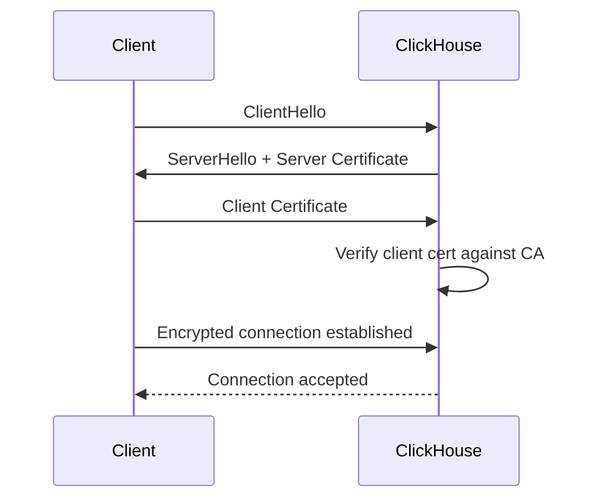

# How to Set Up SSL Mutual Authentication in ClickHouse

Author: [nawazdhandala](https://www.github.com/nawazdhandala)

Tags: ClickHouse, SSL, TLS, Security, Authentication, Certificate, mTLS

Description: Configure mutual TLS (mTLS) in ClickHouse so both the server and clients authenticate with X.509 certificates, eliminating password-based authentication for service accounts.

---

## Introduction

Mutual TLS (mTLS) in ClickHouse requires both the server and the connecting client to present valid X.509 certificates signed by a trusted Certificate Authority. This eliminates password-based authentication for service accounts and ensures that only clients with authorized certificates can connect.

## mTLS Handshake Flow



## Step 1: Generate a CA and Certificates

```bash
# Create CA
openssl genrsa -out ca.key 4096
openssl req -x509 -new -nodes -key ca.key -sha256 -days 3650 \
    -subj "/CN=ClickHouseCA" -out ca.crt

# Generate server certificate
openssl genrsa -out server.key 2048
openssl req -new -key server.key \
    -subj "/CN=clickhouse.example.com" \
    -out server.csr
openssl x509 -req -in server.csr -CA ca.crt -CAkey ca.key \
    -CAcreateserial -out server.crt -days 365 -sha256

# Generate client certificate
openssl genrsa -out client.key 2048
openssl req -new -key client.key \
    -subj "/CN=etl_service" \
    -out client.csr
openssl x509 -req -in client.csr -CA ca.crt -CAkey ca.key \
    -CAcreateserial -out client.crt -days 365 -sha256

# Install certificates
mkdir -p /etc/clickhouse-server/certs
cp ca.crt server.crt server.key /etc/clickhouse-server/certs/
chown -R clickhouse:clickhouse /etc/clickhouse-server/certs
chmod 600 /etc/clickhouse-server/certs/server.key
```

## Step 2: Configure ClickHouse Server for mTLS

Create `/etc/clickhouse-server/config.d/ssl.xml`:

```xml
<clickhouse>
  <openSSL>
    <server>
      <certificateFile>/etc/clickhouse-server/certs/server.crt</certificateFile>
      <privateKeyFile>/etc/clickhouse-server/certs/server.key</privateKeyFile>
      <caConfig>/etc/clickhouse-server/certs/ca.crt</caConfig>
      <verificationMode>strict</verificationMode>    <!-- Require client cert -->
      <invalidCertificateHandler>
        <name>RejectCertificateHandler</name>
      </invalidCertificateHandler>
    </server>
    <client>
      <caConfig>/etc/clickhouse-server/certs/ca.crt</caConfig>
      <verificationMode>strict</verificationMode>
    </client>
  </openSSL>

  <!-- Enable secure TCP port -->
  <tcp_port_secure>9440</tcp_port_secure>
  <!-- Enable HTTPS port -->
  <https_port>8443</https_port>
</clickhouse>
```

## Step 3: Create a Certificate-Authenticated User

In `users.xml`, use the SSL certificate's Common Name (CN) to identify the user:

```xml
<users>
  <etl_service>
    <ssl_certificates>
      <common_name>etl_service</common_name>
    </ssl_certificates>
    <networks>
      <ip>10.0.0.0/8</ip>
    </networks>
    <profile>default</profile>
    <quota>default</quota>
  </etl_service>
</users>
```

Or use SQL (with `access_management = 1`):

```sql
CREATE USER etl_service
    IDENTIFIED WITH ssl_certificate
    CN 'etl_service';

GRANT INSERT ON raw_data.* TO etl_service;
```

## Step 4: Connect with Client Certificate

Using `clickhouse-client`:

```bash
clickhouse-client \
    --host clickhouse.example.com \
    --port 9440 \
    --secure \
    --ssl-ca-cert-file ca.crt \
    --ssl-cert-file client.crt \
    --ssl-key-file client.key \
    --user etl_service \
    --query "SELECT currentUser()"
```

Using curl (HTTPS interface):

```bash
curl --cacert ca.crt \
     --cert client.crt \
     --key client.key \
     "https://clickhouse.example.com:8443/?query=SELECT+currentUser()"
```

## Step 5: Python Client with mTLS

```python
import clickhouse_connect

client = clickhouse_connect.get_client(
    host='clickhouse.example.com',
    port=8443,
    secure=True,
    ca_cert='ca.crt',
    client_cert='client.crt',
    client_cert_key='client.key',
    username='etl_service',
)

result = client.query('SELECT currentUser()')
print(result.result_rows)
```

## Step 6: Disable Non-Secure Port (Optional)

To force all connections through TLS:

```xml
<clickhouse>
  <!-- Comment out or remove the non-SSL ports -->
  <!-- <tcp_port>9000</tcp_port> -->
  <!-- <http_port>8123</http_port> -->
  <tcp_port_secure>9440</tcp_port_secure>
  <https_port>8443</https_port>
</clickhouse>
```

## Verifying mTLS is Working

```sql
-- Check whether the current connection is using TLS
SELECT
    interface,
    is_initial_query,
    user,
    client_hostname
FROM system.query_log
WHERE type = 'QueryStart'
ORDER BY event_time DESC
LIMIT 5;
```

## Certificate Rotation

1. Generate new client certificate signed by the same CA.
2. Update the application to use the new certificate.
3. Old certificate remains valid until its expiry date (or revoke via CRL/OCSP).

## Summary

Mutual TLS in ClickHouse requires both server and client to present X.509 certificates signed by a shared CA. Configure the server certificate, private key, and CA in `<openSSL><server>` with `verificationMode = strict`. Define users by their certificate's Common Name using `<ssl_certificates>` or `IDENTIFIED WITH ssl_certificate CN`. Clients connect with their certificate and key over the secure port (9440 for native protocol, 8443 for HTTP). This eliminates passwords for service accounts.
