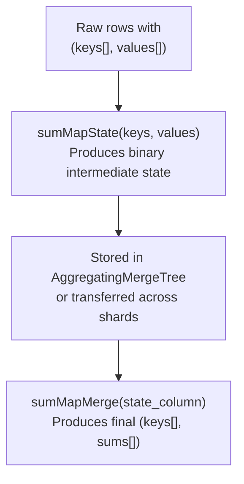

# How to Use sumMapMerge() in ClickHouse

Author: [nawazdhandala](https://www.github.com/nawazdhandala)

Tags: ClickHouse, Aggregate Function, sumMapMerge, AggregatingMergeTree, Map, Incremental Aggregation

Description: Learn how sumMapMerge() finalizes partial sumMap states stored in AggregatingMergeTree columns, enabling efficient per-key sum aggregation across shards and partitions.

---

`sumMapMerge()` is the merge-phase counterpart of `sumMapState()`. Together they implement the two-phase aggregation pattern: `sumMapState()` produces a binary intermediate state that can be stored or transmitted, and `sumMapMerge()` combines those states into a final map of per-key sums. This pattern is used with `AggregatingMergeTree` tables to incrementally maintain summed maps without re-scanning raw data.

## Background: sumMap and the State/Merge Pattern

`sumMap(keys, values)` aggregates multiple (keys, values) array pairs into a single map where each key's values are summed. The `State` and `Merge` combinators extend this to support incremental and distributed aggregation.



## Function Signatures

```text
-- Two-array form
sumMap(keys_array, values_array)

-- State combinator: returns AggregateFunction state
sumMapState(keys_array, values_array)

-- Merge combinator: finalizes stored states
sumMapMerge(state_column)
```

## Setting Up an AggregatingMergeTree Table

```sql
CREATE TABLE daily_event_counts
(
    date         Date,
    region       String,
    event_sums   AggregateFunction(sumMap, Array(String), Array(Int64))
)
ENGINE = AggregatingMergeTree()
ORDER BY (date, region);
```

## Inserting Partial States

```sql
INSERT INTO daily_event_counts
SELECT
    toDate(event_time) AS date,
    region,
    sumMapState(event_types, counts) AS event_sums
FROM raw_events
GROUP BY date, region;
```

## Querying with sumMapMerge

```sql
SELECT
    date,
    region,
    sumMapMerge(event_sums).1 AS event_types,
    sumMapMerge(event_sums).2 AS total_counts
FROM daily_event_counts
GROUP BY date, region
ORDER BY date, region;
```

The result is a tuple of two arrays: the key array and the summed value array.

## Flattening the Map Output

`sumMapMerge` returns a `Tuple(Array(K), Array(V))`. Use `arrayZip` to pair keys with values, then `arrayJoin` to produce one row per key.

```sql
SELECT
    date,
    region,
    event_type,
    total_count
FROM (
    SELECT
        date,
        region,
        sumMapMerge(event_sums).1 AS event_types,
        sumMapMerge(event_sums).2 AS total_counts
    FROM daily_event_counts
    GROUP BY date, region
)
ARRAY JOIN
    event_types AS event_type,
    total_counts AS total_count
ORDER BY date, region, event_type;
```

## Distributed Query Pattern

On a sharded cluster, each shard computes partial states locally. The coordinator merges them.

```sql
-- On each shard (implicit in distributed queries):
SELECT region, sumMapState(event_types, counts) AS partial
FROM raw_events_local
GROUP BY region

-- On coordinator, ClickHouse automatically uses sumMapMerge
-- when querying a Distributed table backed by AggregatingMergeTree.
SELECT region, sumMapMerge(event_sums) FROM daily_event_counts_distributed
GROUP BY region;
```

## Using sumMap Directly (Without State/Merge)

For ad-hoc queries where you do not need incremental storage, use `sumMap` directly on raw data.

```sql
SELECT
    region,
    sumMap(event_types, counts).1 AS event_types,
    sumMap(event_types, counts).2 AS totals
FROM raw_events
GROUP BY region;
```

## Filtering by Key After Merge

Extract the total for a specific key from the merged result using `indexOf`.

```sql
SELECT
    date,
    region,
    sumMapMerge(event_sums).2[
        indexOf(sumMapMerge(event_sums).1, 'purchase')
    ] AS total_purchases
FROM daily_event_counts
GROUP BY date, region
HAVING total_purchases > 0
ORDER BY total_purchases DESC;
```

## Summary

`sumMapMerge()` finalizes binary aggregate states produced by `sumMapState()`, enabling per-key sum aggregation to be stored incrementally in `AggregatingMergeTree` tables and merged efficiently at query time. Use `sumMapState()` during ingestion to maintain pre-aggregated maps without re-scanning raw data, and `sumMapMerge()` at read time to combine those states into the final summed map. For one-off queries on raw data, `sumMap()` alone is sufficient.
