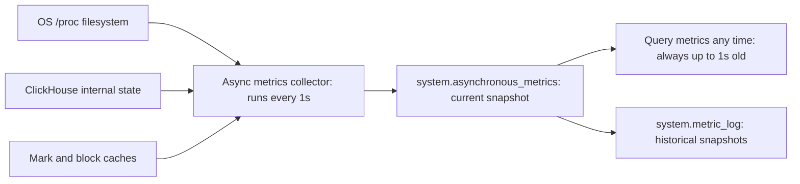

# How to Use system.asynchronous_metrics in ClickHouse

Author: [nawazdhandala](https://www.github.com/nawazdhandala)

Tags: ClickHouse, System, Monitoring, Metric, Performance

Description: Learn how to use system.asynchronous_metrics in ClickHouse to access periodically updated server metrics like memory usage, CPU load, uptime, and cache sizes.

---

`system.asynchronous_metrics` provides a set of server-wide metrics that are collected asynchronously in the background at a configurable interval (default: 1 second). These metrics are more expensive to compute than the instant counters in `system.metrics`, so they are pre-calculated and cached. They include OS-level metrics (CPU load, memory from `/proc`), ClickHouse internal state metrics, and cache utilization counters.

## Viewing All Asynchronous Metrics

```sql
SELECT metric, value, description
FROM system.asynchronous_metrics
ORDER BY metric
LIMIT 50;
```

## Key Metrics

| Metric | Description |
|--------|-------------|
| `MemoryResident` | Resident memory (RSS) of the ClickHouse process in bytes |
| `MemoryVirtual` | Virtual memory size in bytes |
| `MemoryShared` | Shared memory in bytes |
| `OSCPUWaitMicroseconds` | CPU wait time due to I/O or other blocking |
| `LoadAverage1` | 1-minute OS load average |
| `LoadAverage5` | 5-minute OS load average |
| `LoadAverage15` | 15-minute OS load average |
| `Uptime` | Server uptime in seconds |
| `MarkCacheFiles` | Files cached in the mark cache |
| `MarkCacheBytes` | Mark cache size in bytes |
| `UncompressedCacheBytes` | Uncompressed block cache size in bytes |
| `NumberOfDatabases` | Total number of databases |
| `NumberOfTables` | Total number of tables |
| `ReplicasMaxRelativeDelay` | Maximum replication lag across all replicated tables |

## Filtering for Specific Metrics

```sql
SELECT metric, value
FROM system.asynchronous_metrics
WHERE metric LIKE '%Memory%'
ORDER BY metric;
```

## Memory Metrics at a Glance

```sql
SELECT
    metric,
    formatReadableSize(toUInt64(value)) AS readable
FROM system.asynchronous_metrics
WHERE metric IN (
    'MemoryResident',
    'MemoryVirtual',
    'MemoryShared',
    'UncompressedCacheBytes',
    'MarkCacheBytes'
)
ORDER BY metric;
```

## CPU Load Average

```sql
SELECT
    metric,
    round(value, 2) AS load
FROM system.asynchronous_metrics
WHERE metric IN ('LoadAverage1', 'LoadAverage5', 'LoadAverage15');
```

## Replication Lag

```sql
SELECT
    metric,
    value AS seconds_behind
FROM system.asynchronous_metrics
WHERE metric LIKE '%Delay%'
  OR metric LIKE '%Replica%'
ORDER BY metric;
```

## Metric Collection Flow



## Uptime and Server State

```sql
SELECT
    metric,
    value
FROM system.asynchronous_metrics
WHERE metric IN ('Uptime', 'NumberOfDatabases', 'NumberOfTables', 'NumberOfDetachedParts')
ORDER BY metric;
```

## Cache Utilization

```sql
SELECT
    metric,
    formatReadableSize(toUInt64(value)) AS size
FROM system.asynchronous_metrics
WHERE metric LIKE '%Cache%'
ORDER BY metric;
```

## Comparing with system.metrics

| Table | Metrics Type | Update Frequency |
|-------|-------------|-----------------|
| `system.metrics` | Instant counters (queries running, merges, etc.) | Real-time |
| `system.asynchronous_metrics` | Computed metrics (memory, CPU, cache) | Every 1 second |
| `system.events` | Cumulative counters since server start | Real-time |
| `system.metric_log` | Historical snapshots of all metrics | Every N seconds (configurable) |

## Monitoring Script

```bash
#!/usr/bin/env bash
# Print key asynchronous metrics in a dashboard-friendly format

clickhouse-client --query "
SELECT
    metric,
    CASE
        WHEN metric LIKE '%Bytes%' THEN formatReadableSize(toUInt64(value))
        WHEN metric LIKE '%Memory%' THEN formatReadableSize(toUInt64(value))
        ELSE toString(round(value, 2))
    END AS readable_value
FROM system.asynchronous_metrics
WHERE metric IN (
    'MemoryResident', 'LoadAverage1', 'LoadAverage5',
    'Uptime', 'NumberOfTables', 'ReplicasMaxRelativeDelay',
    'MarkCacheBytes', 'UncompressedCacheBytes'
)
ORDER BY metric
FORMAT PrettyCompactNoEscapes
"
```

## Setting the Collection Interval

```xml
<asynchronous_metrics_update_period_s>1</asynchronous_metrics_update_period_s>
```

Increase this for lower CPU overhead, at the cost of less frequent metric updates.

## Summary

`system.asynchronous_metrics` gives you access to periodically updated server-wide metrics including memory usage, CPU load averages, cache sizes, replication lag, and database/table counts. Unlike `system.metrics` (which reflects instantaneous state), these values are computed in the background and cached, making them safe to poll at high frequency. Use them in health checks, Prometheus scrapers, Grafana dashboards, and replication lag alerting.
