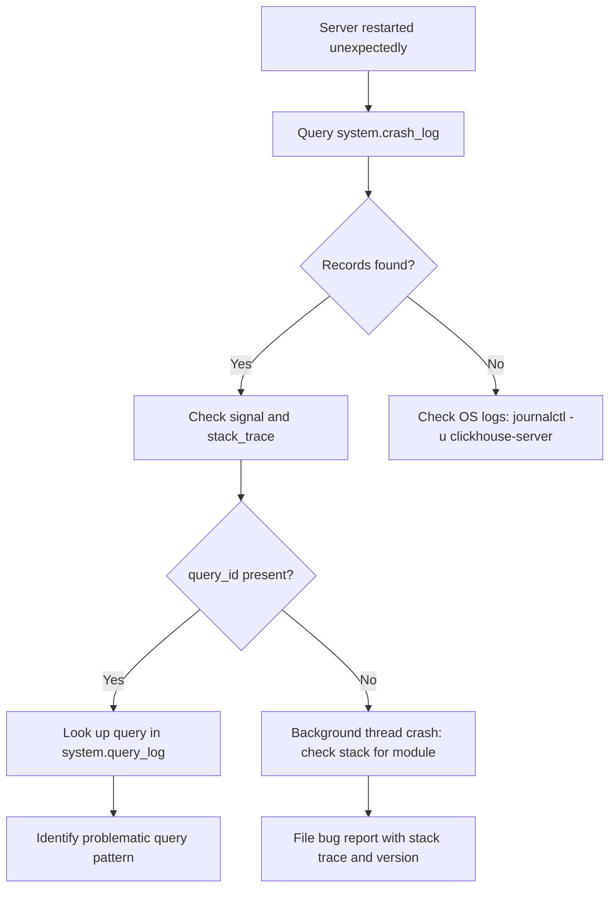

# How to Use system.crash_log in ClickHouse

Author: [nawazdhandala](https://www.github.com/nawazdhandala)

Tags: ClickHouse, System, Monitoring, Crash, Logging

Description: Learn how to use system.crash_log in ClickHouse to investigate server crashes, read stack traces, and diagnose fatal errors that caused process restarts.

---

`system.crash_log` stores information about fatal errors and crashes that caused the ClickHouse server process to terminate abnormally. Unlike `system.error_log` (which tracks query-level exceptions), `system.crash_log` records low-level signals and aborts such as segmentation faults, assertion failures, and out-of-memory kills. It is your first resource when you see unexpected server restarts or need to file a bug report.

## How It Works

When ClickHouse receives a fatal signal (SIGSEGV, SIGABRT, etc.), the signal handler writes a crash record to `system.crash_log` before the process terminates. Because this happens inside the signal handler, the record may be incomplete if the crash is severe enough to prevent the write. The information is persisted across restarts.

## Viewing Crash Records

```sql
SELECT
    event_time,
    signal,
    thread_id,
    query_id,
    terminate_reason,
    stack_trace
FROM system.crash_log
ORDER BY event_time DESC
LIMIT 10;
```

## Key Columns

| Column | Type | Description |
|--------|------|-------------|
| `event_date` | Date | Date of the crash |
| `event_time` | DateTime | Timestamp of the crash |
| `timestamp_ns` | UInt64 | Nanosecond-precision timestamp |
| `signal` | Int32 | POSIX signal number (11=SIGSEGV, 6=SIGABRT) |
| `thread_id` | UInt64 | OS thread ID that crashed |
| `query_id` | String | Query being executed when crash occurred |
| `terminate_reason` | String | Reason from the terminate handler |
| `stack_trace` | String | Raw stack trace as text |
| `version` | String | ClickHouse version string |
| `revision` | UInt32 | ClickHouse revision number |
| `build_id` | String | Build identifier for debuginfo matching |

## Signal Number Reference

| Signal | Number | Meaning |
|--------|--------|---------|
| `SIGSEGV` | 11 | Segmentation fault (invalid memory access) |
| `SIGABRT` | 6 | Abort (assertion failure or `std::terminate`) |
| `SIGBUS` | 7 | Bus error (unaligned access or hardware fault) |
| `SIGILL` | 4 | Illegal instruction |
| `SIGUSR1` | 10 | User-defined (sometimes used for controlled exits) |

## Crash History

```sql
SELECT
    event_date,
    count()            AS crash_count,
    arrayDistinct(groupArray(signal)) AS signals,
    version
FROM system.crash_log
GROUP BY event_date, version
ORDER BY event_date DESC;
```

## Reading the Stack Trace

```sql
SELECT
    event_time,
    signal,
    query_id,
    stack_trace
FROM system.crash_log
WHERE event_date = today()
ORDER BY event_time DESC
LIMIT 1
FORMAT Vertical;
```

## Crash Investigation Workflow



## Correlating Crash with Query

```sql
-- Find the query that was running when the crash occurred
SELECT
    c.event_time AS crash_time,
    c.signal,
    q.user,
    q.query_duration_ms,
    left(q.query, 200) AS query_text
FROM system.crash_log c
LEFT JOIN system.query_log q
    ON c.query_id = q.query_id
    AND q.type IN ('QueryStart', 'QueryFinish')
WHERE c.event_date >= today() - 30
ORDER BY c.event_time DESC
LIMIT 10;
```

## Checking ClickHouse Version at Crash Time

```sql
SELECT
    event_time,
    version,
    revision,
    build_id,
    signal
FROM system.crash_log
ORDER BY event_time DESC
LIMIT 5;
```

## Reading Crash Logs from the Filesystem

In addition to `system.crash_log`, ClickHouse writes crash information to its log files:

```bash
# View recent crash entries in the ClickHouse server log
grep -i "Received signal\|Fatal error\|SIGSEGV\|SIGABRT" \
    /var/log/clickhouse-server/clickhouse-server.log | tail -50
```

## When crash_log Is Empty After a Crash

If `system.crash_log` has no records but the server restarted, consider:

1. The OOM killer terminated the process (check `dmesg | grep -i "oom\|killed"`)
2. `systemd` or Docker forcibly killed the process with `SIGKILL` (unkillable signal)
3. The crash was so severe the signal handler could not write to the table

```bash
# Check for OOM kill events
sudo dmesg | grep -E "oom_kill|Out of memory" | tail -20

# Check systemd kill reason
sudo systemctl status clickhouse-server
```

## Summary

`system.crash_log` records fatal crashes including signal number, stack trace, query ID, and ClickHouse version. Query it immediately after an unexpected server restart to determine what crashed and which query was involved. Pair it with `system.query_log` to identify problematic query patterns, and include the `version`, `revision`, and `stack_trace` when filing ClickHouse bug reports.
