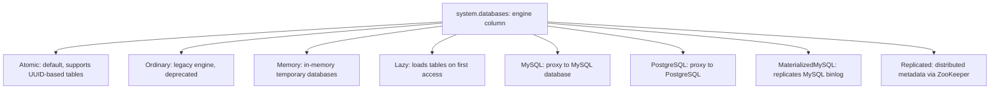

# How to Use system.databases in ClickHouse

Author: [nawazdhandala](https://www.github.com/nawazdhandala)

Tags: ClickHouse, System, Metadata, Database, Monitoring

Description: Learn how to use system.databases in ClickHouse to list all databases, inspect their engines, check data paths, and audit database metadata and comments.

---

`system.databases` contains one row per database on the ClickHouse server. It is a simple but essential catalog table for discovering databases, understanding their storage engines, and auditing database-level configuration. It is the starting point for schema discovery alongside `system.tables` and `system.columns`.

## Key Columns

| Column | Type | Description |
|--------|------|-------------|
| `name` | String | Database name |
| `engine` | String | Database engine (Atomic, Ordinary, Memory, Lazy, MySQL, PostgreSQL, MaterializedMySQL, Replicated) |
| `data_path` | String | Path to data directory on disk |
| `metadata_path` | String | Path to metadata directory |
| `uuid` | UUID | Unique identifier for the database (Atomic engine) |
| `engine_full` | String | Full engine definition |
| `comment` | String | Database comment |

## Listing All Databases

```sql
SELECT
    name,
    engine,
    data_path
FROM system.databases
ORDER BY name;
```

## Database Engine Types



## Viewing Database Metadata

```sql
SELECT
    name,
    engine,
    engine_full,
    uuid,
    comment
FROM system.databases
WHERE name NOT IN ('system', 'information_schema', 'INFORMATION_SCHEMA')
FORMAT Vertical;
```

## Databases Using External Engines

```sql
-- Find federated databases (MySQL, PostgreSQL proxies)
SELECT name, engine, engine_full
FROM system.databases
WHERE engine IN ('MySQL', 'PostgreSQL', 'MaterializedMySQL')
ORDER BY engine, name;
```

## Finding Databases by Data Path

```sql
SELECT name, engine, data_path
FROM system.databases
WHERE data_path LIKE '/mnt/ssd%'
ORDER BY name;
```

## Databases Without Comments

```sql
SELECT name, engine
FROM system.databases
WHERE (comment = '' OR comment IS NULL)
  AND name NOT IN ('system', 'information_schema', 'INFORMATION_SCHEMA')
ORDER BY name;
```

## Auditing Replicated Databases

```sql
SELECT name, engine, engine_full
FROM system.databases
WHERE engine = 'Replicated'
ORDER BY name;
```

The `Replicated` database engine keeps DDL synchronized across ClickHouse nodes via ZooKeeper, similar to `ReplicatedMergeTree` for tables.

## Counting Tables per Database

```sql
SELECT
    d.name       AS database,
    d.engine     AS db_engine,
    count(t.name) AS table_count
FROM system.databases d
LEFT JOIN system.tables t ON d.name = t.database
WHERE d.name NOT IN ('system', 'information_schema', 'INFORMATION_SCHEMA')
GROUP BY database, db_engine
ORDER BY table_count DESC;
```

## Storage Size by Database

```sql
SELECT
    t.database,
    formatReadableSize(sum(t.total_bytes)) AS total_size,
    sum(t.total_rows)                      AS total_rows,
    count()                                AS tables
FROM system.tables t
JOIN system.databases d ON t.database = d.name
WHERE t.has_own_data = 1
GROUP BY t.database
ORDER BY sum(t.total_bytes) DESC;
```

## Adding Comments to Databases

```sql
-- Add a descriptive comment to a database
ALTER DATABASE analytics COMMENT 'Production analytics data warehouse';
ALTER DATABASE staging   COMMENT 'Staging environment for testing';

-- Verify
SELECT name, comment FROM system.databases ORDER BY name;
```

## Checking UUID for the Atomic Engine

The `Atomic` database engine assigns a UUID to each database and table, which allows safe `RENAME` and `DROP` operations without data loss from filesystem conflicts:

```sql
SELECT name, uuid, engine
FROM system.databases
WHERE engine = 'Atomic'
ORDER BY name;
```

## Summary

`system.databases` is the top-level catalog table in ClickHouse, providing an inventory of all databases and their engine types. Use it to discover external database proxies (MySQL, PostgreSQL), audit database comments, identify deprecated `Ordinary` engine databases for migration, and correlate with `system.tables` for storage reporting. It is a lightweight read with no performance impact and is safe to query frequently.
