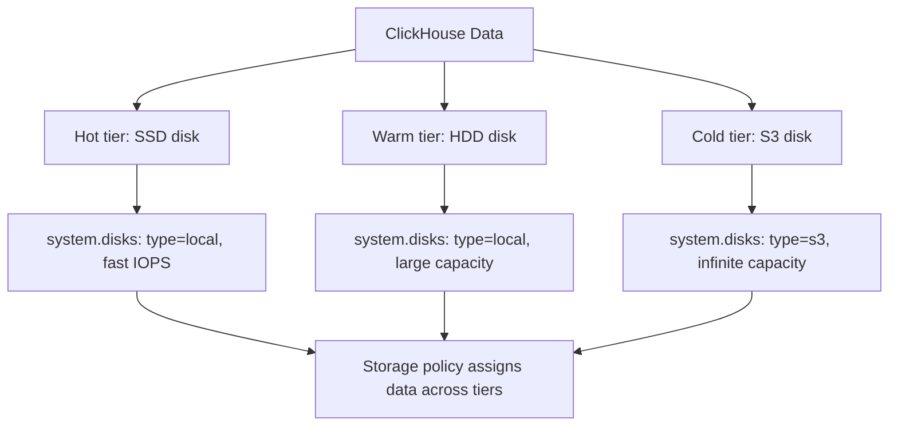

# How to Use system.disks in ClickHouse

Author: [nawazdhandala](https://www.github.com/nawazdhandala)

Tags: ClickHouse, System, Storage, Disk, Monitoring

Description: Learn how to use system.disks in ClickHouse to inspect configured disk definitions, monitor free and total space, and verify tiered storage configurations.

---

`system.disks` lists all storage disks configured in ClickHouse's `storage_configuration` section of `config.xml`. A disk in ClickHouse is an abstraction over a storage location -- it can be a local filesystem path, an S3 bucket, an Azure Blob Storage container, or a HDFS path. Monitoring `system.disks` is essential for capacity planning and verifying tiered storage setups.

## Default Configuration

Without explicit configuration, ClickHouse creates a single disk named `default` pointing to the `path` defined in `config.xml`:

```xml
<storage_configuration>
    <disks>
        <default>
            <path>/var/lib/clickhouse/</path>
        </default>
    </disks>
</storage_configuration>
```

## Key Columns

| Column | Type | Description |
|--------|------|-------------|
| `name` | String | Disk name as defined in config |
| `path` | String | Filesystem path or endpoint URL |
| `free_space` | UInt64 | Available bytes on this disk |
| `total_space` | UInt64 | Total capacity in bytes |
| `unreserved_space` | UInt64 | Free space minus reserved amount |
| `keep_free_space` | UInt64 | Minimum free bytes to keep reserved |
| `type` | String | local, s3, s3_plain, azure, hdfs, web |
| `is_encrypted` | UInt8 | 1 if disk encryption is enabled |
| `cache_path` | String | Cache path for remote disks |

## Viewing All Disks

```sql
SELECT
    name,
    type,
    path,
    formatReadableSize(free_space)   AS free,
    formatReadableSize(total_space)  AS total,
    round((1 - free_space / total_space) * 100, 1) AS used_pct
FROM system.disks
ORDER BY name;
```

## Checking Disk Space

```sql
SELECT
    name,
    formatReadableSize(free_space)        AS free,
    formatReadableSize(total_space)       AS total,
    formatReadableSize(unreserved_space)  AS unreserved,
    round(free_space * 100.0 / total_space, 1) AS free_pct
FROM system.disks
ORDER BY free_pct;
```

## Multi-Tier Storage Architecture



## Example: Multi-Disk Configuration in config.xml

```xml
<storage_configuration>
    <disks>
        <ssd>
            <path>/mnt/ssd/clickhouse/</path>
            <keep_free_space_bytes>10737418240</keep_free_space_bytes>
        </ssd>
        <hdd>
            <path>/mnt/hdd/clickhouse/</path>
        </hdd>
        <s3_cold>
            <type>s3</type>
            <endpoint>https://s3.amazonaws.com/my-bucket/clickhouse/</endpoint>
            <access_key_id>ACCESS_KEY</access_key_id>
            <secret_access_key>SECRET_KEY</secret_access_key>
        </s3_cold>
    </disks>
</storage_configuration>
```

After configuring, query to verify:

```sql
SELECT name, type, path, formatReadableSize(total_space) AS capacity
FROM system.disks
ORDER BY name;
```

## Encrypted Disks

```sql
SELECT name, type, is_encrypted, path
FROM system.disks
ORDER BY is_encrypted DESC, name;
```

## Remote Disk Cache Information

For S3 and Azure disks with local caching:

```sql
SELECT
    name,
    type,
    path,
    cache_path
FROM system.disks
WHERE type IN ('s3', 's3_plain', 'azure', 'hdfs')
ORDER BY name;
```

## Disk Space Alert Query

```sql
SELECT
    name,
    formatReadableSize(free_space) AS free,
    round(free_space * 100.0 / total_space, 1) AS free_pct,
    'CRITICAL: disk almost full' AS alert
FROM system.disks
WHERE free_space * 100.0 / total_space < 10;
```

## Which Parts Live on Which Disk

Correlate with `system.parts` to see data distribution:

```sql
SELECT
    p.disk_name,
    d.type        AS disk_type,
    count()       AS part_count,
    formatReadableSize(sum(p.data_compressed_bytes)) AS data_size
FROM system.parts p
JOIN system.disks d ON p.disk_name = d.name
WHERE p.active = 1
  AND p.database = currentDatabase()
GROUP BY p.disk_name, d.type
ORDER BY data_size DESC;
```

## Summary

`system.disks` is the authoritative view of all storage locations available to ClickHouse. Use it to check free space on each disk, verify tiered storage configuration, identify encrypted disks, and monitor remote disk cache paths. Pair it with `system.storage_policies` to understand how ClickHouse assigns data across disks, and with `system.parts` to see how data is actually distributed in practice.
