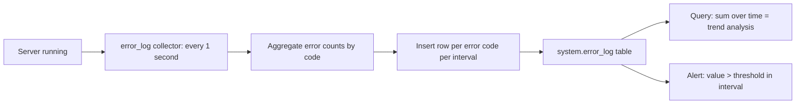

# How to Use system.error_log in ClickHouse

Author: [nawazdhandala](https://www.github.com/nawazdhandala)

Tags: ClickHouse, System, Monitoring, Error, Logging

Description: Learn how to use system.error_log in ClickHouse to track error frequency trends over time, detect spikes, and diagnose recurring server-side exceptions.

---

`system.error_log` records the rate at which specific error codes occur on the ClickHouse server over time. Unlike `system.query_log` (which captures the full exception for each failed query), `system.error_log` aggregates error counts by code at regular intervals. This makes it ideal for alerting on error rate spikes and tracking whether a fix reduced errors.

## Enabling error_log

Configure in `config.xml`:

```xml
<error_log>
    <database>system</database>
    <table>error_log</table>
    <flush_interval_milliseconds>7500</flush_interval_milliseconds>
    <collect_interval_milliseconds>1000</collect_interval_milliseconds>
    <ttl>event_date + INTERVAL 30 DAY DELETE</ttl>
</error_log>
```

## Key Columns

| Column | Type | Description |
|--------|------|-------------|
| `event_date` | Date | Date of the interval |
| `event_time` | DateTime | Start of the collection interval |
| `code` | Int32 | ClickHouse error code |
| `error` | String | Error name (e.g., `MEMORY_LIMIT_EXCEEDED`) |
| `value` | UInt64 | Number of times this error occurred in the interval |
| `remote` | UInt8 | 1 if the error originated from a remote server |

## Viewing Recent Errors

```sql
SELECT
    event_time,
    code,
    error,
    value AS count
FROM system.error_log
WHERE event_date = today()
  AND value > 0
ORDER BY event_time DESC, value DESC
LIMIT 50;
```

## Top Errors Over the Last 7 Days

```sql
SELECT
    code,
    error,
    sum(value)         AS total_occurrences,
    max(value)         AS peak_per_interval,
    count()            AS intervals_with_error
FROM system.error_log
WHERE event_date >= today() - 7
  AND value > 0
GROUP BY code, error
ORDER BY total_occurrences DESC
LIMIT 20;
```

## Error Rate Timeline

```sql
SELECT
    toStartOfHour(event_time) AS hour,
    error,
    sum(value)                AS total
FROM system.error_log
WHERE event_date >= today() - 3
  AND error = 'MEMORY_LIMIT_EXCEEDED'
GROUP BY hour, error
ORDER BY hour;
```

## Error Trend Diagram



## Detecting Error Spikes

```sql
SELECT
    event_time,
    error,
    value
FROM system.error_log
WHERE event_date = today()
  AND value > 10  -- More than 10 occurrences in a 1-second interval
ORDER BY value DESC
LIMIT 30;
```

## Remote vs Local Error Breakdown

```sql
SELECT
    error,
    sumIf(value, remote = 0) AS local_errors,
    sumIf(value, remote = 1) AS remote_errors,
    sum(value)               AS total
FROM system.error_log
WHERE event_date >= today() - 7
  AND value > 0
GROUP BY error
HAVING total > 100
ORDER BY total DESC;
```

## Common Error Codes to Monitor

| Code | Error Name | Typical Cause |
|------|-----------|---------------|
| 241 | `MEMORY_LIMIT_EXCEEDED` | Query or server memory limit hit |
| 159 | `TIMEOUT_EXCEEDED` | Query exceeded max execution time |
| 396 | `LIMIT_EXCEEDED` | Result exceeded max_result_rows/bytes |
| 60  | `UNKNOWN_TABLE` | Query references nonexistent table |
| 164 | `READONLY` | Write attempted on read-only replica |
| 285 | `TOO_FEW_LIVE_REPLICAS` | Replication quorum not met |

## Correlating with Query Failures

```sql
-- Join error_log counts with failed query details
SELECT
    e.event_time,
    e.error,
    e.value          AS error_count,
    q.user,
    left(q.query, 100) AS query_preview
FROM system.error_log e
JOIN system.query_log q
    ON toStartOfSecond(q.event_time) = e.event_time
    AND q.exception LIKE concat('%', e.error, '%')
WHERE e.event_date = today()
  AND e.value > 0
ORDER BY e.event_time DESC
LIMIT 20;
```

## Summary

`system.error_log` provides a time-series view of ClickHouse server errors, aggregated by error code at configurable intervals. Use it to build error rate dashboards, detect spikes after deployments, compare error rates between time windows, and distinguish local errors from remote ones in distributed setups. Pair it with `system.query_log` to drill from an error count spike down to the actual failing queries.
