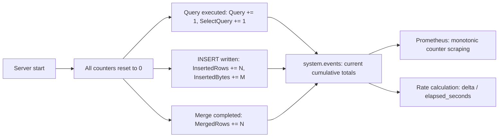

# How to Use system.events in ClickHouse

Author: [nawazdhandala](https://www.github.com/nawazdhandala)

Tags: ClickHouse, System, Monitoring, Event, Counter

Description: Learn how to use system.events in ClickHouse to read cumulative server event counters, track query activity, and measure I/O and network throughput since server start.

---

`system.events` exposes cumulative server-wide event counters that increment from the moment the ClickHouse process started. Each counter represents a specific event (a query completed, a file was read, bytes were sent to a network socket, etc.). These counters never reset unless the server restarts. Use them for throughput calculations, health checks, and Prometheus-style monotonic counter scraping.

## Viewing All Events

```sql
SELECT event, value, description
FROM system.events
ORDER BY event
LIMIT 50;
```

## Key Events

| Event | Description |
|-------|-------------|
| `Query` | Total queries completed since server start |
| `SelectQuery` | SELECT queries completed |
| `InsertQuery` | INSERT queries completed |
| `FailedQuery` | Queries that raised an exception |
| `FailedSelectQuery` | SELECT queries that failed |
| `SelectedRows` | Rows read by SELECT queries |
| `SelectedBytes` | Bytes read by SELECT queries |
| `InsertedRows` | Rows written by INSERT queries |
| `InsertedBytes` | Bytes written by INSERT queries |
| `MergedRows` | Rows merged by background merges |
| `MergedUncompressedBytes` | Uncompressed bytes merged |
| `MergeTreeDataWriterRows` | Rows written to MergeTree parts |
| `NetworkSendBytes` | Bytes sent to clients |
| `NetworkReceiveBytes` | Bytes received from clients |
| `DiskReadElapsedMicroseconds` | Total time spent in disk reads |
| `ReadBufferFromFileDescriptorReadBytes` | Bytes read from local files |

## Viewing Query Throughput Counters

```sql
SELECT event, value
FROM system.events
WHERE event IN (
    'Query', 'SelectQuery', 'InsertQuery',
    'FailedQuery', 'FailedSelectQuery',
    'SelectedRows', 'SelectedBytes'
)
ORDER BY event;
```

## Calculating Rates Since Server Start

Combine `system.events` with `system.asynchronous_metrics` (`Uptime`) to calculate per-second rates:

```sql
SELECT
    e.event,
    e.value                                                AS total,
    round(e.value / m.value, 2)                           AS per_second
FROM system.events e
CROSS JOIN (
    SELECT toUInt64(value) AS value
    FROM system.asynchronous_metrics
    WHERE metric = 'Uptime'
) m
WHERE e.event IN ('Query', 'SelectQuery', 'InsertedRows', 'MergedRows')
ORDER BY per_second DESC;
```

## Comparing Snapshots to Measure Throughput

Because `system.events` is monotonically increasing, you can snapshot it at two points in time and compute the delta:

```sql
-- Snapshot 1 (run and save result externally)
SELECT event, value AS snapshot1
FROM system.events
WHERE event IN ('SelectQuery', 'InsertQuery', 'FailedQuery');

-- 60 seconds later, snapshot 2
SELECT event, value AS snapshot2
FROM system.events
WHERE event IN ('SelectQuery', 'InsertQuery', 'FailedQuery');

-- Delta = snapshot2 - snapshot1 / 60 = per-second rate
```

## Event Counter Model



## Network I/O Counters

```sql
SELECT
    event,
    formatReadableSize(value) AS total
FROM system.events
WHERE event IN ('NetworkSendBytes', 'NetworkReceiveBytes')
ORDER BY event;
```

## Cache Hit Counters

```sql
SELECT event, value
FROM system.events
WHERE event LIKE '%CacheHit%'
   OR event LIKE '%CacheMiss%'
ORDER BY event;
```

## Disk Read/Write Counters

```sql
SELECT
    event,
    formatReadableSize(value) AS total,
    value / (SELECT toUInt64(value) FROM system.asynchronous_metrics WHERE metric = 'Uptime') AS bytes_per_second
FROM system.events
WHERE event IN (
    'ReadBufferFromFileDescriptorReadBytes',
    'WriteBufferFromFileDescriptorWriteBytes',
    'DiskReadElapsedMicroseconds'
)
ORDER BY event;
```

## Prometheus Scraping

ClickHouse exposes `system.events` via its built-in Prometheus endpoint:

```bash
curl http://localhost:9363/metrics | grep "clickhouse_events"
```

Or read directly via SQL for custom scrapers:

```sql
SELECT
    concat('clickhouse_events_', lower(replaceAll(event, '.', '_'))) AS metric_name,
    value
FROM system.events
FORMAT TSV;
```

## Summary

`system.events` provides cumulative monotonic counters for all significant server events since startup. Use them to calculate query throughput rates, measure I/O volume, track cache effectiveness, and build Prometheus-compatible monitoring. Because values never decrease, always compute rates as deltas between two snapshots. Pair with `system.metrics` for instantaneous gauges and `system.asynchronous_metrics` for OS-level resource metrics.
