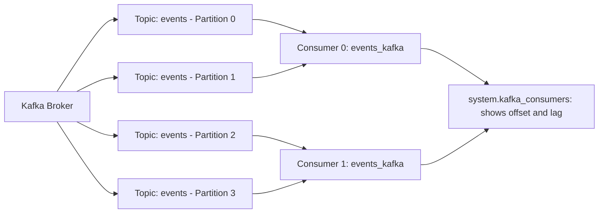

# How to Use system.kafka_consumers in ClickHouse

Author: [nawazdhandala](https://www.github.com/nawazdhandala)

Tags: ClickHouse, System, Kafka, Consumer, Monitoring

Description: Learn how to use system.kafka_consumers in ClickHouse to monitor Kafka engine consumer state, track partition offsets, and diagnose consumer lag and errors.

---

`system.kafka_consumers` provides a real-time view into the state of all active Kafka engine consumers in ClickHouse. When you create a table using the `Kafka` engine, ClickHouse creates one or more consumer threads that continuously read from Kafka topics. This table shows each consumer's current partition assignments, offsets, lag, and error state.

## Prerequisites: Kafka Engine Table

```sql
CREATE TABLE events_kafka
(
    ts         DateTime,
    user_id    UInt64,
    event_type String,
    payload    String
)
ENGINE = Kafka
SETTINGS
    kafka_broker_list = 'kafka:9092',
    kafka_topic_list  = 'events',
    kafka_group_name  = 'clickhouse_events_consumer',
    kafka_format      = 'JSONEachRow',
    kafka_num_consumers = 4;
```

## Key Columns

| Column | Type | Description |
|--------|------|-------------|
| `database` | String | Database of the Kafka table |
| `table` | String | Kafka table name |
| `consumer_id` | String | Unique consumer instance identifier |
| `assignments.topic` | Array(String) | Assigned Kafka topics |
| `assignments.partition_id` | Array(Int32) | Assigned partition numbers |
| `assignments.current_offset` | Array(Int64) | Current committed offset per partition |
| `assignments.offset_committed` | Array(Int64) | Last committed offset |
| `assignments.offset_end` | Array(Int64) | Latest available offset (end of partition) |
| `assignments.messages_in_flight` | Array(Int64) | Messages being processed |
| `last_exception_time` | DateTime | Time of the most recent error |
| `last_exception` | String | Most recent error message |
| `num_messages_read` | UInt64 | Total messages read by this consumer |

## Viewing Active Consumers

```sql
SELECT
    database,
    table,
    consumer_id,
    length(assignments.topic)            AS assigned_partitions,
    sum(assignments.current_offset)      AS total_current_offset,
    num_messages_read,
    last_exception_time,
    last_exception
FROM system.kafka_consumers
WHERE table = 'events_kafka'
ORDER BY consumer_id;
```

## Calculating Consumer Lag Per Partition

```sql
SELECT
    table,
    consumer_id,
    arrayJoin(
        arrayZip(
            assignments.partition_id,
            assignments.current_offset,
            assignments.offset_end,
            arrayMap((c, e) -> e - c, assignments.current_offset, assignments.offset_end)
        )
    ) AS (partition, current_offset, end_offset, lag)
FROM system.kafka_consumers
WHERE table = 'events_kafka'
ORDER BY lag DESC;
```

## Consumer Architecture



## Detecting Consumers with Errors

```sql
SELECT
    table,
    consumer_id,
    last_exception_time,
    last_exception
FROM system.kafka_consumers
WHERE last_exception != ''
  AND last_exception_time > now() - INTERVAL 1 HOUR
ORDER BY last_exception_time DESC;
```

## Total Lag Across All Consumers

```sql
SELECT
    table,
    count()       AS consumer_count,
    sum(
        arraySum(
            arrayMap((c, e) -> greatest(0, e - c),
                assignments.current_offset,
                assignments.offset_end
            )
        )
    )             AS total_lag
FROM system.kafka_consumers
WHERE database = currentDatabase()
GROUP BY table
ORDER BY total_lag DESC;
```

## Messages Read per Consumer

```sql
SELECT
    consumer_id,
    num_messages_read
FROM system.kafka_consumers
WHERE table = 'events_kafka'
ORDER BY num_messages_read DESC;
```

An imbalanced distribution (some consumers reading far more than others) indicates uneven partition assignment or a hotspot partition.

## Checking Partition Assignment Balance

```sql
SELECT
    consumer_id,
    length(assignments.partition_id) AS partitions_assigned
FROM system.kafka_consumers
WHERE table = 'events_kafka'
ORDER BY consumer_id;
```

For `kafka_num_consumers = 4` and 8 partitions, each consumer should have 2 partitions. If assignment is uneven, it may indicate a rebalance is in progress.

## Monitoring Lag Over Time with a MaterializedView

Create a table to track lag snapshots:

```sql
CREATE TABLE kafka_consumer_lag_history
(
    ts             DateTime DEFAULT now(),
    table_name     String,
    consumer_id    String,
    total_lag      Int64
)
ENGINE = MergeTree()
ORDER BY (table_name, consumer_id, ts)
TTL ts + INTERVAL 7 DAY;

-- Periodically insert lag snapshots via a scheduled query or external script
INSERT INTO kafka_consumer_lag_history
SELECT
    now(),
    table,
    consumer_id,
    sum(arraySum(
        arrayMap((c, e) -> greatest(0, e - c),
            assignments.current_offset,
            assignments.offset_end
        )
    ))
FROM system.kafka_consumers
WHERE database = currentDatabase()
GROUP BY table, consumer_id;
```

## Summary

`system.kafka_consumers` is the primary tool for monitoring Kafka engine consumer health in ClickHouse. Use it to check partition assignments, calculate per-partition lag, detect consumers with errors, and verify balanced load distribution across consumer threads. Track lag over time by periodically snapshotting this view into a history table, enabling alerting when lag exceeds acceptable thresholds.
