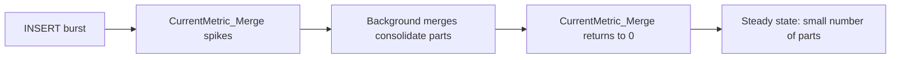

# How to Use system.metric_log in ClickHouse

Author: [nawazdhandala](https://www.github.com/nawazdhandala)

Tags: ClickHouse, System, Monitoring, Metric, Logging

Description: Learn how to use system.metric_log in ClickHouse to track server-level metrics over time, build dashboards, and diagnose performance trends.

---

`system.metric_log` records a snapshot of all ClickHouse server metrics at regular intervals (default: every 1 second). Where `system.metrics` gives you the current value of each metric at query time, `system.metric_log` gives you their historical values, making it useful for time-series dashboards, alerting, and retrospective performance analysis.

## Enabling metric_log

Enable it in `config.xml`:

```xml
<metric_log>
    <database>system</database>
    <table>metric_log</table>
    <flush_interval_milliseconds>7500</flush_interval_milliseconds>
    <collect_interval_milliseconds>1000</collect_interval_milliseconds>
    <ttl>event_date + INTERVAL 30 DAY DELETE</ttl>
</metric_log>
```

`collect_interval_milliseconds` controls how often metrics are sampled.

## Key Columns

`system.metric_log` has a column per metric. There are hundreds of columns, one for each entry in `system.metrics` and `system.asynchronous_metrics`. Common ones:

| Column | Description |
|--------|-------------|
| `event_time` | Timestamp of the snapshot |
| `CurrentMetric_Query` | Number of queries currently running |
| `CurrentMetric_Merge` | Number of background merges running |
| `CurrentMetric_MemoryTracking` | Memory currently tracked by queries |
| `CurrentMetric_OpenFileForRead` | Open file descriptors for reads |
| `CurrentMetric_ReplicatedChecks` | Replication consistency checks running |
| `ProfileEvent_Query` | Cumulative queries since server start |
| `ProfileEvent_MergedRows` | Rows merged since server start |

## Listing Available Metric Columns

```sql
SELECT name
FROM system.columns
WHERE table = 'metric_log' AND database = 'system'
ORDER BY name
LIMIT 50;
```

## Query Concurrency Over Time

```sql
SELECT
    toStartOfMinute(event_time)              AS minute,
    avg(CurrentMetric_Query)                 AS avg_concurrent_queries,
    max(CurrentMetric_Query)                 AS max_concurrent_queries
FROM system.metric_log
WHERE event_date >= today() - 1
GROUP BY minute
ORDER BY minute;
```

## Memory Usage Trend

```sql
SELECT
    toStartOfMinute(event_time)              AS minute,
    formatReadableSize(
        avg(CurrentMetric_MemoryTracking)
    )                                        AS avg_query_memory,
    formatReadableSize(
        max(CurrentMetric_MemoryTracking)
    )                                        AS peak_query_memory
FROM system.metric_log
WHERE event_date >= today() - 1
GROUP BY minute
ORDER BY minute;
```

## Merge Activity Timeline



```sql
SELECT
    toStartOfMinute(event_time)  AS minute,
    avg(CurrentMetric_Merge)     AS avg_merges,
    max(CurrentMetric_Merge)     AS max_merges
FROM system.metric_log
WHERE event_date = today()
GROUP BY minute
ORDER BY minute;
```

## Open File Descriptors Trend

```sql
SELECT
    toStartOfHour(event_time)              AS hour,
    avg(CurrentMetric_OpenFileForRead)     AS avg_read_fds,
    max(CurrentMetric_OpenFileForRead)     AS max_read_fds,
    avg(CurrentMetric_OpenFileForWrite)    AS avg_write_fds
FROM system.metric_log
WHERE event_date >= today() - 7
GROUP BY hour
ORDER BY hour;
```

## Detecting Query Saturation

```sql
SELECT
    event_time,
    CurrentMetric_Query        AS running_queries,
    CurrentMetric_QueryThread  AS running_threads
FROM system.metric_log
WHERE event_date = today()
  AND CurrentMetric_Query > 50
ORDER BY event_time;
```

## Comparing Metric Snapshots Before and After a Change

```sql
-- Before deployment window
SELECT avg(CurrentMetric_Merge) AS avg_merges
FROM system.metric_log
WHERE event_time BETWEEN '2024-01-15 09:00:00' AND '2024-01-15 10:00:00';

-- After deployment window
SELECT avg(CurrentMetric_Merge) AS avg_merges
FROM system.metric_log
WHERE event_time BETWEEN '2024-01-15 11:00:00' AND '2024-01-15 12:00:00';
```

## Exporting to Grafana

`system.metric_log` pairs naturally with the ClickHouse Grafana data source plugin. A typical Grafana query:

```sql
SELECT
    $__timeInterval(event_time)              AS time,
    avg(CurrentMetric_Query)                 AS queries,
    avg(CurrentMetric_Merge)                 AS merges
FROM system.metric_log
WHERE $__timeFilter(event_time)
GROUP BY time
ORDER BY time;
```

## Summary

`system.metric_log` is the historical time-series counterpart to `system.metrics`. It persists periodic snapshots of all server metrics, making it ideal for monitoring dashboards, capacity planning, and incident retrospectives. Configure the collect interval and TTL based on your retention and storage budget, and use it alongside Grafana or any time-series visualization tool for real-time cluster observability.
