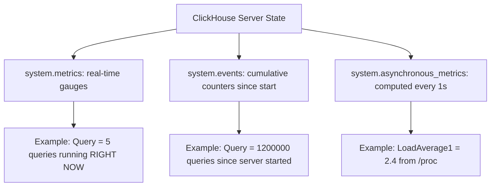

# How to Use system.metrics in ClickHouse

Author: [nawazdhandala](https://www.github.com/nawazdhandala)

Tags: ClickHouse, System, Monitoring, Metric, Performance

Description: Learn how to use system.metrics in ClickHouse to read real-time server state gauges including active queries, merges, connections, and memory tracking.

---

`system.metrics` exposes real-time gauge metrics reflecting the current state of the ClickHouse server. Unlike `system.events` (cumulative counters) or `system.asynchronous_metrics` (periodically computed), `system.metrics` values change instantly as server state changes. Querying it gives you a snapshot of what is happening right now.

## Viewing All Current Metrics

```sql
SELECT metric, value, description
FROM system.metrics
ORDER BY metric;
```

## Key Metrics

| Metric | Description |
|--------|-------------|
| `Query` | Number of queries currently running |
| `Merge` | Number of background merges running |
| `Move` | Number of part moves in progress |
| `ReplicatedFetch` | Parts being fetched from other replicas |
| `ReplicatedSend` | Parts being sent to other replicas |
| `ReplicatedChecks` | Parts undergoing consistency checks |
| `BackgroundMovePoolTask` | Background move tasks running |
| `BackgroundMergesAndMutationsPoolTask` | Merge/mutation pool tasks running |
| `MemoryTracking` | Memory tracked by running queries |
| `OpenFileForRead` | Open file descriptors for reads |
| `OpenFileForWrite` | Open file descriptors for writes |
| `TCPConnection` | Active TCP connections |
| `HTTPConnection` | Active HTTP connections |
| `InterserverConnection` | Active inter-shard connections |
| `ZooKeeperRequest` | ZooKeeper requests in flight |
| `ZooKeeperWatch` | Active ZooKeeper watches |
| `DistributedSend` | Distributed INSERT sends in progress |

## Checking Active Queries and Merges

```sql
SELECT metric, value
FROM system.metrics
WHERE metric IN ('Query', 'Merge', 'Move', 'MemoryTracking')
ORDER BY metric;
```

## Connection Count by Type

```sql
SELECT
    metric,
    value AS connections
FROM system.metrics
WHERE metric LIKE '%Connection%'
ORDER BY value DESC;
```

## Replication State

```sql
SELECT metric, value
FROM system.metrics
WHERE metric LIKE 'Replicated%'
ORDER BY metric;
```

## Background Thread Pool Utilization

```sql
SELECT metric, value
FROM system.metrics
WHERE metric LIKE 'Background%'
ORDER BY metric;
```

## Metric Type Comparison



## Memory Usage of Running Queries

```sql
SELECT
    metric,
    formatReadableSize(value) AS current_value
FROM system.metrics
WHERE metric IN ('MemoryTracking', 'MemoryTrackingInBackgroundProcessingPool')
ORDER BY metric;
```

## ZooKeeper Metrics

```sql
SELECT metric, value
FROM system.metrics
WHERE metric LIKE 'ZooKeeper%'
ORDER BY metric;
```

## Building a Health Check

```sql
-- Simple health check: alert if too many queries or merges are running
SELECT
    metric,
    value,
    CASE
        WHEN metric = 'Query' AND value > 100 THEN 'WARNING: High concurrency'
        WHEN metric = 'Merge'  AND value > 50  THEN 'WARNING: High merge load'
        WHEN metric = 'ReplicatedFetch' AND value > 20 THEN 'WARNING: Replica catching up'
        ELSE 'OK'
    END AS status
FROM system.metrics
WHERE metric IN ('Query', 'Merge', 'ReplicatedFetch', 'ReplicatedChecks')
ORDER BY metric;
```

## Prometheus Endpoint

ClickHouse exposes `system.metrics` via its built-in Prometheus endpoint on port 9363:

```bash
curl http://localhost:9363/metrics | grep "clickhouse_metrics"
```

Example output:

```text
# HELP clickhouse_metrics_Query Number of executing queries
# TYPE clickhouse_metrics_Query gauge
clickhouse_metrics_Query 3
```

## Alerting on Metric Thresholds

```sql
-- Find metrics exceeding thresholds (useful for alerting scripts)
SELECT
    metric,
    value
FROM system.metrics
WHERE
    (metric = 'Query'           AND value > 200)
    OR (metric = 'Merge'        AND value > 100)
    OR (metric = 'ReplicatedFetch' AND value > 50)
    OR (metric = 'ZooKeeperRequest' AND value > 100);
```

## Tracking Metrics Over Time

To track metrics over time, query `system.metric_log` (which stores periodic snapshots):

```sql
SELECT
    toStartOfMinute(event_time) AS minute,
    avg(CurrentMetric_Query)    AS avg_queries,
    avg(CurrentMetric_Merge)    AS avg_merges
FROM system.metric_log
WHERE event_date >= today() - 1
GROUP BY minute
ORDER BY minute;
```

## Summary

`system.metrics` provides real-time gauge values for the ClickHouse server's current operational state. Query it to see how many queries, merges, and connections are active right now, how much memory running queries are consuming, and whether replication or ZooKeeper is under load. Use it in health checks, alerting scripts, and Prometheus scrapers. Pair it with `system.events` for cumulative totals and `system.metric_log` for historical trends.
