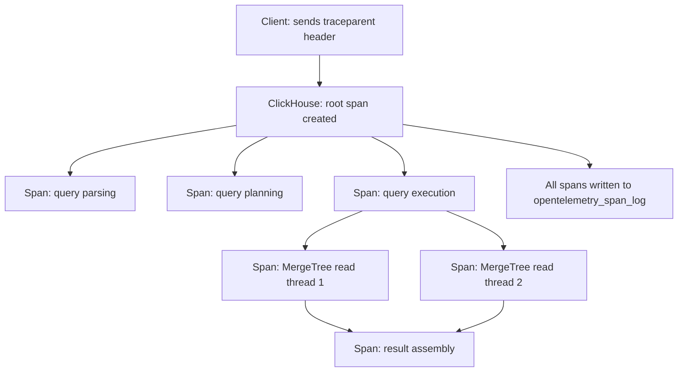

# How to Use system.opentelemetry_span_log in ClickHouse

Author: [nawazdhandala](https://www.github.com/nawazdhandala)

Tags: ClickHouse, System, OpenTelemetry, Tracing, Logging

Description: Learn how to use system.opentelemetry_span_log in ClickHouse to capture distributed trace spans, integrate with OpenTelemetry backends, and trace query execution.

---

`system.opentelemetry_span_log` records OpenTelemetry trace spans generated by ClickHouse itself during query execution. When a client sends an OpenTelemetry trace context header alongside a query, ClickHouse propagates that context internally and writes span records for each significant execution step. This enables end-to-end distributed tracing from application code through ClickHouse to your observability backend.

## Enabling OpenTelemetry Tracing

Enable span logging in `config.xml`:

```xml
<opentelemetry_span_log>
    <database>system</database>
    <table>opentelemetry_span_log</table>
    <flush_interval_milliseconds>7500</flush_interval_milliseconds>
    <ttl>event_date + INTERVAL 7 DAY DELETE</ttl>
</opentelemetry_span_log>
```

Optionally configure the sampling rate (0.0 to 1.0):

```xml
<opentelemetry_trace_processors>
    <sampling_ratio>0.1</sampling_ratio>
</opentelemetry_trace_processors>
```

## Key Columns

| Column | Type | Description |
|--------|------|-------------|
| `trace_id` | FixedString(16) | 128-bit trace ID (hex-encoded) |
| `span_id` | UInt64 | 64-bit span ID |
| `parent_span_id` | UInt64 | Parent span ID (0 for root spans) |
| `operation_name` | String | Name of the operation (e.g., `query`) |
| `start_time_us` | UInt64 | Span start time in microseconds since epoch |
| `finish_time_us` | UInt64 | Span finish time in microseconds |
| `finish_date` | Date | Finish date (for partitioning) |
| `attribute.names` | Array(String) | Span attribute key names |
| `attribute.values` | Array(String) | Span attribute values |

## Propagating Trace Context from a Client

When using `clickhouse-client` or the HTTP interface, pass trace context headers:

```bash
# HTTP interface with W3C traceparent header
curl "http://localhost:8123/?query=SELECT+count()+FROM+events" \
  -H "traceparent: 00-4bf92f3577b34da6a3ce929d0e0e4736-00f067aa0ba902b7-01"
```

Or via query settings:

```sql
SELECT count() FROM events
SETTINGS opentelemetry_start_new_trace = 1;
```

## Viewing Recent Spans

```sql
SELECT
    lower(hex(trace_id))  AS trace_id,
    span_id,
    parent_span_id,
    operation_name,
    (finish_time_us - start_time_us) / 1000 AS duration_ms,
    attribute.names,
    attribute.values
FROM system.opentelemetry_span_log
WHERE finish_date = today()
ORDER BY start_time_us DESC
LIMIT 20;
```

## Reconstructing a Full Trace

```sql
-- View all spans for a specific trace_id
SELECT
    span_id,
    parent_span_id,
    operation_name,
    (finish_time_us - start_time_us) / 1000 AS duration_ms
FROM system.opentelemetry_span_log
WHERE trace_id = unhex('4bf92f3577b34da6a3ce929d0e0e4736')
ORDER BY start_time_us;
```

## Span Hierarchy



## Slowest Operations by Span Type

```sql
SELECT
    operation_name,
    count()                                          AS span_count,
    avg((finish_time_us - start_time_us) / 1000)    AS avg_duration_ms,
    max((finish_time_us - start_time_us) / 1000)    AS max_duration_ms
FROM system.opentelemetry_span_log
WHERE finish_date >= today() - 7
GROUP BY operation_name
ORDER BY avg_duration_ms DESC
LIMIT 20;
```

## Extracting Span Attributes

```sql
SELECT
    lower(hex(trace_id))  AS trace_id,
    operation_name,
    arrayZip(attribute.names, attribute.values) AS attrs,
    (finish_time_us - start_time_us) / 1000     AS duration_ms
FROM system.opentelemetry_span_log
WHERE finish_date = today()
  AND has(attribute.names, 'db.statement')
ORDER BY start_time_us DESC
LIMIT 10;
```

## Exporting to Jaeger or Tempo via ClickHouse Exporter

You can forward spans from `opentelemetry_span_log` to an OTLP-compatible backend using the ClickHouse OpenTelemetry exporter or by reading the table with an ETL process:

```sql
-- Read spans not yet exported (track last exported time externally)
SELECT
    lower(hex(trace_id))   AS trace_id,
    span_id,
    parent_span_id,
    operation_name,
    start_time_us,
    finish_time_us,
    attribute.names,
    attribute.values
FROM system.opentelemetry_span_log
WHERE finish_date >= today() - 1
  AND finish_time_us > {last_export_timestamp:UInt64}
ORDER BY finish_time_us
LIMIT 10000;
```

## Summary

`system.opentelemetry_span_log` brings distributed tracing into ClickHouse's SQL-queryable system table ecosystem. When clients propagate W3C trace context, ClickHouse creates spans for query lifecycle steps and writes them here. Query this table to reconstruct full traces, identify slow operation types, and integrate ClickHouse query traces into your existing observability stack (Jaeger, Grafana Tempo, or any OTLP-compatible backend).
